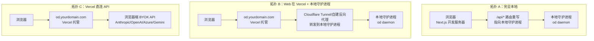
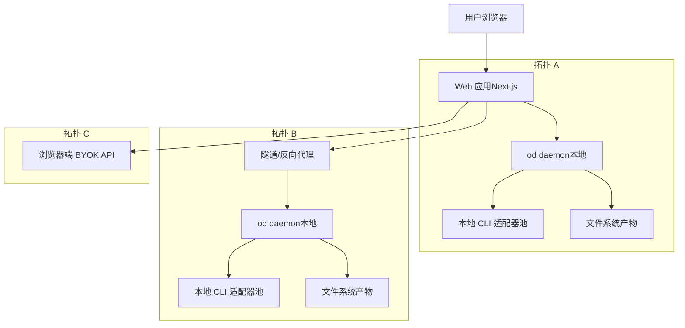
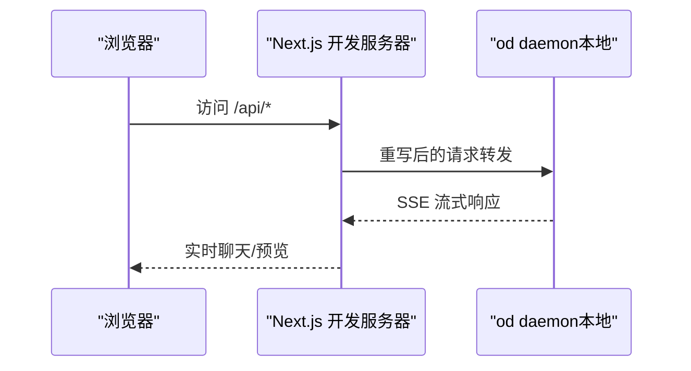
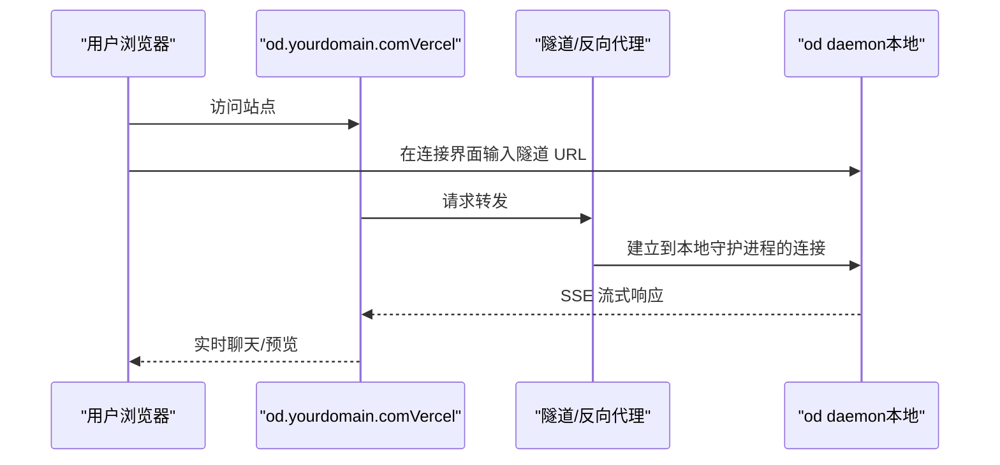
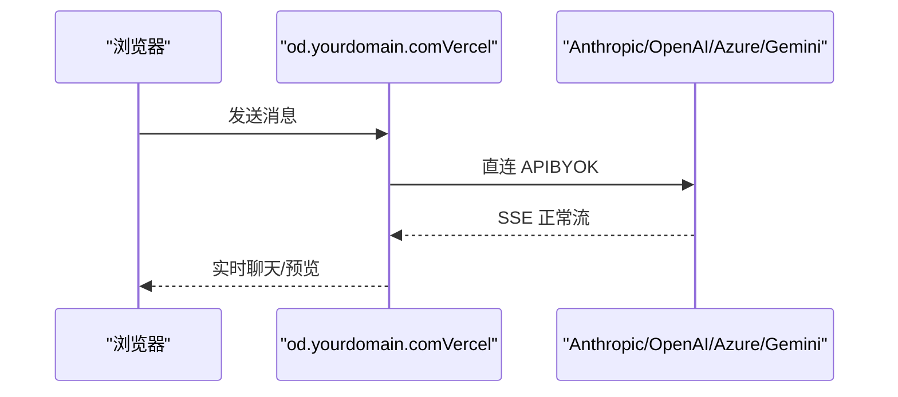
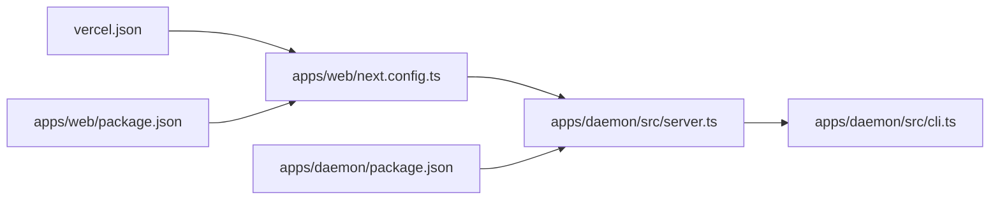

# 部署拓扑

<cite>
**本文引用的文件**
- [README.md](file://README.md)
- [docs/architecture.md](file://docs/architecture.md)
- [QUICKSTART.md](file://QUICKSTART.md)
- [vercel.json](file://vercel.json)
- [apps/web/package.json](file://apps/web/package.json)
- [apps/web/next.config.ts](file://apps/web/next.config.ts)
- [apps/daemon/package.json](file://apps/daemon/package.json)
- [apps/daemon/src/cli.ts](file://apps/daemon/src/cli.ts)
- [apps/daemon/src/server.ts](file://apps/daemon/src/server.ts)
- [apps/packaged/package.json](file://apps/packaged/package.json)
</cite>

## 目录
1. [简介](#简介)
2. [项目结构](#项目结构)
3. [核心组件](#核心组件)
4. [架构总览](#架构总览)
5. [详细组件分析](#详细组件分析)
6. [依赖关系分析](#依赖关系分析)
7. [性能考量](#性能考量)
8. [故障排查指南](#故障排查指南)
9. [结论](#结论)
10. [附录](#附录)

## 简介
本文件系统性阐述 Open Design 的三种部署拓扑：Topology A（完全本地）、Topology B（Web 在 Vercel + 本地守护进程）、Topology C（直接 API）。我们将从架构差异、安全边界、性能特征与部署复杂度入手，给出可操作的部署步骤、配置要点与功能限制对比，并解释为何采用这种分层设计，帮助读者基于自身需求做出合适选择。

## 项目结构
Open Design 由“前端 Web 应用（Next.js）+ 本地守护进程（Node/Express）”构成，三类拓扑共享同一 Web 打包产物，差异在于运行时与传输链路：
- 完全本地：前端在本地开发服务器，通过重写路由直连本地守护进程。
- Vercel + 本地守护进程：前端托管于 Vercel，守护进程在本地，通过隧道将浏览器连接到本地守护进程。
- Vercel 直连 API：前端托管于 Vercel，不运行守护进程，使用浏览器端 BYOK API 模式。

图表来源
- [docs/architecture.md](file://docs/architecture.md)
- [apps/web/next.config.ts](file://apps/web/next.config.ts)
- [apps/daemon/src/cli.ts](file://apps/daemon/src/cli.ts)

章节来源
- [README.md](file://README.md)
- [docs/architecture.md](file://docs/architecture.md)
- [apps/web/next.config.ts](file://apps/web/next.config.ts)

## 核心组件
- 前端 Web 应用（Next.js 16）
  - 支持静态导出与服务端渲染；开发期通过重写将 /api/*、/artifacts/*、/frames/* 转发至本地守护进程；生产期可由守护进程直接提供静态资源或由 Vercel 提供静态导出。
- 本地守护进程（od daemon）
  - 提供 REST/SSE 接口（/api/*），负责会话管理、技能注册表、设计系统解析、预览编译流水线、导出与媒体生成调度等。
- 传输与模式
  - 拓扑 A：本地 CLI 模式（默认）与 BYOK API 模式（无本地 CLI 时自动降级）。
  - 拓扑 B：通过隧道连接本地守护进程，保持与拓扑 A 相同的传输能力。
  - 拓扑 C：仅支持浏览器端 BYOK API，不支持本地 CLI、文件系统产物与 PPTX 导出。

章节来源
- [apps/web/package.json](file://apps/web/package.json)
- [apps/daemon/package.json](file://apps/daemon/package.json)
- [docs/architecture.md](file://docs/architecture.md)
- [QUICKSTART.md](file://QUICKSTART.md)

## 架构总览
下图展示三种拓扑的逻辑交互：Web 层始终一致，差异在于数据流与安全边界。

图表来源
- [docs/architecture.md](file://docs/architecture.md)
- [apps/web/next.config.ts](file://apps/web/next.config.ts)
- [apps/daemon/src/cli.ts](file://apps/daemon/src/cli.ts)

## 详细组件分析

### 拓扑 A：完全本地（Topology A）
- 架构要点
  - 开发期：Next.js 在本地启动，通过 next.config.ts 的重写规则将 /api/*、/artifacts/*、/frames/* 转发到本地守护进程（默认端口 7456）。
  - 运行期：守护进程监听本地回环地址，提供 REST/SSE 接口；前端与守护进程在同一机器，无需网络暴露。
- 安全边界
  - 绑定到本地回环地址，避免对外暴露；预览 iframe 使用沙箱隔离。
- 性能特征
  - 启动快、延迟低；SSE 流式输出无缓冲。
- 部署复杂度
  - 最低：安装依赖后一键启动工具链，即可获得完整体验。
- 功能限制
  - 本地 CLI 模式可用；BYOK API 可用但受限于浏览器存储与网络。
- 典型命令
  - 安装与启动：参见 [QUICKSTART.md](file://QUICKSTART.md) 中的“一键启动”与“生命周期脚本”。

图表来源
- [apps/web/next.config.ts](file://apps/web/next.config.ts)
- [apps/daemon/src/server.ts](file://apps/daemon/src/server.ts)

章节来源
- [docs/architecture.md](file://docs/architecture.md)
- [apps/web/next.config.ts](file://apps/web/next.config.ts)
- [apps/daemon/src/cli.ts](file://apps/daemon/src/cli.ts)
- [QUICKSTART.md](file://QUICKSTART.md)

### 拓扑 B：Web 在 Vercel + 本地守护进程（Topology B）
- 架构要点
  - Web 应用部署到 Vercel；守护进程在本地运行并通过隧道（如 Cloudflare Tunnel）暴露给 Vercel 域名。
  - 用户在 Web 应用中输入隧道 URL，建立与本地守护进程的连接。
- 安全边界
  - 隧道加密；守护进程仍绑定本地回环，敏感信息保留在本地。
- 性能特征
  - 延迟主要受隧道质量影响；SSE 仍保持无缓冲。
- 部署复杂度
  - 中等：需要先部署 Web 到 Vercel，再在本地启动守护进程并配置隧道。
- 功能限制
  - 与拓扑 A 相同，支持本地 CLI 与 BYOK API。
- 典型命令
  - 部署 Web：参见 [vercel.json](file://vercel.json) 与 [apps/web/package.json](file://apps/web/package.json)。
  - 启动守护进程并暴露：参见 [docs/architecture.md](file://docs/architecture.md) 中的“Vercel + 本地 daemon（Topology B）”。

图表来源
- [docs/architecture.md](file://docs/architecture.md)
- [apps/daemon/src/cli.ts](file://apps/daemon/src/cli.ts)

章节来源
- [docs/architecture.md](file://docs/architecture.md)
- [apps/daemon/src/cli.ts](file://apps/daemon/src/cli.ts)
- [vercel.json](file://vercel.json)

### 拓扑 C：Vercel 直连 API（Topology C）
- 架构要点
  - Web 应用部署到 Vercel；不运行守护进程；所有模型调用在浏览器端进行（BYOK API）。
- 安全边界
  - API 密钥存储在浏览器本地（localStorage），需明确提示风险。
- 性能特征
  - 无本地 CLI 与文件系统产物；无法生成 PPTX；部分媒体生成受限。
- 部署复杂度
  - 低：仅需部署 Web 应用。
- 功能限制
  - 不支持本地 CLI、文件系统产物、PPTX 导出；部分媒体生成能力受限。
- 典型命令
  - 部署 Web：参见 [vercel.json](file://vercel.json) 与 [apps/web/package.json](file://apps/web/package.json)。
  - 启用直连模式：参见 [docs/architecture.md](file://docs/architecture.md) 中的“Vercel direct（Topology C）”。

图表来源
- [docs/architecture.md](file://docs/architecture.md)

章节来源
- [docs/architecture.md](file://docs/architecture.md)
- [apps/web/package.json](file://apps/web/package.json)
- [vercel.json](file://vercel.json)

## 依赖关系分析
- Web 应用与守护进程
  - Web 应用通过 next.config.ts 的重写规则在开发期将 /api/*、/artifacts/*、/frames/* 转发到守护进程；生产期可由守护进程提供静态资源或由 Vercel 提供静态导出。
- 守护进程与本地 CLI
  - 守护进程负责检测 PATH 上的代码代理 CLI 并复用其适配器实例，统一通过子进程调用。
- Vercel 配置
  - vercel.json 指定构建命令与输出目录，确保 Web 应用可被 Vercel 正确部署。

图表来源
- [apps/web/next.config.ts](file://apps/web/next.config.ts)
- [apps/daemon/src/server.ts](file://apps/daemon/src/server.ts)
- [apps/daemon/src/cli.ts](file://apps/daemon/src/cli.ts)
- [vercel.json](file://vercel.json)
- [apps/web/package.json](file://apps/web/package.json)
- [apps/daemon/package.json](file://apps/daemon/package.json)

章节来源
- [apps/web/next.config.ts](file://apps/web/next.config.ts)
- [apps/daemon/src/server.ts](file://apps/daemon/src/server.ts)
- [apps/daemon/src/cli.ts](file://apps/daemon/src/cli.ts)
- [vercel.json](file://vercel.json)
- [apps/web/package.json](file://apps/web/package.json)
- [apps/daemon/package.json](file://apps/daemon/package.json)

## 性能考量
- 启动与冷启动
  - 守护进程启动时间短，适配器按需初始化；首次生成延迟主要由模型推理决定。
- 流式传输
  - SSE 流式输出在开发与生产环境均保持无缓冲，避免长轮询带来的延迟。
- 反向代理注意事项
  - 若在守护进程前放置反向代理，需确保对 /api/* 的 SSE 流不启用压缩与缓冲，否则可能出现连接中断。

章节来源
- [docs/architecture.md](file://docs/architecture.md)
- [QUICKSTART.md](file://QUICKSTART.md)

## 故障排查指南
- “未在 PATH 中发现任何代理”
  - 安装任一支持的本地 CLI 或切换到 BYOK API 模式并在设置中粘贴密钥。
- 守护进程 500 错误
  - 查看守护进程日志，通常为 CLI 参数不兼容；检查 apps/daemon/src/agents.ts 中的参数构建逻辑。
- 媒体生成提示 OD_BIN 缺失或守护进程 URL 为 :0
  - 重新构建守护进程 CLI 并重启管理态运行时；确保 OD_DAEMON_URL 为实际端口而非占位符。
- Codex 插件上下文过大
  - 通过环境变量禁用插件后重启守护进程。
- 产物未渲染
  - 确认系统提示已正确下发，必要时更换更合适的模型或技能。

章节来源
- [QUICKSTART.md](file://QUICKSTART.md)

## 结论
- 选择拓扑 A（完全本地）适合个人开发者与需要完整功能（本地 CLI、文件系统产物、PPTX 导出）的场景。
- 选择拓扑 B（Web 在 Vercel + 本地守护进程）适合希望快速上线 Web 界面、同时保留本地 CLI 与文件系统的团队协作场景。
- 选择拓扑 C（Vercel 直连 API）适合快速试用与演示，但会牺牲本地 CLI、文件系统产物与 PPTX 导出能力。
- 三类拓扑共享同一 Web 打包产物，差异在于传输链路与安全边界，遵循“前端可部署、后端可替换”的分层设计原则。

## 附录

### 三种拓扑对比总表
- 安全边界
  - 拓扑 A：本地回环绑定，预览 iframe 沙箱隔离。
  - 拓扑 B：隧道加密，守护进程本地回环。
  - 拓扑 C：浏览器端存储密钥，需明确风险提示。
- 性能特征
  - 拓扑 A：最低延迟，SSE 无缓冲。
  - 拓扑 B：受隧道质量影响，SSE 无缓冲。
  - 拓扑 C：无本地 CLI 与文件系统产物，部分媒体生成受限。
- 部署复杂度
  - 拓扑 A：最低。
  - 拓扑 B：中等（需部署 Web 与配置隧道）。
  - 拓扑 C：最低（仅部署 Web）。
- 功能限制
  - 拓扑 A：无限制。
  - 拓扑 B：与 A 相同。
  - 拓扑 C：不支持本地 CLI、文件系统产物、PPTX 导出。

章节来源
- [docs/architecture.md](file://docs/architecture.md)
- [QUICKSTART.md](file://QUICKSTART.md)