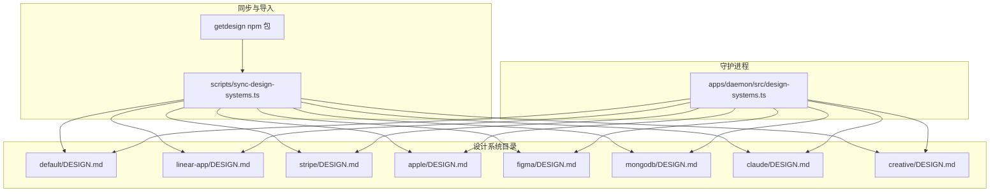
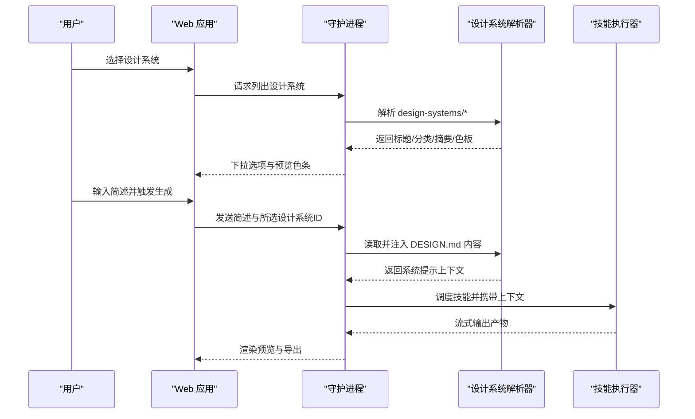
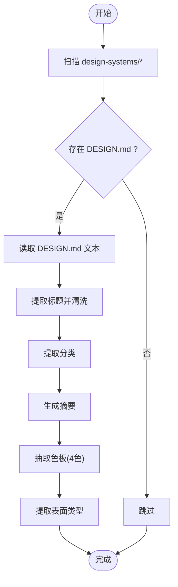
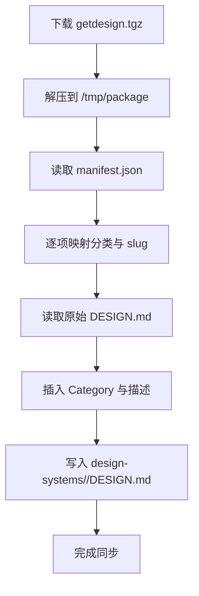
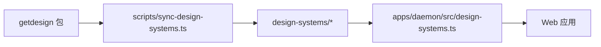

# 设计系统库

<cite>
**本文引用的文件**
- [design-systems/README.md](file://design-systems/README.md)
- [design-systems/default/DESIGN.md](file://design-systems/default/DESIGN.md)
- [design-systems/linear-app/DESIGN.md](file://design-systems/linear-app/DESIGN.md)
- [design-systems/stripe/DESIGN.md](file://design-systems/stripe/DESIGN.md)
- [design-systems/apple/DESIGN.md](file://design-systems/apple/DESIGN.md)
- [design-systems/figma/DESIGN.md](file://design-systems/figma/DESIGN.md)
- [design-systems/mongodb/DESIGN.md](file://design-systems/mongodb/DESIGN.md)
- [design-systems/claude/DESIGN.md](file://design-systems/claude/DESIGN.md)
- [design-systems/creative/DESIGN.md](file://design-systems/creative/DESIGN.md)
- [docs/spec.md](file://docs/spec.md)
- [scripts/sync-design-systems.ts](file://scripts/sync-design-systems.ts)
- [apps/daemon/src/design-systems.ts](file://apps/daemon/src/design-systems.ts)
</cite>

## 目录
1. [简介](#简介)
2. [项目结构](#项目结构)
3. [核心组件](#核心组件)
4. [架构总览](#架构总览)
5. [详细组件分析](#详细组件分析)
6. [依赖关系分析](#依赖关系分析)
7. [性能考量](#性能考量)
8. [故障排查指南](#故障排查指南)
9. [结论](#结论)
10. [附录](#附录)

## 简介
本文件为 Open Design 设计系统库的完整技术文档，围绕 DESIGN.md 标准的九章节规范（颜色、字体排版、间距、布局、组件、动效、声音语调、品牌、反模式）进行系统化梳理，并结合仓库中的实际设计系统样例（如 Linear、Stripe、Apple、Figma、MongoDB、Claude 等），阐述设计系统的可移植性理念与跨技能复用机制。同时提供设计系统开发指南，包括如何创建新的 DESIGN.md 文件、如何集成第三方设计系统，以及设计系统的最佳实践。

## 项目结构
- 设计系统目录：每个子目录代表一个可独立选择的“便携式”设计系统，均以符合 DESIGN.md 规范的 Markdown 文件为核心资产。
- 设计系统注册与解析：后端守护进程扫描本地项目根目录下的 design-systems 子目录，读取每个子目录内的 DESIGN.md，提取标题、分类、摘要、色板与表面类型等元数据，供前端下拉选择器与生成流程使用。
- 同步脚本：通过 npm 包 getdesign 的 tarball 导入 70 个外部品牌设计系统，并自动标注 Category 与描述，保持与 awesome-design-md 的一致性。

图表来源
- [design-systems/README.md:1-98](file://design-systems/README.md#L1-L98)
- [scripts/sync-design-systems.ts:1-155](file://scripts/sync-design-systems.ts#L1-L155)
- [apps/daemon/src/design-systems.ts:1-168](file://apps/daemon/src/design-systems.ts#L1-L168)

章节来源
- [design-systems/README.md:1-98](file://design-systems/README.md#L1-L98)
- [docs/spec.md:63-95](file://docs/spec.md#L63-L95)

## 核心组件
- 设计系统清单与解析
  - 守护进程扫描 design-systems 目录，读取每个子目录的 DESIGN.md，解析标题、分类、摘要、色板与表面类型。
  - 提供按分类分组的下拉列表，支持快速切换当前设计系统。
- 设计系统导入与同步
  - 通过同步脚本从上游 getdesign 包导入品牌设计系统，自动写入 Category 与描述，保持与 awesome-design-md 的一致性。
- 设计系统规范
  - DESIGN.md 遵循 9 章节标准：视觉主题与氛围、颜色与角色、字体规则、组件样式、布局原则、深度与高程、使用守则、响应式行为、代理提示指南。

章节来源
- [apps/daemon/src/design-systems.ts:10-50](file://apps/daemon/src/design-systems.ts#L10-L50)
- [apps/daemon/src/design-systems.ts:52-87](file://apps/daemon/src/design-systems.ts#L52-L87)
- [scripts/sync-design-systems.ts:28-69](file://scripts/sync-design-systems.ts#L28-L69)
- [design-systems/README.md:46-63](file://design-systems/README.md#L46-L63)

## 架构总览
Open Design 将“设计系统”作为可插拔的上下文注入到所有生成流程中。用户在界面中选择某个 DESIGN.md，守护进程将其内容注入到技能（skills）的系统提示中，从而确保原型、演示文稿、模板等产物一致地遵循该设计系统。

图表来源
- [docs/spec.md:63-95](file://docs/spec.md#L63-L95)
- [apps/daemon/src/design-systems.ts:10-50](file://apps/daemon/src/design-systems.ts#L10-L50)

## 详细组件分析

### 设计系统清单与解析器
- 功能要点
  - 列举：遍历 design-systems 目录，检查每个子目录是否存在 DESIGN.md 并读取。
  - 标题清洗：去除“Design System Inspired by …”前缀，保留简洁标题。
  - 分类提取：从 DESIGN.md 中提取 Category 行，用于前端分组。
  - 摘要生成：截取首段文本，剔除分类元信息，限制长度。
  - 色板提取：从 DESIGN.md 中抽取 4 个代表性色值（背景、支持、前景、强调），用于下拉预览。
  - 表面类型：提取 Surface 元信息（web/image/video/audio），默认 web。
- 复杂度与性能
  - 时间复杂度：O(N) 遍历子目录与文件读取；色板提取为线性扫描与正则匹配。
  - 建议：对大型集合启用缓存与增量更新策略。

图表来源
- [apps/daemon/src/design-systems.ts:10-50](file://apps/daemon/src/design-systems.ts#L10-L50)
- [apps/daemon/src/design-systems.ts:52-87](file://apps/daemon/src/design-systems.ts#L52-L87)
- [apps/daemon/src/design-systems.ts:102-157](file://apps/daemon/src/design-systems.ts#L102-L157)

章节来源
- [apps/daemon/src/design-systems.ts:10-168](file://apps/daemon/src/design-systems.ts#L10-L168)

### 设计系统导入与同步
- 功能要点
  - 从 npm 包 getdesign 的 tarball 中读取 manifest.json，映射品牌到分类。
  - 为每个品牌生成 slug（点号替换为连字符），并将 DESIGN.md 写入 design-systems/<slug>/DESIGN.md。
  - 在 DESIGN.md 中插入 Category 与描述元信息，保持与 awesome-design-md 的一致性。
- 使用方式
  - 参考脚本头部注释，先下载并解压 tarball，再运行脚本进行同步。

图表来源
- [scripts/sync-design-systems.ts:14-155](file://scripts/sync-design-systems.ts#L14-L155)

章节来源
- [scripts/sync-design-systems.ts:14-155](file://scripts/sync-design-systems.ts#L14-L155)

### 设计系统九章节规范与示例

#### 颜色与角色
- 设计系统应明确主色、强调色、中性色、边框与阴影色等角色定义，并给出具体十六进制值或变量名。
- 示例参考：
  - 默认系统：中性现代风格，强调色为 cobalt，背景/前景/表面/边框均有明确取值。
  - Stripe：深海军蓝作为主标题色，紫色为主交互色，多层蓝色阴影增强深度感。
  - MongoDB：森林黑背景 + 生机绿强调，强调色用于高光与状态指示。
  - Claude：羊皮纸背景 + 暖陶色强调，暖灰中性体系，环形阴影传达柔和深度。
  - Apple：绝对黑/浅苹果灰/纯白三元色，行动蓝作为唯一强调色。
  - Linear：深黑背景 + 靛紫强调，半透明白边框与多层阴影叠加。
  - Figma：严格黑白界面 + 多彩产品展示，按钮采用胶囊与圆形几何。

章节来源
- [design-systems/default/DESIGN.md:10-18](file://design-systems/default/DESIGN.md#L10-L18)
- [design-systems/stripe/DESIGN.md:24-67](file://design-systems/stripe/DESIGN.md#L24-L67)
- [design-systems/mongodb/DESIGN.md:25-51](file://design-systems/mongodb/DESIGN.md#L25-L51)
- [design-systems/claude/DESIGN.md:23-58](file://design-systems/claude/DESIGN.md#L23-L58)
- [design-systems/apple/DESIGN.md:24-57](file://design-systems/apple/DESIGN.md#L24-L57)
- [design-systems/linear-app/DESIGN.md:26-68](file://design-systems/linear-app/DESIGN.md#L26-L68)
- [design-systems/figma/DESIGN.md:24-40](file://design-systems/figma/DESIGN.md#L24-L40)

#### 字体排版规则
- 明确显示/正文/等宽字体家族、OpenType 特性、字号/字重/行高/字距表与使用原则。
- 示例参考：
  - Linear：Inter Variable 全局启用 cv01/ss03，显示级采用负字距压缩，签名字重 510。
  - Stripe：sohne-var 启用 ss01，显示/正文均为 300，金融数字启用 tnum。
  - MongoDB：MongoDB Value Serif 用于标题，Euclid Circular A 用于正文，Source Code Pro 用于代码标签。
  - Claude：Anthropic Serif 用于标题，Anthropic Sans 用于 UI，Anthropic Mono 用于代码。
  - Apple：SF Pro Display 用于标题，SF Pro Text 用于正文与控制，权重阶梯清晰。
  - Figma：figmaSans 变量字体，大量中间权重，全局启用 kern；figmaMono 用于大写字母标签。

章节来源
- [design-systems/linear-app/DESIGN.md:69-113](file://design-systems/linear-app/DESIGN.md#L69-L113)
- [design-systems/stripe/DESIGN.md:69-107](file://design-systems/stripe/DESIGN.md#L69-L107)
- [design-systems/mongodb/DESIGN.md:52-86](file://design-systems/mongodb/DESIGN.md#L52-L86)
- [design-systems/claude/DESIGN.md:60-96](file://design-systems/claude/DESIGN.md#L60-L96)
- [design-systems/apple/DESIGN.md:58-93](file://design-systems/apple/DESIGN.md#L58-L93)
- [design-systems/figma/DESIGN.md:41-68](file://design-systems/figma/DESIGN.md#L41-L68)

#### 间距与网格
- 明确基础单位、间距刻度、列数与最大宽度、断点与触达目标尺寸。
- 示例参考：
  - 默认系统：8px 基础单位，12 列网格，最大 1200px，Hero 40–60vh。
  - Stripe：8px 基础，1080px 最大宽度，深色区块全宽，金融数据密集。
  - MongoDB：8px 基础，暗/亮双模式切换，卡片网格 2–3 列。
  - Linear：8px 基础，7px/11px 微调，深色背景下“空白即空间”的哲学。
  - Apple：8px 基础，营销与零售两套节奏，胶囊几何与圆角分级。
  - Figma：8px 基础，极简网格，画廊式节奏，彩色区块提供视觉呼吸。
  - Claude：8px 基础，30px 间距刻度，编辑式节奏，章节如书页。

章节来源
- [design-systems/default/DESIGN.md:34-38](file://design-systems/default/DESIGN.md#L34-L38)
- [design-systems/stripe/DESIGN.md:197-223](file://design-systems/stripe/DESIGN.md#L197-L223)
- [design-systems/mongodb/DESIGN.md:151-180](file://design-systems/mongodb/DESIGN.md#L151-L180)
- [design-systems/linear-app/DESIGN.md:236-265](file://design-systems/linear-app/DESIGN.md#L236-L265)
- [design-systems/apple/DESIGN.md:129-153](file://design-systems/apple/DESIGN.md#L129-L153)
- [design-systems/figma/DESIGN.md:134-157](file://design-systems/figma/DESIGN.md#L134-L157)
- [design-systems/claude/DESIGN.md:187-216](file://design-systems/claude/DESIGN.md#L187-L216)

#### 布局与组件
- 明确按钮、卡片、输入、导航、徽章等组件的样式与半径分级。
- 示例参考：
  - 默认系统：按钮 8px 圆角，卡片 12px 圆角，输入 8px 圆角，链接无下划线悬停下划线。
  - Stripe：4–8px 圆角保守，多层阴影，深色区块沉浸式。
  - MongoDB：16–48px 圆角分级，胶囊按钮，绿色边框，生态标签。
  - Linear：半透明白边框，多层阴影堆叠，近黑背景上的“发光”效果。
  - Apple：胶囊/圆角几何，黑/灰/白三元对比，边界引导层次。
  - Figma：胶囊（50px）与圆形（50%）几何，虚线焦点轮廓。
  - Claude：环形阴影（ring shadow）与轻柔投影，暖灰中性，软角设计。
  - Creative：Bangers 作为标题字体，IBM Plex Mono 用于代码，强调 Primary 色。

章节来源
- [design-systems/default/DESIGN.md:28-33](file://design-systems/default/DESIGN.md#L28-L33)
- [design-systems/stripe/DESIGN.md:108-187](file://design-systems/stripe/DESIGN.md#L108-L187)
- [design-systems/mongodb/DESIGN.md:87-151](file://design-systems/mongodb/DESIGN.md#L87-L151)
- [design-systems/linear-app/DESIGN.md:114-235](file://design-systems/linear-app/DESIGN.md#L114-L235)
- [design-systems/apple/DESIGN.md:94-128](file://design-systems/apple/DESIGN.md#L94-L128)
- [design-systems/figma/DESIGN.md:69-133](file://design-systems/figma/DESIGN.md#L69-L133)
- [design-systems/claude/DESIGN.md:97-187](file://design-systems/claude/DESIGN.md#L97-L187)
- [design-systems/creative/DESIGN.md:29-53](file://design-systems/creative/DESIGN.md#L29-L53)

#### 深度与高程
- 明确阴影/边框/内嵌阴影等表达层级的方式与色彩建议。
- 示例参考：
  - Linear：基于背景透明度递增与半透明白边框表达层级。
  - Stripe：蓝色阴影叠加（rgba(50,50,93,0.25)+rgba(0,0,0,0.1)）创造“带色深度”。
  - MongoDB：森林绿阴影（rgba(0,30,43,0.12)）贯穿浅色表面。
  - Claude：环形阴影（0px 0px 0px 1px）与“耳语阴影”（极低不透明度投影）。
  - Apple：边界引导与表面步进，阴影克制。
  - Figma：背景对比与截图本身提供维度，阴影稀少。
  - 默认系统：两级高程（Flat/ Raised），避免拟态风格。

章节来源
- [design-systems/linear-app/DESIGN.md:266-279](file://design-systems/linear-app/DESIGN.md#L266-L279)
- [design-systems/stripe/DESIGN.md:224-241](file://design-systems/stripe/DESIGN.md#L224-L241)
- [design-systems/mongodb/DESIGN.md:181-191](file://design-systems/mongodb/DESIGN.md#L181-L191)
- [design-systems/claude/DESIGN.md:217-232](file://design-systems/claude/DESIGN.md#L217-L232)
- [design-systems/apple/DESIGN.md:154-169](file://design-systems/apple/DESIGN.md#L154-L169)
- [design-systems/figma/DESIGN.md:158-167](file://design-systems/figma/DESIGN.md#L158-L167)
- [design-systems/default/DESIGN.md:40-44](file://design-systems/default/DESIGN.md#L40-L44)

#### 使用守则与反模式
- 明确“可做”与“不可做”，避免偏离系统核心特征。
- 示例参考：
  - Linear：禁用纯白文字、禁用实体边框、强调 cv01/ss03 开启。
  - Stripe：禁用 600–700 字重、禁用暖色强调、禁用中性阴影。
  - MongoDB：禁用纯黑背景、禁用通用灰色阴影、强调绿色仅用于小面积。
  - Claude：禁用冷灰、禁用几何插图、禁用重投影。
  - Apple：禁用广域阴影、禁用装饰性渐变、禁用扁平圆角。
  - Figma：禁用界面着色、禁用标准字体权重、禁用尖角按钮。
  - 默认系统：少即是多、强调色一屏一用、三色以内。

章节来源
- [design-systems/linear-app/DESIGN.md:281-304](file://design-systems/linear-app/DESIGN.md#L281-L304)
- [design-systems/stripe/DESIGN.md:242-263](file://design-systems/stripe/DESIGN.md#L242-L263)
- [design-systems/mongodb/DESIGN.md:193-214](file://design-systems/mongodb/DESIGN.md#L193-L214)
- [design-systems/claude/DESIGN.md:233-257](file://design-systems/claude/DESIGN.md#L233-L257)
- [design-systems/apple/DESIGN.md:170-189](file://design-systems/apple/DESIGN.md#L170-L189)
- [design-systems/figma/DESIGN.md:168-186](file://design-systems/figma/DESIGN.md#L168-L186)
- [design-systems/default/DESIGN.md:46-53](file://design-systems/default/DESIGN.md#L46-L53)

#### 响应式行为
- 明确断点、触达目标、折叠策略与图片行为。
- 示例参考：
  - Linear：移动端单列、导航汉堡、Hero 缩放、Section 间距缩减。
  - Stripe：移动端单列、深色区块全宽、金融表格横向滚动。
  - MongoDB：Hero 缩放、导航汉堡、卡片堆叠。
  - Apple：营销 Hero → 产品列表模块节奏切换。
  - Figma：Hero 文字缩放、标签横向滚动、页脚堆叠。
  - Claude：导航汉堡、Hero 缩放、模型卡片垂直排列。
  - Creative：断点与触达目标适配，保持视觉一致性。

章节来源
- [design-systems/linear-app/DESIGN.md:305-338](file://design-systems/linear-app/DESIGN.md#L305-L338)
- [design-systems/stripe/DESIGN.md:264-294](file://design-systems/stripe/DESIGN.md#L264-L294)
- [design-systems/mongodb/DESIGN.md:215-243](file://design-systems/mongodb/DESIGN.md#L215-L243)
- [design-systems/apple/DESIGN.md:190-219](file://design-systems/apple/DESIGN.md#L190-L219)
- [design-systems/figma/DESIGN.md:187-204](file://design-systems/figma/DESIGN.md#L187-L204)
- [design-systems/claude/DESIGN.md:258-288](file://design-systems/claude/DESIGN.md#L258-L288)
- [design-systems/creative/DESIGN.md:36-47](file://design-systems/creative/DESIGN.md#L36-L47)

#### 代理提示指南
- 提供快速颜色参考与组件提示模板，便于代理在生成时遵循系统。
- 示例参考：
  - Linear：快速色卡与示例组件提示。
  - Stripe：快速色卡与示例组件提示。
  - MongoDB：快速色卡与示例组件提示。
  - Claude：快速色卡与示例组件提示。
  - Apple：快速色卡与示例组件提示。
  - Figma：快速色卡与示例组件提示。
  - 默认系统：强调色使用建议与十六进制约束。

章节来源
- [design-systems/linear-app/DESIGN.md:339-371](file://design-systems/linear-app/DESIGN.md#L339-L371)
- [design-systems/stripe/DESIGN.md:295-326](file://design-systems/stripe/DESIGN.md#L295-L326)
- [design-systems/mongodb/DESIGN.md:244-270](file://design-systems/mongodb/DESIGN.md#L244-L270)
- [design-systems/claude/DESIGN.md:289-316](file://design-systems/claude/DESIGN.md#L289-L316)
- [design-systems/apple/DESIGN.md:220-251](file://design-systems/apple/DESIGN.md#L220-L251)
- [design-systems/figma/DESIGN.md:205-224](file://design-systems/figma/DESIGN.md#L205-L224)
- [design-systems/default/DESIGN.md:59-63](file://design-systems/default/DESIGN.md#L59-L63)

### 设计系统分类与特点概览
- 产品系统（70 个）
  - AI 与 LLM：Claude、Cohere、ElevenLabs、Minimax、Mistral-AI、Ollama、OpenCode-AI、Replicate、RunwayML、Together-AI、Voltagent、X-AI。
  - 开发者工具：Cursor、Expo、Lovable、Raycast、Superhuman、Vercel、Warp。
  - 生产力与 SaaS：Cal、Intercom、Linear-App、Mintlify、Notion、Resend、Zapier。
  - 后端与数据：ClickHouse、Composio、HashiCorp、MongoDB、PostHog、Sanity、Sentry、Supabase。
  - 设计与创意：Airtable、Clay、Figma、Framer、Miro、Webflow。
  - 金融科技与加密：Binance、Coinbase、Kraken、MasterCard、Revolut、Stripe、Wise。
  - 电商与零售：Airbnb、Meta、Nike、Shopify、Starbucks。
  - 媒体与消费者：Apple、IBM、NVIDIA、Pinterest、PlayStation、SpaceX、Spotify、TheVerge、Uber、Vodafone、Wired、Xiaohongshu。
  - 汽车：BMW、Bugatti、Ferrari、Lamborghini、Renault、Tesla。
- 手写系统（starter）
  - default：中性现代默认系统。
  - warm-editorial：温暖编辑型手写 serif 系统。
  - atelier-zero：杂志级拼贴系统，搭配 landing-page 与 slide-deck。
  - kami：源自 tw93/kami 的纸张系统，搭配模板。

章节来源
- [design-systems/README.md:23-42](file://design-systems/README.md#L23-L42)
- [design-systems/README.md:65-98](file://design-systems/README.md#L65-L98)

## 依赖关系分析
- 设计系统解析器依赖于本地磁盘上的 DESIGN.md 文件，解析结果用于前端下拉与生成流程。
- 同步脚本依赖上游 getdesign 包的 manifest.json 与 DESIGN.md 源文件，生成本地 DESIGN.md。
- Web 应用通过守护进程提供的 API 获取设计系统清单与内容，实现“所见即所得”的系统切换。

图表来源
- [apps/daemon/src/design-systems.ts:10-50](file://apps/daemon/src/design-systems.ts#L10-L50)
- [scripts/sync-design-systems.ts:14-155](file://scripts/sync-design-systems.ts#L14-L155)

章节来源
- [apps/daemon/src/design-systems.ts:10-50](file://apps/daemon/src/design-systems.ts#L10-L50)
- [scripts/sync-design-systems.ts:14-155](file://scripts/sync-design-systems.ts#L14-L155)

## 性能考量
- 设计系统解析
  - 对于大型集合（数百个 DESIGN.md），建议引入文件系统缓存与增量扫描策略，避免每次请求都全量读取。
  - 色板提取与摘要生成为 O(n) 线性处理，可在守护进程侧进行预计算与缓存。
- 同步导入
  - 一次性批量导入时，建议并发读取与写入，减少 I/O 等待时间。
- 生成流程
  - 将 DESIGN.md 注入代理提示时，尽量保持上下文精简，避免超长提示导致延迟与成本上升。

## 故障排查指南
- 设计系统未出现在下拉列表
  - 检查 DESIGN.md 是否位于 design-systems/<slug>/DESIGN.md。
  - 确认 DESIGN.md 首行存在 H1，且包含 Category 元信息。
  - 查看守护进程日志，确认文件读取与解析是否抛错。
- 色板无法正确显示
  - 确认 DESIGN.md 中存在可识别的颜色标记（如“Background: `#xxxxxx`”或“Brand: `#xxxxxx`”）。
  - 检查颜色值是否为合法十六进制（3/6/8 位）。
- 同步失败
  - 确认已下载并解压 getdesign 包，路径与 manifest.json 存在。
  - 检查品牌映射表是否覆盖对应品牌，否则会跳过导入。

章节来源
- [apps/daemon/src/design-systems.ts:52-87](file://apps/daemon/src/design-systems.ts#L52-L87)
- [apps/daemon/src/design-systems.ts:102-157](file://apps/daemon/src/design-systems.ts#L102-L157)
- [scripts/sync-design-systems.ts:79-100](file://scripts/sync-design-systems.ts#L79-L100)

## 结论
Open Design 通过 DESIGN.md 的标准化与可移植性，将品牌与风格抽象为可版本化、可共享、可复用的设计系统。借助守护进程的解析与同步能力，系统实现了“一处编写，处处应用”的设计一致性。对于使用者而言，只需在界面中选择合适的系统，即可让后续的原型、演示文稿与模板产出自然遵循该风格；对于维护者而言，通过统一的九章节规范与同步脚本，可以高效地扩展与集成新的设计系统。

## 附录

### 设计系统开发指南
- 创建新的 DESIGN.md
  - 遵循九章节规范：视觉主题与氛围、颜色与角色、字体规则、组件样式、布局原则、深度与高程、使用守则、响应式行为、代理提示指南。
  - 在 DESIGN.md 首行写入标题，在其后添加 Category 与描述元信息，以便被解析器识别与展示。
  - 将 DESIGN.md 放置在 design-systems/<slug>/DESIGN.md，重启或刷新守护进程后即可生效。
- 集成第三方设计系统
  - 使用同步脚本从 getdesign 包导入品牌系统，自动写入 Category 与描述。
  - 如需自定义分类或品牌映射，可在脚本中扩展映射表。
- 最佳实践
  - 保持颜色与字体的最小必要集合，避免过度装饰。
  - 使用明确的组件半径分级与阴影策略，确保一致性。
  - 在代理提示中明确强调色与文本色的使用边界，避免偏离系统。
  - 为移动端提供合理的折叠策略与触达目标，保证可用性。

章节来源
- [design-systems/README.md:46-69](file://design-systems/README.md#L46-L69)
- [scripts/sync-design-systems.ts:28-69](file://scripts/sync-design-systems.ts#L28-L69)
- [docs/spec.md:34-36](file://docs/spec.md#L34-L36)