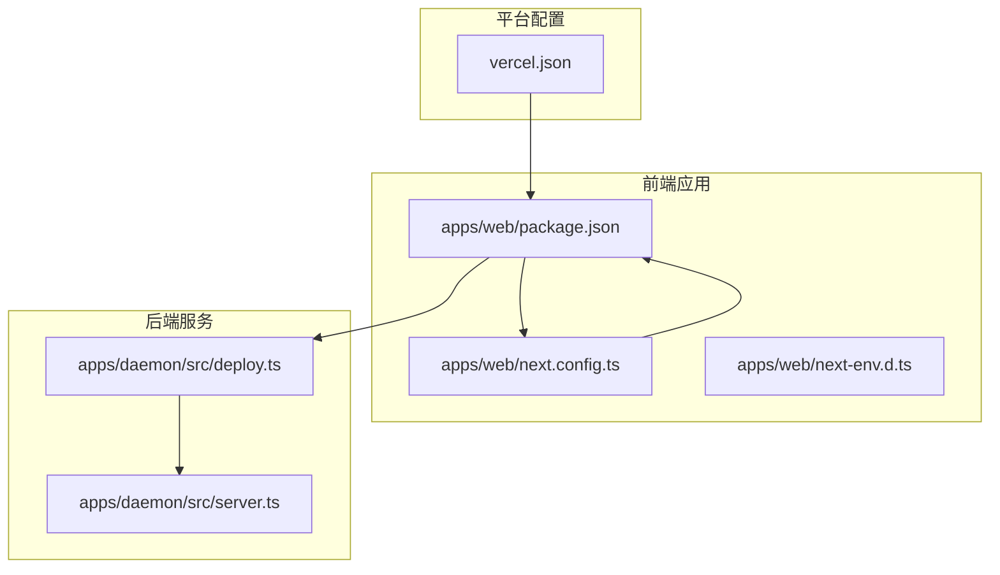
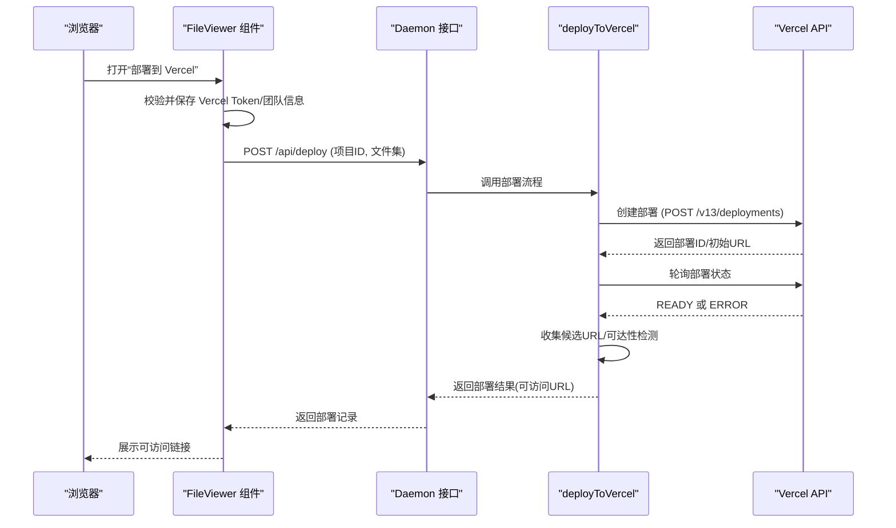
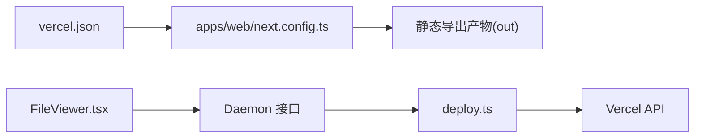

# Vercel 部署

<cite>
**本文引用的文件**
- [vercel.json](file://vercel.json)
- [apps/web/package.json](file://apps/web/package.json)
- [apps/web/next.config.ts](file://apps/web/next.config.ts)
- [apps/daemon/src/deploy.ts](file://apps/daemon/src/deploy.ts)
- [apps/daemon/src/server.ts](file://apps/daemon/src/server.ts)
- [apps/web/src/components/FileViewer.tsx](file://apps/web/src/components/FileViewer.tsx)
- [apps/web/next-env.d.ts](file://apps/web/next-env.d.ts)
- [README.md](file://README.md)
</cite>

## 目录
1. [简介](#简介)
2. [项目结构](#项目结构)
3. [核心组件](#核心组件)
4. [架构总览](#架构总览)
5. [详细组件分析](#详细组件分析)
6. [依赖关系分析](#依赖关系分析)
7. [性能考量](#性能考量)
8. [故障排查指南](#故障排查指南)
9. [结论](#结论)
10. [附录](#附录)

## 简介
本指南面向在 Vercel 平台上部署 Open Design 的用户，聚焦于 vercel.json 配置项、Next.js 静态生成、环境变量与域名绑定、项目创建与连接、环境变量配置、部署预览与发布、回滚操作、边缘网络与 CDN 缓存策略，以及常见失败原因与解决方案。文档基于仓库中现有配置与实现进行说明，并提供可追溯的文件来源。

## 项目结构
Open Design 采用多包工作区（pnpm workspace）组织，前端 Web 应用位于 apps/web，Vercel 部署相关的关键文件为根目录下的 vercel.json 与 apps/web/next.config.ts。部署流程由后端 Daemon 提供 API 支持，前端通过 UI 触发部署。

**图表来源**
- [vercel.json:1-8](file://vercel.json#L1-L8)
- [apps/web/package.json:1-52](file://apps/web/package.json#L1-L52)
- [apps/web/next.config.ts:1-108](file://apps/web/next.config.ts#L1-L108)
- [apps/daemon/src/deploy.ts:188-234](file://apps/daemon/src/deploy.ts#L188-L234)
- [apps/daemon/src/server.ts:2628-2671](file://apps/daemon/src/server.ts#L2628-L2671)

**章节来源**
- [vercel.json:1-8](file://vercel.json#L1-L8)
- [apps/web/package.json:1-52](file://apps/web/package.json#L1-L52)
- [apps/web/next.config.ts:1-108](file://apps/web/next.config.ts#L1-L108)
- [apps/daemon/src/deploy.ts:188-234](file://apps/daemon/src/deploy.ts#L188-L234)
- [apps/daemon/src/server.ts:2628-2671](file://apps/daemon/src/server.ts#L2628-L2671)

## 核心组件
- vercel.json：定义 Vercel 构建与输出行为，指定构建命令、安装命令与输出目录，框架字段设为 null。
- apps/web/next.config.ts：控制 Next.js 在开发与生产中的行为，支持静态导出（export），并根据环境变量决定输出模式与 dist 目录。
- apps/daemon/src/deploy.ts：封装 Vercel 部署 API 调用、文件打包、轮询部署状态、可达性检测等逻辑。
- apps/daemon/src/server.ts：提供部署接口，接收前端请求后调用部署模块并写入数据库记录。
- apps/web/src/components/FileViewer.tsx：前端 UI 中的“部署到 Vercel”入口，负责收集 token、团队信息并触发部署。

**章节来源**
- [vercel.json:1-8](file://vercel.json#L1-L8)
- [apps/web/next.config.ts:71-105](file://apps/web/next.config.ts#L71-L105)
- [apps/daemon/src/deploy.ts:188-234](file://apps/daemon/src/deploy.ts#L188-L234)
- [apps/daemon/src/server.ts:2628-2671](file://apps/daemon/src/server.ts#L2628-L2671)
- [apps/web/src/components/FileViewer.tsx:999-1028](file://apps/web/src/components/FileViewer.tsx#L999-L1028)

## 架构总览
下图展示从浏览器发起部署到 Vercel 完成部署并返回可访问链接的端到端流程。

**图表来源**
- [apps/web/src/components/FileViewer.tsx:999-1028](file://apps/web/src/components/FileViewer.tsx#L999-L1028)
- [apps/daemon/src/server.ts:2628-2671](file://apps/daemon/src/server.ts#L2628-L2671)
- [apps/daemon/src/deploy.ts:188-234](file://apps/daemon/src/deploy.ts#L188-L234)
- [apps/daemon/src/deploy.ts:716-730](file://apps/daemon/src/deploy.ts#L716-L730)
- [apps/daemon/src/deploy.ts:836-847](file://apps/daemon/src/deploy.ts#L836-L847)
- [apps/daemon/src/deploy.ts:849-877](file://apps/daemon/src/deploy.ts#L849-L877)

## 详细组件分析

### vercel.json 配置解析
- $schema：指向 Vercel 开放规范，确保配置合法性。
- buildCommand：先执行 pnpm install，再对 @open-design/web 包执行构建命令，保证工作区依赖正确安装与产物生成。
- installCommand：统一使用 pnpm install，确保依赖一致性。
- outputDirectory：指定静态导出产物目录为 apps/web/out，与 Next.js 生产静态导出输出一致。
- framework：设为 null，明确不启用框架自动识别。

上述配置与 apps/web/next.config.ts 的静态导出策略相匹配，确保 Vercel 正确识别并部署静态页面。

**章节来源**
- [vercel.json:1-8](file://vercel.json#L1-L8)
- [apps/web/next.config.ts:78-86](file://apps/web/next.config.ts#L78-L86)

### Next.js 静态生成与输出目录
- 输出模式：在生产且未启用服务器模式时，Next.js 使用 export 模式，输出目录为 out；开发或服务器模式则使用 .next。
- distDir：受环境变量影响，可自定义构建产物目录，便于固定路径以便本地守护进程指向。
- trailingSlash：静态导出时开启尾斜杠，简化静态回退逻辑。
- images：静态导出时关闭优化，避免运行时图片处理。
- allowedDevOrigins：开发期允许的来源集合，基于 OD_HOST 环境变量动态计算。

这些设置与 vercel.json 的 outputDirectory 保持一致，确保 Vercel 部署的静态产物与本地构建一致。

**章节来源**
- [apps/web/next.config.ts:16-18](file://apps/web/next.config.ts#L16-L18)
- [apps/web/next.config.ts:23-28](file://apps/web/next.config.ts#L23-L28)
- [apps/web/next.config.ts:30-36](file://apps/web/next.config.ts#L30-L36)
- [apps/web/next.config.ts:71-105](file://apps/web/next.config.ts#L71-L105)

### 环境变量管理
- OD_PORT：守护进程端口，用于开发期 API 代理。
- OD_WEB_OUTPUT_MODE：控制是否以服务器模式运行，影响 Next.js 输出模式。
- OD_WEB_PROD：控制 distDir 默认值。
- OD_WEB_DIST_DIR：自定义 dist 目录，支持绝对/相对路径。
- OD_WEB_TSCONFIG_PATH：开发期类型检查使用的 tsconfig 路径。
- OD_HOST：开发期 allowedDevOrigins 计算依据。
- NODE_ENV：区分开发与生产，影响输出模式。
- OD_USER_STATE_DIR：Vercel 部署配置文件存储目录（默认 ~/.open-design）。

这些变量在 next.config.ts 中被读取，用于决定构建行为与开发期重写规则。

**章节来源**
- [apps/web/next.config.ts:9-10](file://apps/web/next.config.ts#L9-L10)
- [apps/web/next.config.ts:16-18](file://apps/web/next.config.ts#L16-L18)
- [apps/web/next.config.ts:23-28](file://apps/web/next.config.ts#L23-L28)
- [apps/web/next.config.ts:30-36](file://apps/web/next.config.ts#L30-L36)
- [apps/web/next.config.ts:40-69](file://apps/web/next.config.ts#L40-L69)
- [apps/daemon/src/deploy.ts:25-28](file://apps/daemon/src/deploy.ts#L25-L28)

### 域名绑定与团队配置
- 团队查询参数：当配置中存在 teamId 或 teamSlug 时，会附加到 Vercel API 请求中，用于指定团队项目。
- 部署保护：若返回内容提示“部署受保护”，需禁用部署保护或使用自定义域名以公开链接。
- URL 规范化：对返回的 URL 做标准化处理，确保以 https:// 开头。

**章节来源**
- [apps/daemon/src/deploy.ts:871-877](file://apps/daemon/src/deploy.ts#L871-L877)
- [apps/daemon/src/deploy.ts:836-847](file://apps/daemon/src/deploy.ts#L836-L847)
- [apps/daemon/src/deploy.ts:864-869](file://apps/daemon/src/deploy.ts#L864-L869)

### Vercel 项目创建、GitHub 连接与环境变量配置
- 项目创建：通过 Vercel API 的 deployments 接口创建项目，名称采用安全格式并限制长度。
- GitHub 连接：本仓库未提供自动化脚本，通常在 Vercel 控制台手动关联仓库并选择分支。
- 环境变量：前端 UI 支持输入 Vercel Token 与团队信息；Daemon 将其写入用户状态目录下的 vercel.json，权限为 0600。

**章节来源**
- [apps/daemon/src/deploy.ts:25-28](file://apps/daemon/src/deploy.ts#L25-L28)
- [apps/daemon/src/deploy.ts:45-66](file://apps/daemon/src/deploy.ts#L45-L66)
- [apps/web/src/components/FileViewer.tsx:1532-1565](file://apps/web/src/components/FileViewer.tsx#L1532-L1565)

### 部署预览、生产发布与回滚
- 预览：部署完成后返回候选 URL 列表，优先选择可达链接；若无返回 URL，则提示延迟。
- 生产发布：当前实现目标为 preview，未见直接切换至生产环境的逻辑；如需生产发布，请在 Vercel 控制台手动设置别名或域名。
- 回滚：未见专用回滚接口；可通过重新部署同一文件版本或在 Vercel 控制台选择历史版本进行回滚。

**章节来源**
- [apps/daemon/src/deploy.ts:732-744](file://apps/daemon/src/deploy.ts#L732-L744)
- [apps/daemon/src/deploy.ts:849-877](file://apps/daemon/src/deploy.ts#L849-L877)
- [apps/daemon/src/deploy.ts:896-900](file://apps/daemon/src/deploy.ts#L896-L900)

### 边缘网络、CDN 加速与缓存策略
- 边缘网络：Vercel 作为边缘平台，自动将静态资源分发至全球节点。
- CDN 加速：静态导出产物由 Vercel CDN 分发，无需额外配置。
- 缓存策略：仓库未显式配置缓存头；静态导出产物默认按浏览器缓存策略生效。若需自定义缓存行为，可在 Vercel 控制台或 vercel.json 中添加重写/缓存规则。

**章节来源**
- [vercel.json:1-8](file://vercel.json#L1-L8)
- [apps/web/next.config.ts:80-86](file://apps/web/next.config.ts#L80-L86)

### 部署失败的常见原因与解决方案
- 缺少 Vercel Token：部署前必须保存有效 Token，否则抛出错误。
- 权限不足：Vercel 返回 forbidden 或权限相关错误时，检查 Token 权限与团队成员身份。
- 部署保护：返回受保护提示时，禁用部署保护或绑定自定义域名。
- 文件缺失/无效：部署文件计划中存在缺失或无效引用时，修复项目文件后再部署。
- 轮询超时：若部署长时间未 READY，检查网络与 Vercel 状态。

**章节来源**
- [apps/daemon/src/deploy.ts:188-191](file://apps/daemon/src/deploy.ts#L188-L191)
- [apps/daemon/src/deploy.ts:887-894](file://apps/daemon/src/deploy.ts#L887-L894)
- [apps/daemon/src/deploy.ts:836-847](file://apps/daemon/src/deploy.ts#L836-L847)
- [apps/daemon/src/deploy.ts:174-186](file://apps/daemon/src/deploy.ts#L174-L186)
- [apps/daemon/src/deploy.ts:716-730](file://apps/daemon/src/deploy.ts#L716-L730)

## 依赖关系分析
- vercel.json 与 apps/web/next.config.ts：vercel.json 的 outputDirectory 与 next.config.ts 的静态导出策略强耦合。
- 前端 UI 与 Daemon：前端通过 FileViewer 触发部署，Daemon 调用 deploy.ts 完成实际部署。
- Daemon 与 Vercel API：deploy.ts 直接调用 Vercel API，完成部署创建、轮询与可达性检测。

**图表来源**
- [vercel.json:1-8](file://vercel.json#L1-L8)
- [apps/web/next.config.ts:78-86](file://apps/web/next.config.ts#L78-L86)
- [apps/web/src/components/FileViewer.tsx:999-1028](file://apps/web/src/components/FileViewer.tsx#L999-L1028)
- [apps/daemon/src/server.ts:2628-2671](file://apps/daemon/src/server.ts#L2628-L2671)
- [apps/daemon/src/deploy.ts:188-234](file://apps/daemon/src/deploy.ts#L188-L234)

**章节来源**
- [vercel.json:1-8](file://vercel.json#L1-L8)
- [apps/web/next.config.ts:78-86](file://apps/web/next.config.ts#L78-L86)
- [apps/web/src/components/FileViewer.tsx:999-1028](file://apps/web/src/components/FileViewer.tsx#L999-L1028)
- [apps/daemon/src/server.ts:2628-2671](file://apps/daemon/src/server.ts#L2628-L2671)
- [apps/daemon/src/deploy.ts:188-234](file://apps/daemon/src/deploy.ts#L188-L234)

## 性能考量
- 静态导出：生产环境使用 export 可减少运行时开销，适合纯静态页面。
- 图片优化：静态导出时关闭图片优化，避免运行时处理；如需优化，建议在本地构建阶段完成。
- CDN 分发：Vercel 全球边缘节点自动加速静态资源，无需额外配置。
- 开发体验：开发期重写 /api、/artifacts、/frames 到守护进程，避免跨域问题并提升调试效率。

**章节来源**
- [apps/web/next.config.ts:80-86](file://apps/web/next.config.ts#L80-L86)
- [apps/web/next.config.ts:89-99](file://apps/web/next.config.ts#L89-L99)

## 故障排查指南
- 部署无 URL：检查 Vercel 返回的 URL 与别名列表，必要时等待或手动刷新。
- 部署保护：出现“Authentication Required”或 Vercel 特征头时，禁用部署保护或绑定自定义域名。
- 文件缺失：根据部署文件计划中的缺失/无效列表，补齐或修正引用。
- Token 问题：确认 Token 是否已保存，且具备创建项目的权限。

**章节来源**
- [apps/daemon/src/deploy.ts:849-877](file://apps/daemon/src/deploy.ts#L849-L877)
- [apps/daemon/src/deploy.ts:836-847](file://apps/daemon/src/deploy.ts#L836-L847)
- [apps/daemon/src/deploy.ts:174-186](file://apps/daemon/src/deploy.ts#L174-L186)
- [apps/daemon/src/deploy.ts:45-66](file://apps/daemon/src/deploy.ts#L45-L66)

## 结论
Open Design 在 Vercel 上的部署以 vercel.json 与 next.config.ts 的静态导出为核心，配合 Daemon 的部署 API 实现一键预览部署。通过合理的环境变量配置与前端 UI 的 Token/团队设置，可快速完成从本地到云端的交付。若需生产发布与回滚，建议结合 Vercel 控制台进行管理。遇到部署失败时，优先检查 Token 权限、部署保护与文件完整性。

## 附录
- 项目与部署相关说明可参考仓库根文档，其中包含部署能力与对比说明。

**章节来源**
- [README.md:673-674](file://README.md#L673-L674)