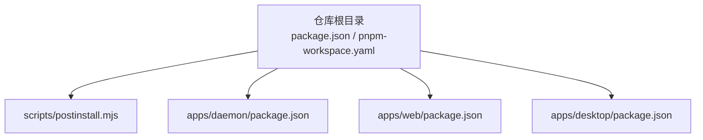
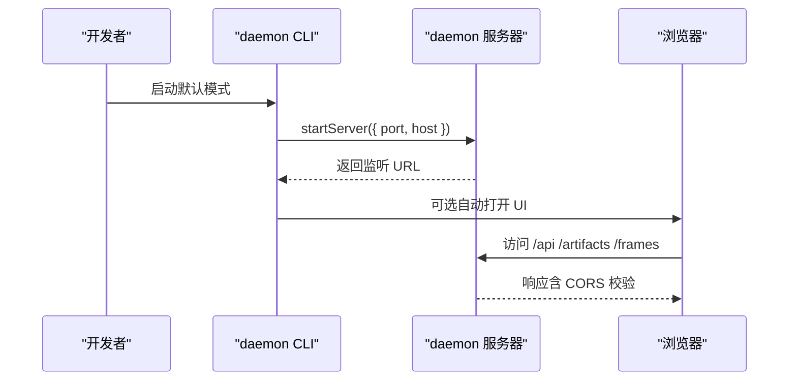
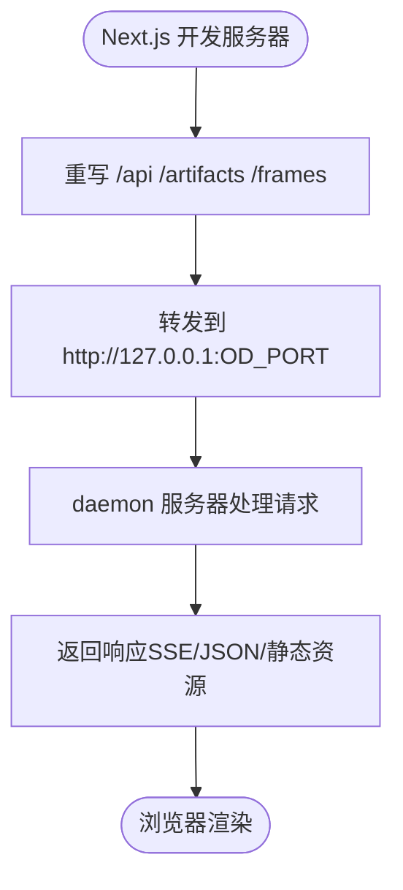
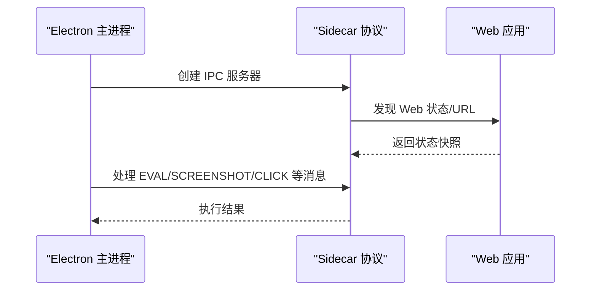
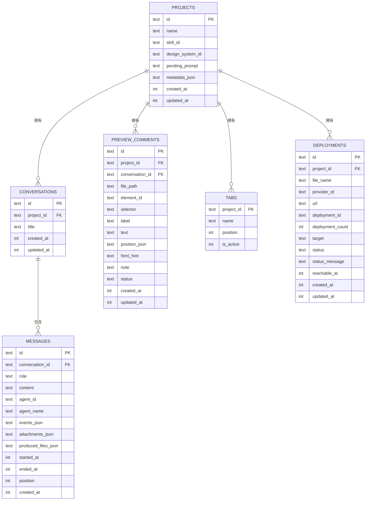
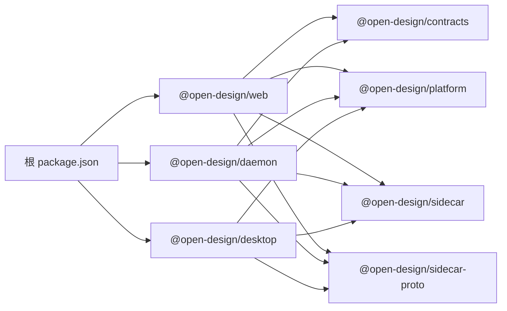

# 本地部署

<cite>
**本文引用的文件**
- [package.json](file://package.json)
- [pnpm-workspace.yaml](file://pnpm-workspace.yaml)
- [apps/daemon/package.json](file://apps/daemon/package.json)
- [apps/daemon/src/cli.ts](file://apps/daemon/src/cli.ts)
- [apps/daemon/src/server.ts](file://apps/daemon/src/server.ts)
- [apps/daemon/src/db.ts](file://apps/daemon/src/db.ts)
- [apps/daemon/src/app-config.ts](file://apps/daemon/src/app-config.ts)
- [apps/daemon/src/media-config.ts](file://apps/daemon/src/media-config.ts)
- [apps/web/package.json](file://apps/web/package.json)
- [apps/web/next.config.ts](file://apps/web/next.config.ts)
- [apps/web/sidecar/server.ts](file://apps/web/sidecar/server.ts)
- [apps/desktop/package.json](file://apps/desktop/package.json)
- [apps/desktop/src/main/index.ts](file://apps/desktop/src/main/index.ts)
- [scripts/postinstall.mjs](file://scripts/postinstall.mjs)
</cite>

## 目录
1. [简介](#简介)
2. [项目结构](#项目结构)
3. [核心组件](#核心组件)
4. [架构总览](#架构总览)
5. [详细组件分析](#详细组件分析)
6. [依赖关系分析](#依赖关系分析)
7. [性能考虑](#性能考虑)
8. [故障排查指南](#故障排查指南)
9. [结论](#结论)
10. [附录](#附录)

## 简介
本指南面向希望在本地完整运行 Open Design 的开发者，覆盖从 Node.js 24+、pnpm 10.33.x 安装，到 monorepo 依赖安装与构建，再到本地守护进程（daemon）、Web 应用、桌面应用的启动步骤。文档同时说明环境变量配置、数据库初始化、代理检测与跨域策略、开发服务器启动与热重载、调试配置，以及常见部署问题的排查方法。

## 项目结构
Open Design 采用 pnpm workspace 的 monorepo 架构，核心应用与工具分布在 apps、packages、tools 等目录中。根级 package.json 指定包管理器版本与 Node 引擎版本，apps/daemon 提供本地服务与 UI；apps/web 是 Next.js 前端；apps/desktop 是 Electron 桌面应用；scripts/postinstall.mjs 在首次安装时自动构建子包。



**图示来源**
- [package.json:1-43](file://package.json#L1-L43)
- [pnpm-workspace.yaml:1-6](file://pnpm-workspace.yaml#L1-L6)
- [scripts/postinstall.mjs:1-50](file://scripts/postinstall.mjs#L1-L50)
- [apps/daemon/package.json:1-57](file://apps/daemon/package.json#L1-L57)
- [apps/web/package.json:1-52](file://apps/web/package.json#L1-L52)
- [apps/desktop/package.json:1-34](file://apps/desktop/package.json#L1-L34)

**章节来源**
- [package.json:1-43](file://package.json#L1-L43)
- [pnpm-workspace.yaml:1-6](file://pnpm-workspace.yaml#L1-L6)

## 核心组件
- 本地守护进程（daemon）
  - 负责扫描可用代码代理、提供聊天 UI、代理消息给选定代理、暴露统一媒体生成接口等。
  - 默认监听端口可通过环境变量配置，支持绑定地址、自动打开浏览器等行为。
- Web 应用（Next.js）
  - 开发模式下通过重写将 /api、/artifacts、/frames 请求转发至 daemon；生产模式可静态导出由 daemon 服务。
- 桌面应用（Electron）
  - 作为桌面侧车（sidecar）运行，与 Web 应用通过 IPC 协作，提供截图、点击、控制台等能力。
- 数据与配置
  - 使用 SQLite 存储项目、会话、消息、预览评论、标签页、部署记录等元数据。
  - 应用偏好与媒体提供商密钥等配置持久化于数据目录。

**章节来源**
- [apps/daemon/src/cli.ts:61-90](file://apps/daemon/src/cli.ts#L61-L90)
- [apps/daemon/src/server.ts:781-800](file://apps/daemon/src/server.ts#L781-L800)
- [apps/web/next.config.ts:71-105](file://apps/web/next.config.ts#L71-L105)
- [apps/desktop/src/main/index.ts:81-143](file://apps/desktop/src/main/index.ts#L81-L143)
- [apps/daemon/src/db.ts:16-29](file://apps/daemon/src/db.ts#L16-L29)
- [apps/daemon/src/app-config.ts:99-117](file://apps/daemon/src/app-config.ts#L99-L117)

## 架构总览
本地开发时，Web 前端在 Next.js 开发服务器上运行，通过重写将 API 请求代理到 daemon；daemon 内部以 Express 提供服务，负责路由、上传、任务队列、SSE、SQLite 数据持久化、媒体生成等。桌面应用通过 sidecar 协议与 Web 进行 IPC 通信。

```mermaid
graph TB
subgraph "本地开发"
web_dev["Next.js 开发服务器<br/>apps/web/next.config.ts"]
daemon["Express 守护进程<br/>apps/daemon/src/server.ts"]
sqlite["SQLite 数据库<br/>apps/daemon/src/db.ts"]
end
subgraph "桌面应用"
electron["Electron 主进程<br/>apps/desktop/src/main/index.ts"]
sidecar["Sidecar 协议<br/>IPC 通信"]
end
web_dev --> |"重写 /api,/artifacts,/frames"| daemon
daemon --> sqlite
electron <- --> sidecar
electron --> web_dev
```

**图示来源**
- [apps/web/next.config.ts:89-99](file://apps/web/next.config.ts#L89-L99)
- [apps/daemon/src/server.ts:781-800](file://apps/daemon/src/server.ts#L781-L800)
- [apps/daemon/src/db.ts:16-29](file://apps/daemon/src/db.ts#L16-L29)
- [apps/desktop/src/main/index.ts:81-143](file://apps/desktop/src/main/index.ts#L81-L143)

## 详细组件分析

### 本地守护进程（daemon）启动与配置
- 启动方式
  - 通过二进制入口或直接运行 CLI，默认启动后会尝试打开浏览器访问 UI。
  - 支持命令行参数：端口、绑定地址、禁用自动打开等。
- 环境变量
  - OD_PORT：守护进程监听端口，默认 7456。
  - OD_BIND_HOST：绑定地址，默认 127.0.0.1。
  - OD_DATA_DIR：数据目录，用于存储 SQLite、项目文件、工件等。
  - OD_WEB_PORT：Web 应用端口，影响允许的浏览器来源校验。
  - OD_WEB_OUTPUT_MODE：生产模式输出模式，server 或静态导出。
  - OD_WEB_DIST_DIR：自定义构建产物目录。
  - OD_MEDIA_CONFIG_DIR：媒体提供商配置目录（相对项目根解析）。
- 跨域与来源校验
  - 仅允许来自回环地址或与绑定地址一致的来源访问 API；对特定路径允许空来源（沙箱 iframe）。
- 代理检测与 Origin 处理
  - Web 侧车在代理请求时会根据来源与 Host 头进行规范化，确保 daemon 接收正确的 Origin。



**图示来源**
- [apps/daemon/src/cli.ts:61-90](file://apps/daemon/src/cli.ts#L61-L90)
- [apps/daemon/src/server.ts:781-800](file://apps/daemon/src/server.ts#L781-L800)
- [apps/web/sidecar/server.ts:115-137](file://apps/web/sidecar/server.ts#L115-L137)

**章节来源**
- [apps/daemon/src/cli.ts:61-90](file://apps/daemon/src/cli.ts#L61-L90)
- [apps/daemon/src/server.ts:781-800](file://apps/daemon/src/server.ts#L781-L800)
- [apps/web/sidecar/server.ts:115-137](file://apps/web/sidecar/server.ts#L115-L137)

### Web 应用（Next.js）开发与代理
- 开发服务器
  - 使用 next dev，通过重写将 /api、/artifacts、/frames 转发到 daemon。
  - 允许的开发来源基于绑定主机自动推断，支持局域网访问场景。
- 生产构建
  - 默认静态导出（export），产物目录为 out；也可选择 server 模式由 Web 侧车托管。
- 环境变量
  - OD_PORT：与 daemon 端口保持一致。
  - OD_HOST：开发时绑定的主机地址，影响 allowedDevOrigins。
  - OD_WEB_OUTPUT_MODE：server 或 export。
  - OD_WEB_DIST_DIR：自定义构建目录。
  - OD_WEB_TSCONFIG_PATH：开发时使用的 tsconfig 路径。



**图示来源**
- [apps/web/next.config.ts:89-99](file://apps/web/next.config.ts#L89-L99)
- [apps/web/next.config.ts:53-69](file://apps/web/next.config.ts#L53-L69)

**章节来源**
- [apps/web/next.config.ts:71-105](file://apps/web/next.config.ts#L71-L105)

### 桌面应用（Electron）启动与 IPC
- 启动流程
  - Electron 主进程加载 sidecar 协议，建立 JSON IPC 服务器，监听状态查询、执行、截图、点击、控制台、关闭等消息。
  - 支持父进程监控，当父进程退出时优雅关闭。
- 与 Web 的协作
  - 通过 sidecar 发现 Web URL 并进行交互，实现桌面侧的自动化与控制。



**图示来源**
- [apps/desktop/src/main/index.ts:81-143](file://apps/desktop/src/main/index.ts#L81-L143)

**章节来源**
- [apps/desktop/src/main/index.ts:81-143](file://apps/desktop/src/main/index.ts#L81-L143)

### 数据库初始化与配置
- 数据库
  - 使用 SQLite 文件（app.sqlite），默认位于项目根下的 .od 目录，可通过 OD_DATA_DIR 覆盖。
  - 首次使用会自动迁移建表，包含 projects、templates、conversations、messages、preview_comments、tabs、deployments 等。
- 应用配置
  - app-config.json 持久化应用偏好（如 onboardingCompleted、agentId、agentModels、skillId、designSystemId）。
- 媒体配置
  - 媒体提供商（如 OpenAI、Anthropic 等）的密钥与基础地址可配置，支持相对项目根的覆盖目录。



**图示来源**
- [apps/daemon/src/db.ts:38-183](file://apps/daemon/src/db.ts#L38-L183)

**章节来源**
- [apps/daemon/src/db.ts:16-29](file://apps/daemon/src/db.ts#L16-L29)
- [apps/daemon/src/app-config.ts:99-117](file://apps/daemon/src/app-config.ts#L99-L117)
- [apps/daemon/src/media-config.ts:110-128](file://apps/daemon/src/media-config.ts#L110-L128)

## 依赖关系分析
- 包管理器与引擎
  - 根 package.json 指定 Node ~24 与 pnpm >=10.33.2 <11，并声明工作区范围。
- 依赖安装与构建
  - 首次安装后，postinstall.mjs 会为多个子包执行构建，确保 sidecar、platform、tools 等模块可用。
- 应用间依赖
  - apps/web 与 apps/daemon 共享 contracts、platform、sidecar、sidecar-proto。
  - apps/desktop 依赖 platform、sidecar、sidecar-proto。



**图示来源**
- [package.json:27-41](file://package.json#L27-L41)
- [apps/web/package.json:30-40](file://apps/web/package.json#L30-L40)
- [apps/daemon/package.json:34-51](file://apps/daemon/package.json#L34-L51)
- [apps/desktop/package.json:20-29](file://apps/desktop/package.json#L20-L29)

**章节来源**
- [package.json:27-41](file://package.json#L27-L41)
- [scripts/postinstall.mjs:8-14](file://scripts/postinstall.mjs#L8-L14)

## 性能考虑
- SSE 与反向代理
  - daemon 使用 SSE 推送事件流，需确保反向代理不缓冲 SSE（例如关闭 gzip、保持连接不断开）。
- 上传与文件大小限制
  - 项目上传与导入有明确大小上限，避免过大的单文件导致内存压力。
- 数据库 WAL 与外键
  - SQLite 采用 WAL 模式与外键约束，有助于并发读写与数据一致性。

**章节来源**
- [apps/daemon/src/server.ts:574-630](file://apps/daemon/src/server.ts#L574-L630)
- [apps/daemon/src/db.ts:23-24](file://apps/daemon/src/db.ts#L23-L24)

## 故障排查指南
- 端口占用与绑定
  - 若端口被占用，调整 OD_PORT 或停止占用进程；若需要对外访问，设置 OD_BIND_HOST 为允许的地址。
- CORS 与来源校验
  - 当浏览器提示跨域错误，检查 OD_WEB_PORT 与实际 Web 端口是否一致，以及 OD_HOST 是否正确。
- 代理与反向代理
  - 若使用 Nginx 等代理，确保关闭 gzip、禁用缓冲，并透传 Host、X-Forwarded-* 头。
- 上传失败
  - 检查上传字段数量、文件大小与类型限制，必要时增大限制或拆分上传。
- 数据库权限
  - 确认 OD_DATA_DIR 指向的目录可写，否则会抛出权限相关错误。
- 媒体配置缺失
  - 确保媒体提供商的密钥与基础地址已正确配置，或放置在 OD_MEDIA_CONFIG_DIR 指定的相对路径中。

**章节来源**
- [apps/daemon/src/server.ts:781-800](file://apps/daemon/src/server.ts#L781-L800)
- [apps/web/next.config.ts:53-69](file://apps/web/next.config.ts#L53-L69)
- [apps/daemon/src/db.ts:476-483](file://apps/daemon/src/db.ts#L476-L483)
- [apps/daemon/src/media-config.ts:130-138](file://apps/daemon/src/media-config.ts#L130-L138)

## 结论
通过遵循本指南，您可以在本地完成 Open Design 的完整部署与开发：安装满足要求的 Node.js 与 pnpm，执行 monorepo 依赖安装与构建，启动 daemon、Web 与桌面应用，并正确配置环境变量与数据库。遇到问题时，可依据故障排查指南快速定位并解决。

## 附录

### 环境变量一览
- OD_PORT：守护进程监听端口（默认 7456）
- OD_BIND_HOST：绑定地址（默认 127.0.0.1）
- OD_DATA_DIR：数据目录（默认 项目根/.od）
- OD_WEB_PORT：Web 应用端口（影响来源校验）
- OD_WEB_OUTPUT_MODE：server 或 export
- OD_WEB_DIST_DIR：自定义构建目录
- OD_WEB_TSCONFIG_PATH：开发时使用的 tsconfig
- OD_MEDIA_CONFIG_DIR：媒体配置目录（相对项目根）

**章节来源**
- [apps/daemon/src/cli.ts:62-64](file://apps/daemon/src/cli.ts#L62-L64)
- [apps/web/next.config.ts:9-18](file://apps/web/next.config.ts#L9-L18)
- [apps/daemon/src/media-config.ts:110-128](file://apps/daemon/src/media-config.ts#L110-L128)