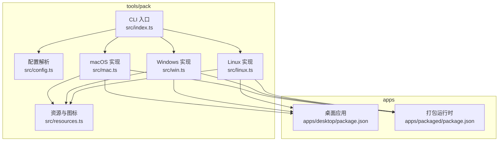
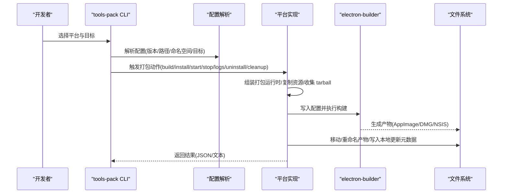
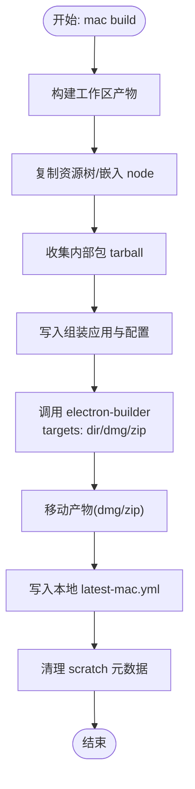
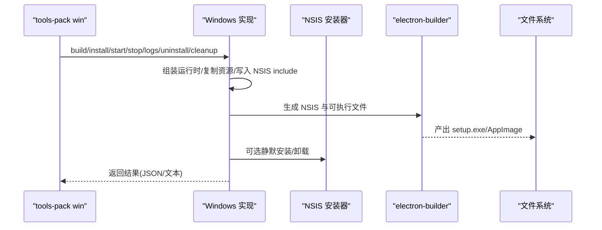
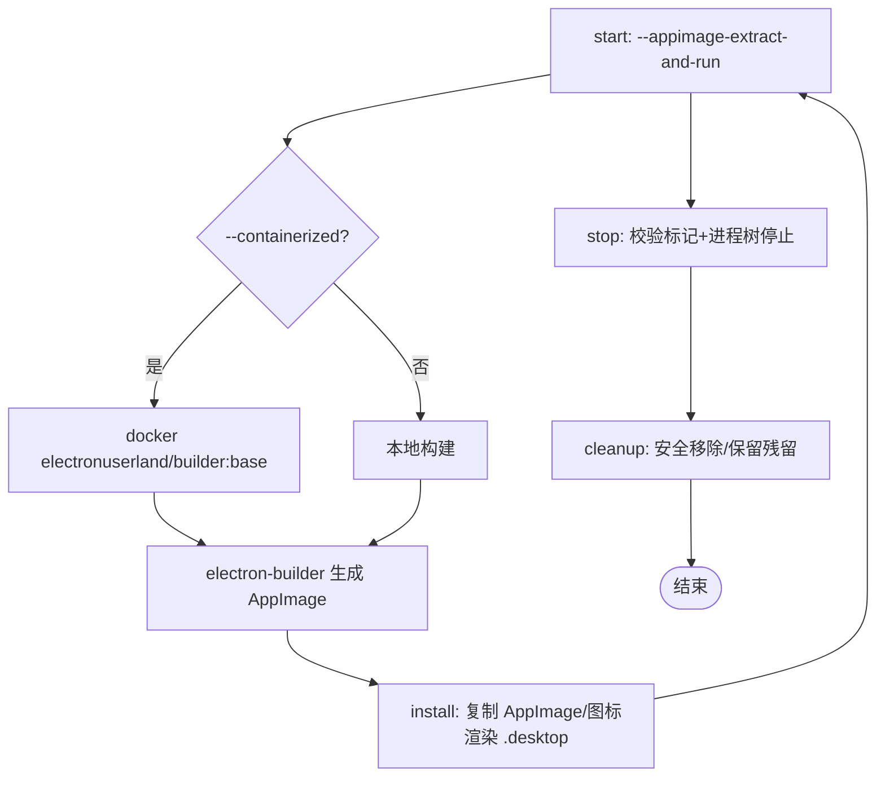
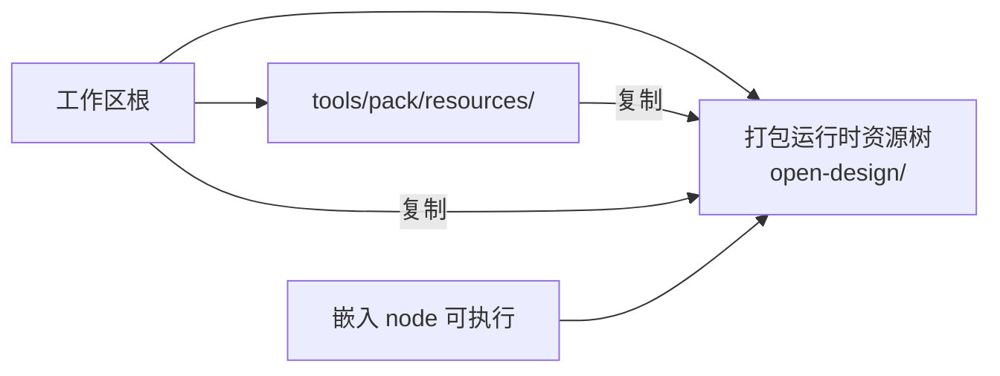
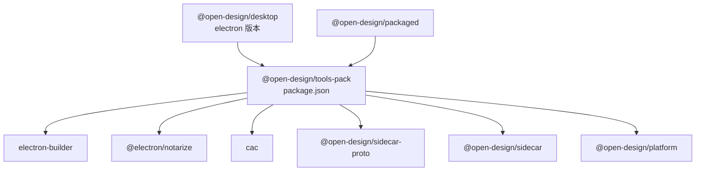

# 桌面应用打包

<cite>
**本文档引用的文件**
- [tools/pack/src/index.ts](file://tools/pack/src/index.ts)
- [tools/pack/src/config.ts](file://tools/pack/src/config.ts)
- [tools/pack/src/mac.ts](file://tools/pack/src/mac.ts)
- [tools/pack/src/win.ts](file://tools/pack/src/win.ts)
- [tools/pack/src/linux.ts](file://tools/pack/src/linux.ts)
- [tools/pack/src/resources.ts](file://tools/pack/src/resources.ts)
- [tools/pack/README.md](file://tools/pack/README.md)
- [tools/pack/package.json](file://tools/pack/package.json)
- [apps/desktop/package.json](file://apps/desktop/package.json)
- [apps/packaged/package.json](file://apps/packaged/package.json)
- [tools/pack/resources/mac/entitlements.mac.plist](file://tools/pack/resources/mac/entitlements.mac.plist)
</cite>

## 目录
1. [简介](#简介)
2. [项目结构](#项目结构)
3. [核心组件](#核心组件)
4. [架构总览](#架构总览)
5. [详细组件分析](#详细组件分析)
6. [依赖关系分析](#依赖关系分析)
7. [性能考虑](#性能考虑)
8. [故障排查指南](#故障排查指南)
9. [结论](#结论)
10. [附录](#附录)

## 简介
本指南面向 Open Design 桌面应用的打包与发布，系统性阐述基于 Electron 的跨平台打包流程（Linux、macOS、Windows），并深入解析 tools/pack 工具链的工作原理。内容涵盖：
- 打包流程与平台差异
- 资源文件处理、签名与权限配置
- 开发环境准备、依赖安装与构建命令
- 应用图标制作、安装包配置与自动更新机制
- 平台特定安全配置、沙箱与权限管理
- 打包问题排查与性能优化建议

## 项目结构
tools/pack 是一个独立的打包控制平面，负责在不同平台上生成可分发的应用包，并提供生命周期管理（启动、停止、日志、卸载、清理）。

**图表来源**
- [tools/pack/src/index.ts:1-204](file://tools/pack/src/index.ts#L1-L204)
- [tools/pack/src/config.ts:1-147](file://tools/pack/src/config.ts#L1-L147)
- [tools/pack/src/resources.ts:1-71](file://tools/pack/src/resources.ts#L1-L71)
- [tools/pack/src/mac.ts:1-1005](file://tools/pack/src/mac.ts#L1-L1005)
- [tools/pack/src/win.ts:1-1201](file://tools/pack/src/win.ts#L1-L1201)
- [tools/pack/src/linux.ts:1-1079](file://tools/pack/src/linux.ts#L1-L1079)
- [apps/desktop/package.json:1-34](file://apps/desktop/package.json#L1-L34)
- [apps/packaged/package.json:1-40](file://apps/packaged/package.json#L1-L40)

**章节来源**
- [tools/pack/src/index.ts:1-204](file://tools/pack/src/index.ts#L1-L204)
- [tools/pack/src/config.ts:1-147](file://tools/pack/src/config.ts#L1-L147)
- [tools/pack/README.md:1-126](file://tools/pack/README.md#L1-L126)

## 核心组件
- CLI 入口与命令分发：解析参数、路由到各平台实现，支持 JSON 输出与命名空间隔离。
- 配置解析：统一解析 Electron 版本、输出目录、命名空间、构建目标等。
- 平台实现：分别封装 Electron Builder 配置、资源复制、产物移动与元数据生成。
- 资源与图标：集中管理 macOS/Windows/Linux 图标与模板，复制工作区资源树。
- 生命周期管理：启动、停止、日志读取、卸载、清理，含进程树管理与验证。

**章节来源**
- [tools/pack/src/index.ts:1-204](file://tools/pack/src/index.ts#L1-L204)
- [tools/pack/src/config.ts:1-147](file://tools/pack/src/config.ts#L1-L147)
- [tools/pack/src/resources.ts:1-71](file://tools/pack/src/resources.ts#L1-L71)

## 架构总览
tools/pack 的打包流程围绕“组装打包运行时 → 生成 Electron Builder 配置 → 调用 electron-builder → 复制/重命名产物 → 写入本地更新元数据”的主干展开。每个平台在资源、签名、安装器与安装路径上存在差异。

**图表来源**
- [tools/pack/src/index.ts:90-201](file://tools/pack/src/index.ts#L90-L201)
- [tools/pack/src/config.ts:101-147](file://tools/pack/src/config.ts#L101-L147)
- [tools/pack/src/mac.ts:547-567](file://tools/pack/src/mac.ts#L547-L567)
- [tools/pack/src/win.ts:833-852](file://tools/pack/src/win.ts#L833-L852)
- [tools/pack/src/linux.ts:463-496](file://tools/pack/src/linux.ts#L463-L496)

## 详细组件分析

### macOS 打包与签名
- 构建目标：支持 all/app/dmg/zip；默认 all；可选 --signed 进行公证。
- 资源与签名：使用 entitlements.plist 与 notarize.cjs；未签名时禁用 hardenedRuntime 与公证。
- 产物处理：移动 DMG/ZIP 至命名空间目录，清理 .blockmap 与 latest-mac.yml。
- 安装与启动：支持将 .app 安装到用户 Applications；启动时写入 desktop-root.json 标记，停止时严格校验命名空间/IPC/命令行一致性。
- 日志与清理：提供 logs 命令读取 desktop/web/daemon 日志；cleanup 清理挂载点与输出/运行时根。

**图表来源**
- [tools/pack/src/mac.ts:547-567](file://tools/pack/src/mac.ts#L547-L567)
- [tools/pack/src/mac.ts:515-545](file://tools/pack/src/mac.ts#L515-L545)

**章节来源**
- [tools/pack/src/mac.ts:1-1005](file://tools/pack/src/mac.ts#L1-L1005)
- [tools/pack/resources/mac/entitlements.mac.plist:1-13](file://tools/pack/resources/mac/entitlements.mac.plist#L1-L13)
- [tools/pack/README.md:5-61](file://tools/pack/README.md#L5-L61)

### Windows 打包与安装器
- 构建目标：支持 all/dir/nsis；默认 nsis；可选 --silent 静默安装。
- 安装器语言：内置多语言支持，包含波斯语别名修复；支持桌面/开始菜单快捷方式。
- 卸载与残留：查询注册表残留项，按策略移除 data/logs/sidecars/product-user-data；记录卸载时间线与日志。
- 进程管理：通过 stamp 校验与进程树停止；支持 inspect 动态评估与截图。
- 产物与元数据：生成 setup.exe 与 latest.yml；支持 blockmap。

**图表来源**
- [tools/pack/src/win.ts:833-852](file://tools/pack/src/win.ts#L833-L852)
- [tools/pack/src/win.ts:927-961](file://tools/pack/src/win.ts#L927-L961)
- [tools/pack/src/win.ts:1054-1093](file://tools/pack/src/win.ts#L1054-L1093)

**章节来源**
- [tools/pack/src/win.ts:1-1201](file://tools/pack/src/win.ts#L1-L1201)
- [tools/pack/README.md:62-126](file://tools/pack/README.md#L62-L126)

### Linux 打包与 AppImage
- 构建目标：支持 all/appimage/dir；默认 all；可选 --containerized 使用 electronuserland/builder:base。
- 容器化构建：映射工具包根目录与缓存，避免 root 权限问题；内层通过 corepack pnpm 调用。
- 启动模式：始终使用 --appimage-extract-and-run 以规避 FUSE 性能问题；首次解压至 /tmp。
- 安装与菜单集成：复制 AppImage/图标，渲染 .desktop 模板，尝试刷新 desktop-database 与 icon-cache。
- 进程验证：通过 desktop-root.json 标记与进程树校验，确保停止操作仅影响当前命名空间。

**图表来源**
- [tools/pack/src/linux.ts:463-496](file://tools/pack/src/linux.ts#L463-L496)
- [tools/pack/src/linux.ts:506-538](file://tools/pack/src/linux.ts#L506-L538)
- [tools/pack/src/linux.ts:761-833](file://tools/pack/src/linux.ts#L761-L833)
- [tools/pack/src/linux.ts:841-946](file://tools/pack/src/linux.ts#L841-L946)

**章节来源**
- [tools/pack/src/linux.ts:1-1079](file://tools/pack/src/linux.ts#L1-L1079)
- [tools/pack/README.md:62-126](file://tools/pack/README.md#L62-L126)

### 资源文件处理与图标
- 资源复制：将 skills/design-systems/craft/assets/prompt-templates 等目录复制到打包运行时资源树。
- 图标与模板：macOS 使用 icns/png 与 notarize 钩子；Windows 使用 ico；Linux 使用 png 与 .desktop 模板。
- Node 嵌入：在资源树 bin 下嵌入 node 可执行文件，赋予可执行权限。

**图表来源**
- [tools/pack/src/resources.ts:49-71](file://tools/pack/src/resources.ts#L49-L71)
- [tools/pack/src/resources.ts:32-47](file://tools/pack/src/resources.ts#L32-L47)

**章节来源**
- [tools/pack/src/resources.ts:1-71](file://tools/pack/src/resources.ts#L1-L71)

## 依赖关系分析
- 工具链依赖：electron-builder、@electron/notarize、cac；运行时依赖 @open-design/sidecar-proto、@open-design/sidecar、@open-design/platform。
- Electron 版本：从 apps/desktop/package.json 中解析 electron 版本，确保与打包运行时一致。
- 平台差异：macOS 强依赖签名/公证；Windows 依赖 NSIS 语言文件与注册表清理；Linux 依赖 AppImage 启动模式与容器化兼容性。

**图表来源**
- [tools/pack/package.json:15-32](file://tools/pack/package.json#L15-L32)
- [apps/desktop/package.json:25-29](file://apps/desktop/package.json#L25-L29)
- [apps/packaged/package.json:22-39](file://apps/packaged/package.json#L22-L39)

**章节来源**
- [tools/pack/package.json:1-34](file://tools/pack/package.json#L1-L34)
- [apps/desktop/package.json:1-34](file://apps/desktop/package.json#L1-L34)
- [apps/packaged/package.json:1-40](file://apps/packaged/package.json#L1-L40)

## 性能考虑
- Linux AppImage 启动性能：优先使用 --appimage-extract-and-run，避免 FUSE 挂载导致的模块加载缓慢。
- 容器化构建：通过 electronuserland/builder:base 提供 glibc 兼容性，避免在滚动发行版上构建的二进制在稳定版不可用。
- 缓存与并行：Docker 缓存目录映射减少重复下载；pnpm 并行构建工作区包。
- 产物压缩：electron-builder 使用 maximum 压缩级别，平衡体积与分发速度。

**章节来源**
- [tools/pack/README.md:88-114](file://tools/pack/README.md#L88-L114)
- [tools/pack/src/linux.ts:506-538](file://tools/pack/src/linux.ts#L506-L538)

## 故障排查指南
- macOS
  - 未签名 DMG/ZIP 无法通过 Gatekeeper：使用 --signed 或在 CI 中配置证书。
  - 停止失败为 unmanaged：检查 desktop-root.json 标记是否被外部进程占用或命令行不匹配。
  - 日志定位：使用 logs 命令查看 desktop/web/daemon 最新日志。
- Windows
  - NSIS 语言缺失：工具会自动添加波斯语别名；若仍失败，确认缓存目录权限。
  - 卸载残留：通过 registry 查询残留键值，必要时手动清理或以管理员权限重试。
  - 进程未停止：inspect 获取状态，必要时强制停止进程树。
- Linux
  - FUSE 性能问题：确保使用 --appimage-extract-and-run；如需菜单启动，确保 .desktop 中正确传递该参数。
  - 沙箱与 chrome-sandbox：根据内核版本设置 kernel.unprivileged_userns_clone 或使用 --no-sandbox。
  - 容器构建失败：检查 Docker 可用性与缓存目录权限；关注退出码与信号。

**章节来源**
- [tools/pack/src/mac.ts:915-955](file://tools/pack/src/mac.ts#L915-L955)
- [tools/pack/src/win.ts:1054-1093](file://tools/pack/src/win.ts#L1054-L1093)
- [tools/pack/src/linux.ts:841-946](file://tools/pack/src/linux.ts#L841-L946)
- [tools/pack/README.md:104-126](file://tools/pack/README.md#L104-L126)

## 结论
tools/pack 将 Electron 打包、资源嵌入、平台差异化配置与生命周期管理整合为统一工具链。通过命名空间隔离与严格的进程/标记校验，确保多开发者环境下的安全与可维护性。建议在 CI 中启用容器化构建与签名/公证流程，结合本地调试命令快速迭代。

## 附录

### 平台特定配置与命令速查
- macOS
  - 构建：tools-pack mac build --to all|app|dmg|zip [--signed] [--portable]
  - 安装/启动/停止/日志/卸载/清理：install/start/stop/logs/uninstall/cleanup
- Windows
  - 构建：tools-pack win build --to all|dir|nsis [--silent] [--portable]
  - 安装/启动/停止/日志/卸载/清理/列表/重置/检查：install/start/stop/logs/uninstall/cleanup/list/reset/inspect
- Linux
  - 构建：tools-pack linux build --to all|appimage|dir [--containerized] [--portable]
  - 安装/启动/停止/日志/卸载/清理：install/start/stop/logs/uninstall/cleanup

**章节来源**
- [tools/pack/src/index.ts:90-201](file://tools/pack/src/index.ts#L90-L201)
- [tools/pack/README.md:5-126](file://tools/pack/README.md#L5-L126)