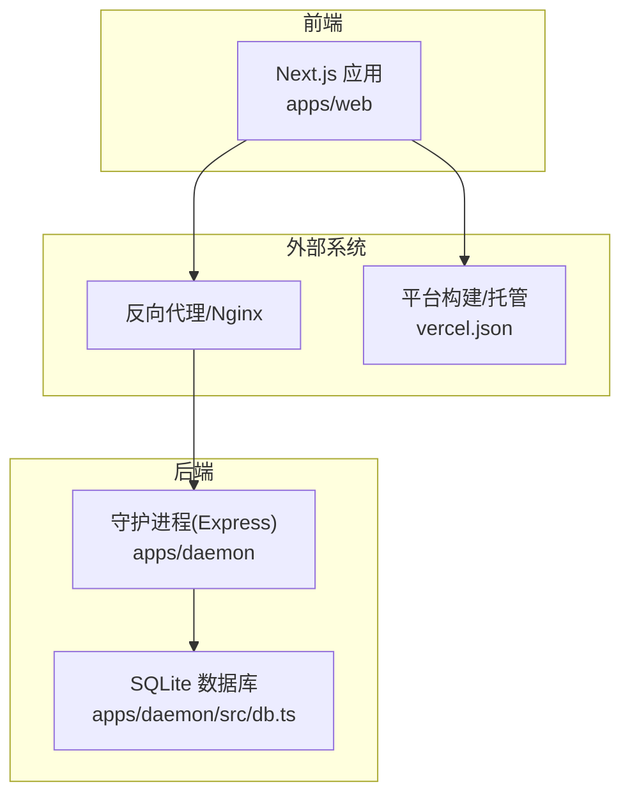
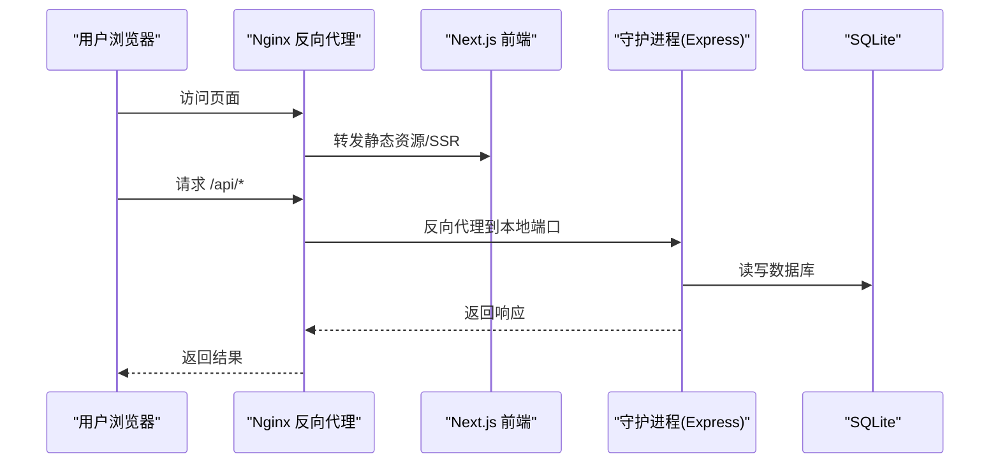
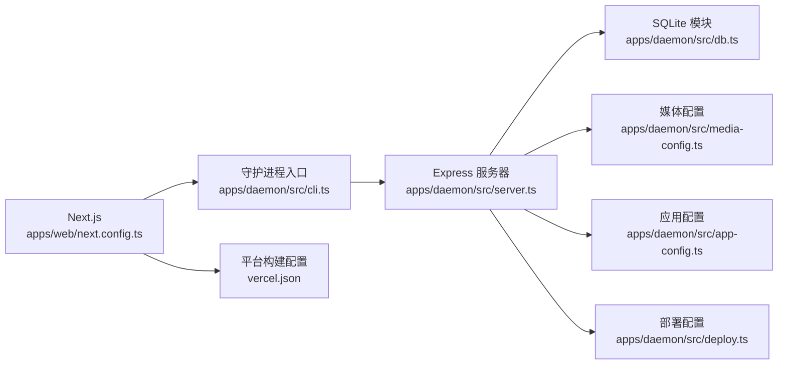

# 生产环境配置

<cite>
**本文引用的文件**
- [apps/daemon/src/cli.ts](file://apps/daemon/src/cli.ts)
- [apps/daemon/src/server.ts](file://apps/daemon/src/server.ts)
- [apps/daemon/src/app-config.ts](file://apps/daemon/src/app-config.ts)
- [apps/daemon/src/media-config.ts](file://apps/daemon/src/media-config.ts)
- [apps/daemon/src/db.ts](file://apps/daemon/src/db.ts)
- [apps/daemon/src/deploy.ts](file://apps/daemon/src/deploy.ts)
- [apps/web/next.config.ts](file://apps/web/next.config.ts)
- [apps/web/src/dev-hosts.ts](file://apps/web/src/dev-hosts.ts)
- [apps/web/src/state/config.ts](file://apps/web/src/state/config.ts)
- [apps/packaged/src/logging.ts](file://apps/packaged/src/logging.ts)
- [tools/dev/src/diagnostics.ts](file://tools/dev/src/diagnostics.ts)
- [tools/dev/src/diagnostics.test.ts](file://tools/dev/src/diagnostics.test.ts)
- [specs/current/architecture-boundaries.md](file://specs/current/architecture-boundaries.md)
- [specs/current/maintainability-roadmap.md](file://specs/current/maintainability-roadmap.md)
- [QUICKSTART.ja-JP.md](file://QUICKSTART.ja-JP.md)
- [vercel.json](file://vercel.json)
- [package.json](file://package.json)
</cite>

## 目录
1. [简介](#简介)
2. [项目结构](#项目结构)
3. [核心组件](#核心组件)
4. [架构总览](#架构总览)
5. [详细组件分析](#详细组件分析)
6. [依赖关系分析](#依赖关系分析)
7. [性能考虑](#性能考虑)
8. [故障排查指南](#故障排查指南)
9. [结论](#结论)
10. [附录](#附录)

## 简介
本指南面向在生产环境中部署与运行 Open Design 的工程团队，聚焦以下目标：
- 明确生产环境下的环境变量配置方法（数据库、代理 API 密钥、文件存储路径）
- 安全配置（CORS、本地绑定、Origin 校验、密钥管理）
- 性能优化（缓存策略、数据库连接池、内存限制）
- 日志与可观测性（日志格式、诊断工具、错误上报）
- 负载均衡与反向代理（Nginx 示例）、SSL 证书
- 配置验证与常见问题排查

## 项目结构
Open Design 采用多应用工作区布局：前端 Next.js 应用、本地守护进程（Express）以及打包桌面端等模块协同工作。生产部署通常以“静态导出 + 反向代理”或“服务端渲染 + 反代”的方式运行。

图示来源
- [apps/web/next.config.ts:71-105](file://apps/web/next.config.ts#L71-L105)
- [apps/daemon/src/server.ts:1-200](file://apps/daemon/src/server.ts#L1-L200)
- [apps/daemon/src/db.ts:172-263](file://apps/daemon/src/db.ts#L172-L263)
- [vercel.json:1-8](file://vercel.json#L1-L8)

章节来源
- [apps/web/next.config.ts:1-108](file://apps/web/next.config.ts#L1-L108)
- [apps/daemon/src/server.ts:1-200](file://apps/daemon/src/server.ts#L1-L200)
- [vercel.json:1-8](file://vercel.json#L1-L8)

## 核心组件
- 守护进程（Daemon）：负责本地能力（文件系统、子进程、SSE 流）、代理 API、媒体生成、部署配置等。
- 前端（Web）：Next.js 应用，开发时通过重写代理到守护进程；生产可静态导出或服务端渲染。
- 配置与密钥：应用偏好、媒体提供商密钥、部署凭据等。
- 数据存储：SQLite（本地），支持迁移与列演进。
- 反向代理：Nginx 示例用于非缓冲 SSE、禁用压缩、长连接超时等。

章节来源
- [apps/daemon/src/cli.ts:62-90](file://apps/daemon/src/cli.ts#L62-L90)
- [apps/daemon/src/server.ts:1-200](file://apps/daemon/src/server.ts#L1-L200)
- [apps/daemon/src/app-config.ts:1-154](file://apps/daemon/src/app-config.ts#L1-L154)
- [apps/daemon/src/media-config.ts:1-200](file://apps/daemon/src/media-config.ts#L1-L200)
- [apps/daemon/src/db.ts:172-263](file://apps/daemon/src/db.ts#L172-L263)

## 架构总览
生产环境典型拓扑：
- 前端 Next.js 在生产模式下可选择静态导出（export）或服务端渲染（server）输出模式。
- 反向代理（如 Nginx）将 /api、/artifacts、/frames 等路由转发至本地守护进程。
- 守护进程仅监听本地回环地址，避免暴露到公网。
- 媒体生成、部署等功能通过守护进程内部接口完成，不直接暴露给公网。

图示来源
- [apps/web/next.config.ts:89-104](file://apps/web/next.config.ts#L89-L104)
- [apps/daemon/src/cli.ts:62-90](file://apps/daemon/src/cli.ts#L62-L90)
- [apps/daemon/src/server.ts:1-200](file://apps/daemon/src/server.ts#L1-L200)
- [apps/daemon/src/db.ts:172-263](file://apps/daemon/src/db.ts#L172-L263)

## 详细组件分析

### 环境变量与端口配置
- 守护进程默认监听本地回环地址与固定端口，可通过环境变量覆盖主机与端口。
- 前端在开发模式下通过重写将 /api、/artifacts、/frames 路由代理到守护进程。
- 生产模式下静态导出或服务端渲染，输出目录与模式由环境变量控制。

章节来源
- [apps/daemon/src/cli.ts:62-115](file://apps/daemon/src/cli.ts#L62-L115)
- [apps/web/next.config.ts:5-38](file://apps/web/next.config.ts#L5-L38)
- [apps/web/next.config.ts:71-105](file://apps/web/next.config.ts#L71-L105)

### 数据库连接与存储
- 使用 SQLite 存储项目、会话、部署状态等数据。
- 启动时自动迁移表结构，确保新增列（如状态、可达时间）存在。
- 提供列表、查询、插入/更新等操作封装。

章节来源
- [apps/daemon/src/db.ts:172-263](file://apps/daemon/src/db.ts#L172-L263)

### 媒体提供商密钥与文件存储
- 媒体配置文件位置优先级：显式媒体配置目录 > 通用数据目录 > 工作区默认目录。
- 支持通过环境变量覆盖特定提供商密钥，便于在容器或平台中注入密钥。
- 写入配置时对未知提供商键进行过滤，避免误写；空密钥会删除对应条目。

章节来源
- [apps/daemon/src/media-config.ts:1-200](file://apps/daemon/src/media-config.ts#L1-L200)
- [apps/daemon/src/media-config.ts:263-318](file://apps/daemon/src/media-config.ts#L263-L318)

### 应用偏好与 Origin 校验
- 应用偏好（如引导完成、默认代理模型等）保存在守护进程侧，跨浏览器/Origin 不丢失。
- 守护进程对跨源请求进行校验，仅允许来自受信任来源（本地同源或受信任的 Web 端口）访问。
- 通过环境变量指定受信任 Web 端口，实现代理场景下的 Origin 放行。

章节来源
- [apps/daemon/src/app-config.ts:1-154](file://apps/daemon/src/app-config.ts#L1-L154)
- [apps/daemon/src/server.ts:1-200](file://apps/daemon/src/server.ts#L1-L200)
- [apps/daemon/tests/app-config.test.ts:219-353](file://apps/daemon/tests/app-config.test.ts#L219-L353)

### 部署配置与凭据
- 部署配置（如 Vercel Token、Team 信息）写入受保护的配置文件，权限严格限制。
- 公开配置对象仅返回必要字段，敏感令牌进行掩码处理。

章节来源
- [apps/daemon/src/deploy.ts:45-77](file://apps/daemon/src/deploy.ts#L45-L77)

### 前端配置与开发主机白名单
- 开发模式下根据主机参数动态生成允许的 Origin 列表，支持局域网与本地域名。
- 前端应用配置从本地存储加载，合并默认值与持久化设置。

章节来源
- [apps/web/src/dev-hosts.ts:1-30](file://apps/web/src/dev-hosts.ts#L1-L30)
- [apps/web/src/state/config.ts:215-238](file://apps/web/src/state/config.ts#L215-L238)

### 反向代理与 Nginx 配置
- 推荐使用 Nginx 作为反向代理，开启无缓冲与禁用压缩以保证 SSE 正常传输。
- 设置长超时、HTTP/1.1、移除 Connection 头，透传 Host、X-Real-IP、X-Forwarded-* 等头部。
- 将 /api、/artifacts、/frames 路由转发到守护进程本地端口。

章节来源
- [QUICKSTART.ja-JP.md:114-131](file://QUICKSTART.ja-JP.md#L114-L131)

## 依赖关系分析
- 前端 Next.js 与守护进程通过 /api/* 重写或反向代理交互。
- 守护进程内部模块解耦：路由、服务、数据库、媒体、部署等职责分离。
- 平台构建（Vercel）与本地守护进程互不干扰，分别负责前端静态导出与本地能力。

图示来源
- [apps/web/next.config.ts:71-105](file://apps/web/next.config.ts#L71-L105)
- [apps/daemon/src/cli.ts:62-90](file://apps/daemon/src/cli.ts#L62-L90)
- [apps/daemon/src/server.ts:1-200](file://apps/daemon/src/server.ts#L1-L200)
- [apps/daemon/src/db.ts:172-263](file://apps/daemon/src/db.ts#L172-L263)
- [apps/daemon/src/media-config.ts:1-200](file://apps/daemon/src/media-config.ts#L1-L200)
- [apps/daemon/src/app-config.ts:1-154](file://apps/daemon/src/app-config.ts#L1-L154)
- [apps/daemon/src/deploy.ts:45-77](file://apps/daemon/src/deploy.ts#L45-L77)
- [vercel.json:1-8](file://vercel.json#L1-L8)

## 性能考虑
- 缓存策略
  - 前端静态导出可结合 CDN 缓存策略；对于动态内容（/api/*）建议通过反代缓存静态资源，避免重复生成。
  - 媒体生成结果建议在项目内缓存，减少重复调用第三方 API。
- 数据库连接池
  - 默认使用单连接 SQLite；生产中若并发较高，可评估外部数据库替代方案，并在守护进程侧增加连接池与事务隔离。
- 内存限制
  - 通过进程管理器（如 systemd、PM2）设置内存上限与重启策略，防止媒体生成等高内存任务导致 OOM。
- SSE 与长连接
  - 反代需保持无缓冲与禁用压缩，确保流式事件及时送达。

章节来源
- [apps/daemon/src/server.ts:1-200](file://apps/daemon/src/server.ts#L1-L200)
- [QUICKSTART.ja-JP.md:114-131](file://QUICKSTART.ja-JP.md#L114-L131)

## 故障排查指南
- 启动诊断与日志
  - 诊断工具会在启动超时等错误时附加最近日志尾部与推荐修复提示。
  - 桌面端日志记录器支持结构化输出与元数据归一化，便于问题定位。
- 常见问题
  - SSE 不可用：检查反代是否启用无缓冲与禁用压缩，确认超时设置足够长。
  - 跨源被拒：确认 Origin 与 Host 头正确，必要时通过受信任 Web 端口放行。
  - 媒体密钥未生效：确认环境变量名与覆盖顺序，检查配置文件写入权限。
  - 部署凭据泄露：仅通过受保护的配置文件存储，避免明文写入日志或前端。

章节来源
- [tools/dev/src/diagnostics.ts:39-56](file://tools/dev/src/diagnostics.ts#L39-L56)
- [tools/dev/src/diagnostics.test.ts:25-44](file://tools/dev/src/diagnostics.test.ts#L25-L44)
- [apps/packaged/src/logging.ts:1-34](file://apps/packaged/src/logging.ts#L1-L34)
- [apps/daemon/tests/app-config.test.ts:219-353](file://apps/daemon/tests/app-config.test.ts#L219-L353)

## 结论
生产环境的关键在于“最小暴露面 + 清晰边界 + 可观测性”。通过本地绑定、严格的跨源校验、受控的密钥注入与反代配置，Open Design 可在本地首的模式下安全稳定地运行。配合缓存、长连接与诊断工具，可进一步提升用户体验与运维效率。

## 附录

### 环境变量清单（生产）
- 守护进程
  - OD_PORT：守护进程监听端口（默认 7456）
  - OD_BIND_HOST：守护进程绑定地址（默认 127.0.0.1）
  - OD_WEB_PORT：受信任的 Web 端口（用于 Origin 放行）
  - OD_DATA_DIR：通用数据目录（影响应用配置、媒体配置等）
  - OD_MEDIA_CONFIG_DIR：媒体配置文件独立存放目录
  - OD_DAEMON_URL：媒体子命令使用的守护进程地址
  - OD_PROJECT_ID：媒体子命令使用的项目标识
- 前端
  - NODE_ENV：开发/生产模式
  - OD_WEB_OUTPUT_MODE：输出模式（export 或 server）
  - OD_WEB_PROD：生产模式标记
  - OD_WEB_DIST_DIR：自定义构建输出目录
  - OD_WEB_TSCONFIG_PATH：开发时自定义 tsconfig 路径
  - OD_HOST：开发时允许的 Origin 主机解析
- 平台
  - vercel.json：平台构建与输出目录配置

章节来源
- [apps/daemon/src/cli.ts:62-115](file://apps/daemon/src/cli.ts#L62-L115)
- [apps/daemon/src/server.ts:1-200](file://apps/daemon/src/server.ts#L1-L200)
- [apps/web/next.config.ts:5-38](file://apps/web/next.config.ts#L5-L38)
- [apps/web/next.config.ts:71-105](file://apps/web/next.config.ts#L71-L105)
- [vercel.json:1-8](file://vercel.json#L1-L8)

### 反向代理（Nginx）要点
- 关闭缓冲与压缩，保持 SSE 流式传输
- 设置长超时与 HTTP/1.1
- 透传必要的头部（Host、X-Real-IP、X-Forwarded-*）
- 将 /api、/artifacts、/frames 转发到守护进程本地端口

章节来源
- [QUICKSTART.ja-JP.md:114-131](file://QUICKSTART.ja-JP.md#L114-L131)

### SSL 证书与 HTTPS
- 若需 HTTPS，请在反向代理层统一终止 TLS，将 HTTP 流量转发至本地守护进程。
- 证书与私钥配置于反代（Nginx/Apache/Traefik），守护进程仍保持本地绑定。

[本节为通用实践说明，无需文件引用]

### 配置验证清单
- 端口与主机：确认守护进程绑定地址与端口，仅监听本地回环
- 反代：SSE 无缓冲、禁用压缩、长超时、透传头部
- 密钥：环境变量覆盖生效、配置文件权限严格
- 数据库：迁移成功、表结构包含新增列
- 前端：静态导出或服务端渲染输出目录正确

章节来源
- [apps/daemon/src/cli.ts:62-115](file://apps/daemon/src/cli.ts#L62-L115)
- [apps/daemon/src/db.ts:172-263](file://apps/daemon/src/db.ts#L172-L263)
- [apps/daemon/src/media-config.ts:1-200](file://apps/daemon/src/media-config.ts#L1-L200)
- [apps/web/next.config.ts:71-105](file://apps/web/next.config.ts#L71-L105)
- [QUICKSTART.ja-JP.md:114-131](file://QUICKSTART.ja-JP.md#L114-L131)