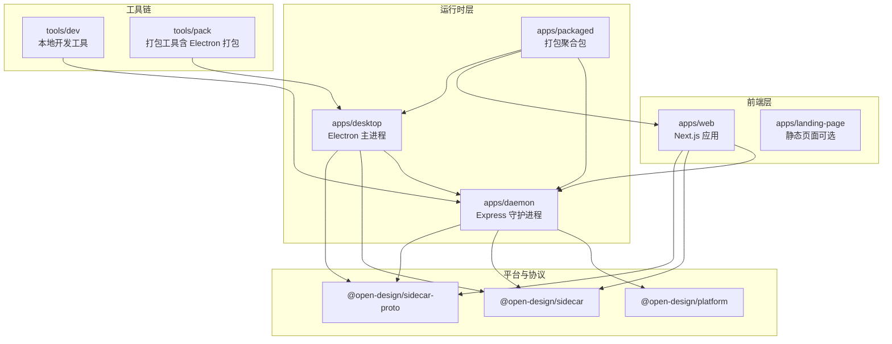
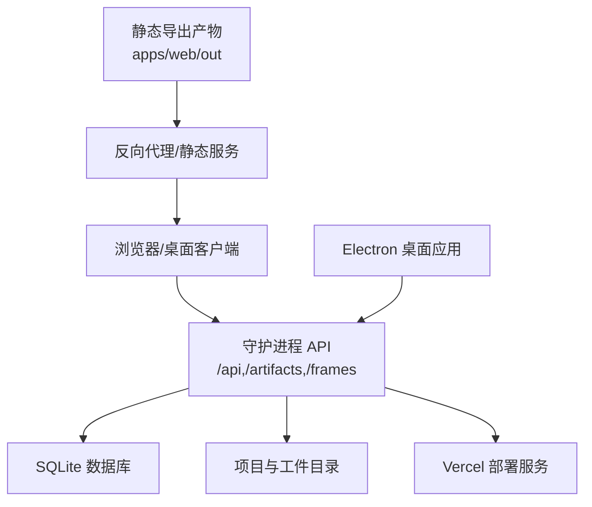
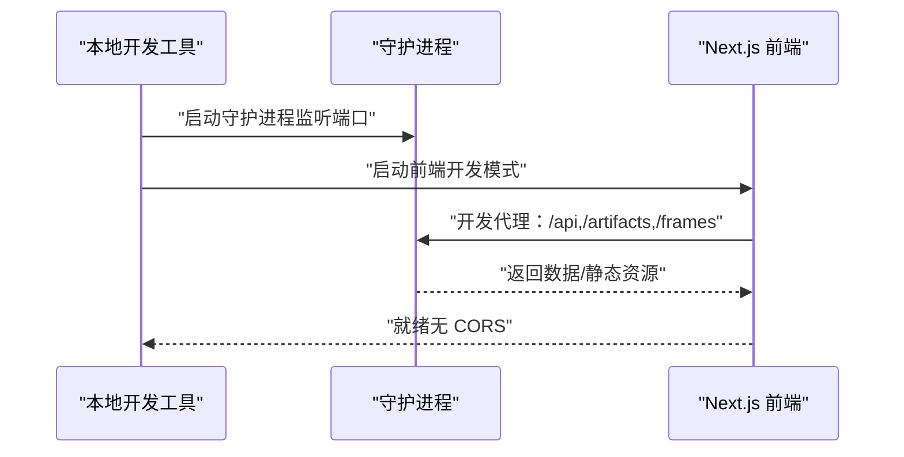
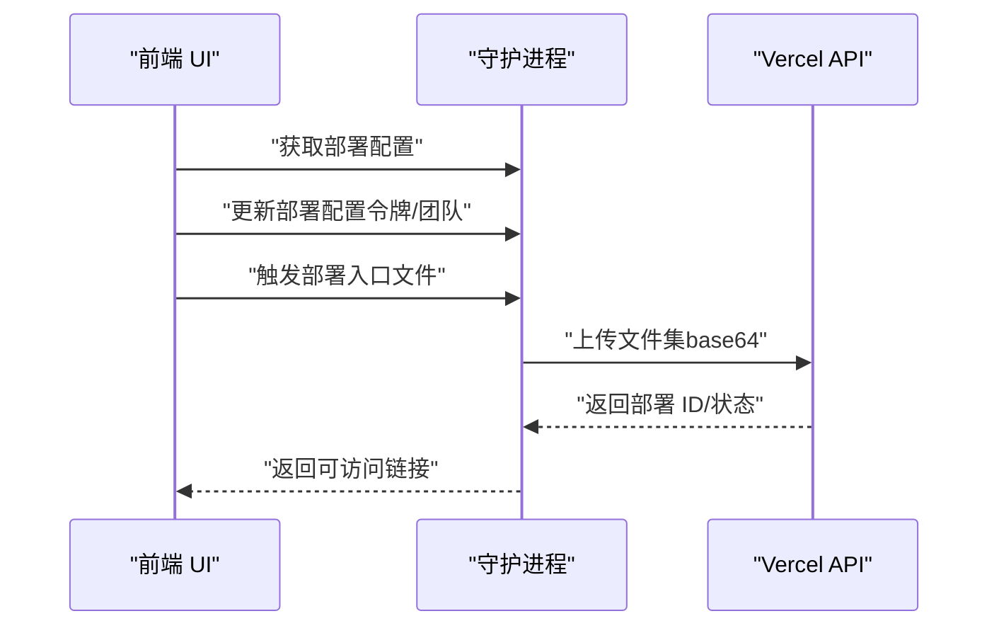
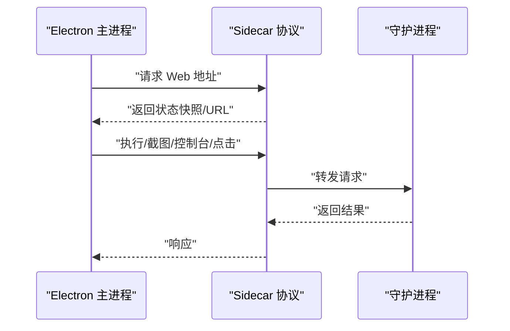
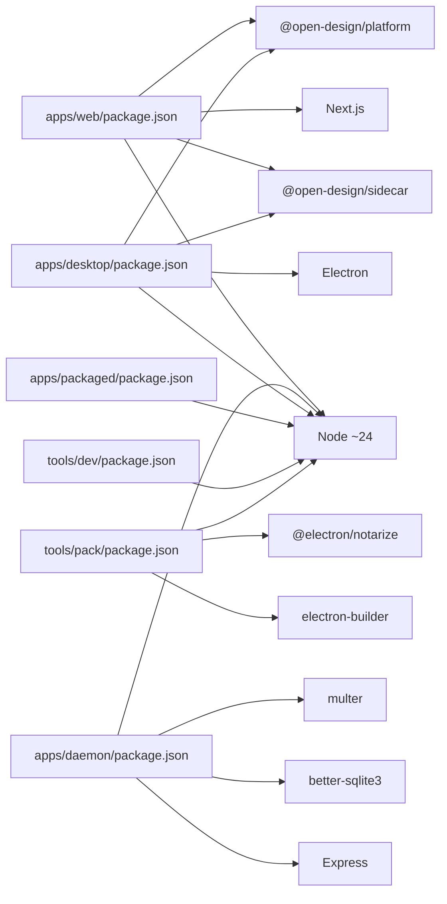

# 部署与运维

<cite>
**本文引用的文件**
- [vercel.json](file://vercel.json)
- [apps/web/package.json](file://apps/web/package.json)
- [apps/web/next.config.ts](file://apps/web/next.config.ts)
- [apps/daemon/package.json](file://apps/daemon/package.json)
- [apps/daemon/src/server.ts](file://apps/daemon/src/server.ts)
- [apps/daemon/src/deploy.ts](file://apps/daemon/src/deploy.ts)
- [apps/daemon/src/db.ts](file://apps/daemon/src/db.ts)
- [apps/daemon/src/app-config.ts](file://apps/daemon/src/app-config.ts)
- [apps/desktop/package.json](file://apps/desktop/package.json)
- [apps/desktop/src/main/index.ts](file://apps/desktop/src/main/index.ts)
- [apps/packaged/package.json](file://apps/packaged/package.json)
- [tools/dev/package.json](file://tools/dev/package.json)
- [tools/pack/package.json](file://tools/pack/package.json)
- [tools/pack/src/linux.ts](file://tools/pack/src/linux.ts)
</cite>

## 目录
1. [简介](#简介)
2. [项目结构](#项目结构)
3. [核心组件](#核心组件)
4. [架构总览](#架构总览)
5. [详细组件分析](#详细组件分析)
6. [依赖关系分析](#依赖关系分析)
7. [性能考量](#性能考量)
8. [故障排除指南](#故障排除指南)
9. [结论](#结论)
10. [附录](#附录)

## 简介
本文件面向运维与开发团队，系统性梳理 Open Design 的多场景部署与运维实践，覆盖本地开发与调试、Web 平台部署（Vercel）、桌面应用打包（Electron）等路径；同时给出生产环境配置要点、环境变量清单、安全与合规建议、容器化与云平台部署思路、监控与日志管理、性能优化、容量规划、备份策略及自动化脚本与监控仪表板使用说明。

## 项目结构
Open Design 采用多包工作区组织，核心运行时由“守护进程（daemon）+ 前端（Next.js）+ 桌面（Electron）”构成，工具链提供本地开发与打包能力。下图展示主要模块与职责边界：

图表来源
- [apps/web/next.config.ts:1-108](file://apps/web/next.config.ts#L1-L108)
- [apps/daemon/src/server.ts:1-800](file://apps/daemon/src/server.ts#L1-L800)
- [apps/desktop/src/main/index.ts:1-159](file://apps/desktop/src/main/index.ts#L1-L159)
- [apps/packaged/package.json:1-40](file://apps/packaged/package.json#L1-L40)
- [tools/dev/package.json:1-31](file://tools/dev/package.json#L1-L31)
- [tools/pack/package.json:1-34](file://tools/pack/package.json#L1-L34)

章节来源
- [apps/web/next.config.ts:1-108](file://apps/web/next.config.ts#L1-L108)
- [apps/daemon/src/server.ts:1-800](file://apps/daemon/src/server.ts#L1-L800)
- [apps/desktop/src/main/index.ts:1-159](file://apps/desktop/src/main/index.ts#L1-L159)
- [apps/packaged/package.json:1-40](file://apps/packaged/package.json#L1-L40)
- [tools/dev/package.json:1-31](file://tools/dev/package.json#L1-L31)
- [tools/pack/package.json:1-34](file://tools/pack/package.json#L1-L34)

## 核心组件
- 前端（Next.js）
  - 支持静态导出与服务端渲染两种模式，通过输出模式控制决定是否内置 SSR 服务器或以静态产物交付。
  - 开发期通过重写代理到守护进程，避免跨域与本地联调复杂度。
- 守护进程（Express）
  - 提供统一 API 与静态资源服务，负责项目与工件存储、媒体生成、部署编排（Vercel）、数据库与配置持久化。
- 桌面（Electron）
  - 通过 Sidecar 协议与守护进程通信，提供桌面侧能力（点击、截图、控制台等），并自动发现 Web 子应用。
- 工具链
  - 本地开发工具：快速启动本地全栈体验。
  - 打包工具：支持 Electron 打包、签名、跨平台分发，并提供容器化构建选项。

章节来源
- [apps/web/next.config.ts:1-108](file://apps/web/next.config.ts#L1-L108)
- [apps/daemon/src/server.ts:1-800](file://apps/daemon/src/server.ts#L1-L800)
- [apps/desktop/src/main/index.ts:1-159](file://apps/desktop/src/main/index.ts#L1-L159)
- [apps/daemon/src/deploy.ts:1-800](file://apps/daemon/src/deploy.ts#L1-L800)
- [tools/dev/package.json:1-31](file://tools/dev/package.json#L1-L31)
- [tools/pack/package.json:1-34](file://tools/pack/package.json#L1-L34)

## 架构总览
下图展示生产环境典型拓扑：浏览器/桌面客户端经守护进程访问后端服务；静态 Web 资产由守护进程托管；部署流程对接 Vercel。

图表来源
- [apps/daemon/src/server.ts:420-490](file://apps/daemon/src/server.ts#L420-L490)
- [apps/web/next.config.ts:16-30](file://apps/web/next.config.ts#L16-L30)
- [apps/daemon/src/deploy.ts:188-234](file://apps/daemon/src/deploy.ts#L188-L234)

章节来源
- [apps/daemon/src/server.ts:420-490](file://apps/daemon/src/server.ts#L420-L490)
- [apps/web/next.config.ts:16-30](file://apps/web/next.config.ts#L16-L30)
- [apps/daemon/src/deploy.ts:188-234](file://apps/daemon/src/deploy.ts#L188-L234)

## 详细组件分析

### 组件一：本地部署（pnpm tools-dev）
- 启动流程
  - 使用本地开发工具启动守护进程与前端，守护进程在默认端口提供 API 与静态资源服务；前端在开发模式下通过重写代理到守护进程，实现无 CORS 联调。
- 关键点
  - 端口探测与环境变量注入：开发工具会探测空闲端口并注入环境变量，确保前后端一致路由。
  - 输出模式：静态导出模式下，前端产物位于固定目录，便于守护进程直接托管。
- 典型命令
  - 使用本地开发工具启动全栈体验，随后在浏览器中访问前端地址进行调试。

图表来源
- [apps/web/next.config.ts:89-103](file://apps/web/next.config.ts#L89-L103)
- [tools/dev/package.json:1-31](file://tools/dev/package.json#L1-L31)

章节来源
- [apps/web/next.config.ts:1-108](file://apps/web/next.config.ts#L1-L108)
- [tools/dev/package.json:1-31](file://tools/dev/package.json#L1-L31)

### 组件二：Vercel 部署（Web 层）
- 构建与输出
  - 通过工作区构建命令生成静态导出产物，输出目录为前端应用的静态导出目录。
- 配置要点
  - 框架字段为空，明确静态导出模式；安装与构建命令由工作区统一管理。
- 部署流程
  - 守护进程提供部署接口，前端通过 API 获取/更新部署配置并触发部署；部署成功后返回可访问链接。

图表来源
- [apps/web/src/providers/registry.ts:232-269](file://apps/web/src/providers/registry.ts#L232-L269)
- [apps/daemon/src/server.ts:2612-2709](file://apps/daemon/src/server.ts#L2612-L2709)
- [apps/daemon/src/deploy.ts:188-234](file://apps/daemon/src/deploy.ts#L188-L234)
- [apps/daemon/src/db.ts:187-263](file://apps/daemon/src/db.ts#L187-L263)

章节来源
- [vercel.json:1-8](file://vercel.json#L1-L8)
- [apps/web/package.json:1-52](file://apps/web/package.json#L1-L52)
- [apps/web/next.config.ts:16-30](file://apps/web/next.config.ts#L16-L30)
- [apps/web/src/providers/registry.ts:232-269](file://apps/web/src/providers/registry.ts#L232-L269)
- [apps/daemon/src/server.ts:2612-2709](file://apps/daemon/src/server.ts#L2612-L2709)
- [apps/daemon/src/deploy.ts:1-800](file://apps/daemon/src/deploy.ts#L1-L800)
- [apps/daemon/src/db.ts:187-263](file://apps/daemon/src/db.ts#L187-L263)

### 组件三：桌面应用打包（Electron）
- 运行时交互
  - 桌面主进程通过 Sidecar 协议与守护进程通信，支持状态查询、执行、截图、控制台、点击等操作；并自动发现 Web 子应用地址。
- 打包与分发
  - 工具链提供 Electron 打包能力，支持签名与跨平台分发；Linux 场景支持容器化构建，确保依赖一致性。
- 安全与权限
  - 通过 IPC 通道与守护进程交互，避免直接暴露网络端口；打包产物包含最小必要依赖。

图表来源
- [apps/desktop/src/main/index.ts:69-128](file://apps/desktop/src/main/index.ts#L69-L128)
- [apps/desktop/package.json:1-34](file://apps/desktop/package.json#L1-L34)
- [tools/pack/src/linux.ts:498-515](file://tools/pack/src/linux.ts#L498-L515)

章节来源
- [apps/desktop/src/main/index.ts:1-159](file://apps/desktop/src/main/index.ts#L1-L159)
- [apps/desktop/package.json:1-34](file://apps/desktop/package.json#L1-L34)
- [apps/packaged/package.json:1-40](file://apps/packaged/package.json#L1-L40)
- [tools/pack/src/linux.ts:498-515](file://tools/pack/src/linux.ts#L498-L515)

## 依赖关系分析
- 包与版本
  - 各应用与工具均声明 Node 版本约束，确保本地与 CI 环境一致。
  - 前端与桌面均依赖平台与 Sidecar 相关包，保证运行时协议一致。
- 外部集成
  - Vercel 部署：通过守护进程封装部署流程，前端通过 API 触发与查询。
  - 文件上传与媒体：守护进程使用流式处理与磁盘存储，限制单文件大小与并发任务生命周期。

图表来源
- [apps/web/package.json:1-52](file://apps/web/package.json#L1-L52)
- [apps/daemon/package.json:1-57](file://apps/daemon/package.json#L1-L57)
- [apps/desktop/package.json:1-34](file://apps/desktop/package.json#L1-L34)
- [apps/packaged/package.json:1-40](file://apps/packaged/package.json#L1-L40)
- [tools/dev/package.json:1-31](file://tools/dev/package.json#L1-L31)
- [tools/pack/package.json:1-34](file://tools/pack/package.json#L1-L34)

章节来源
- [apps/web/package.json:1-52](file://apps/web/package.json#L1-L52)
- [apps/daemon/package.json:1-57](file://apps/daemon/package.json#L1-L57)
- [apps/desktop/package.json:1-34](file://apps/desktop/package.json#L1-L34)
- [apps/packaged/package.json:1-40](file://apps/packaged/package.json#L1-L40)
- [tools/dev/package.json:1-31](file://tools/dev/package.json#L1-L31)
- [tools/pack/package.json:1-34](file://tools/pack/package.json#L1-L34)

## 性能考量
- 前端构建与缓存
  - 固定 dist 目录与静态导出，减少路径解析与动态路由开销；开发期重写代理降低跨域与中间层延迟。
- 上传与媒体
  - 上传限制与磁盘存储策略，避免大文件阻塞；媒体任务带 TTL 清理，防止内存泄漏。
- 部署体积与质量
  - 部署前质量检查与体积阈值告警，避免超大包体导致 Vercel 上传失败或首屏时间过长。
- 数据库与并发
  - 写入串行化与表结构迁移，保障高并发下的数据一致性与稳定性。

章节来源
- [apps/web/next.config.ts:71-105](file://apps/web/next.config.ts#L71-L105)
- [apps/daemon/src/server.ts:574-630](file://apps/daemon/src/server.ts#L574-L630)
- [apps/daemon/src/deploy.ts:363-527](file://apps/daemon/src/deploy.ts#L363-L527)
- [apps/daemon/src/db.ts:172-183](file://apps/daemon/src/db.ts#L172-L183)

## 故障排除指南
- 常见问题定位
  - 部署失败：检查守护进程部署配置（令牌、团队）与入口文件合法性；查看部署预检告警与体积阈值。
  - 上传失败：确认文件大小与数量限制，关注错误码映射与响应体详情。
  - 跨域与代理：开发期确认重写规则与端口绑定范围，确保浏览器与守护进程在同一网络可达范围内。
- 日志与可观测性
  - 守护进程对部署异常进行分类记录，区分预期错误与内部异常，避免泄露细节。
- 数据恢复
  - 数据目录可配置且具备写权限校验；如需迁移，确保新位置具备写权限并正确挂载。

章节来源
- [apps/daemon/src/deploy.ts:16-23](file://apps/daemon/src/deploy.ts#L16-L23)
- [apps/daemon/src/server.ts:641-678](file://apps/daemon/src/server.ts#L641-L678)
- [apps/daemon/src/app-config.ts:108-117](file://apps/daemon/src/app-config.ts#L108-L117)

## 结论
通过本地开发工具、守护进程与前端静态导出、桌面打包工具链的协同，Open Design 能够在不同环境中稳定交付。结合本文的环境变量、安全与合规、监控与日志、性能与容量规划建议，可支撑从开发到生产的全链路运维。

## 附录

### A. 生产环境配置与环境变量
- 前端（Next.js）
  - 输出模式：通过输出模式控制是否内置 SSR 或静态导出。
  - 开发主机与端口：允许的开发源与端口集合由守护进程策略决定。
  - 距离路径解析：支持自定义 tsconfig 路径与 dist 目录。
- 守护进程
  - 绑定主机与端口：支持环回与私网主机绑定，严格校验来源与 Host 头。
  - 数据目录：可配置绝对或相对路径，要求可写；用于项目、工件与配置持久化。
  - 资源根：限定资源目录必须位于工作区根或应用资源路径内，避免越权访问。
- 部署
  - Vercel 配置：令牌、团队 ID/Slug 保存于用户态目录，文件权限严格控制。
  - 部署钩子脚本：可注入脚本到入口 HTML，增强部署后的行为。

章节来源
- [apps/web/next.config.ts:16-39](file://apps/web/next.config.ts#L16-L39)
- [apps/daemon/src/server.ts:236-353](file://apps/daemon/src/server.ts#L236-L353)
- [apps/daemon/src/server.ts:402-420](file://apps/daemon/src/server.ts#L402-L420)
- [apps/daemon/src/server.ts:467-484](file://apps/daemon/src/server.ts#L467-L484)
- [apps/daemon/src/deploy.ts:25-66](file://apps/daemon/src/deploy.ts#L25-L66)

### B. 安全与合规
- 访问控制
  - 严格校验浏览器来源与 Host 头，仅允许环回、私网或显式绑定主机访问。
  - 对 Origin: null 的只读内容路由保持开放，其他 /api 路由拒绝。
- 机密信息
  - Vercel 配置文件权限严格设置，避免泄露令牌。
- 上传与文件
  - 上传路径安全校验与文件名清洗，避免路径穿越与非法字符。
- 传输与代理
  - SSE 保活与缓冲策略，避免上游代理中断导致的连接丢失。

章节来源
- [apps/daemon/src/server.ts:295-353](file://apps/daemon/src/server.ts#L295-L353)
- [apps/daemon/src/server.ts:781-800](file://apps/daemon/src/server.ts#L781-L800)
- [apps/daemon/src/deploy.ts:57-66](file://apps/daemon/src/deploy.ts#L57-L66)
- [apps/daemon/src/server.ts:574-630](file://apps/daemon/src/server.ts#L574-L630)

### C. 监控与日志
- 健康检查
  - 保留健康与版本接口，便于探针与编排系统探测。
- 日志策略
  - 部署异常按类型记录，非预期错误打印堆栈但不泄露内部细节。
- 建议
  - 结合平台日志系统采集守护进程标准输出与错误输出，设置告警阈值（如 5xx、部署失败率、上传失败率）。

章节来源
- [apps/daemon/src/server.ts:1-800](file://apps/daemon/src/server.ts#L1-L800)

### D. 容量规划与备份
- 容量规划
  - 上传限制与媒体任务 TTL，避免资源膨胀；部署体积阈值提示，指导前端优化。
- 备份策略
  - 数据目录独立可配置，建议定期备份；对重要项目与工件建立归档策略。

章节来源
- [apps/daemon/src/server.ts:574-630](file://apps/daemon/src/server.ts#L574-L630)
- [apps/daemon/src/deploy.ts:363-527](file://apps/daemon/src/deploy.ts#L363-L527)
- [apps/daemon/src/app-config.ts:108-117](file://apps/daemon/src/app-config.ts#L108-L117)

### E. 运维自动化与监控仪表板
- 自动化脚本
  - 本地开发工具与打包工具提供构建、类型检查与测试脚本，建议在 CI 中复用。
- 监控仪表板
  - 建议接入平台监控系统，展示守护进程指标（请求量、错误率、部署成功率、媒体任务队列长度、磁盘使用率）。

章节来源
- [tools/dev/package.json:1-31](file://tools/dev/package.json#L1-L31)
- [tools/pack/package.json:1-34](file://tools/pack/package.json#L1-L34)