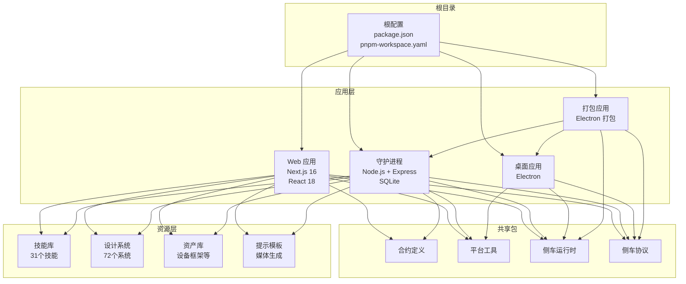
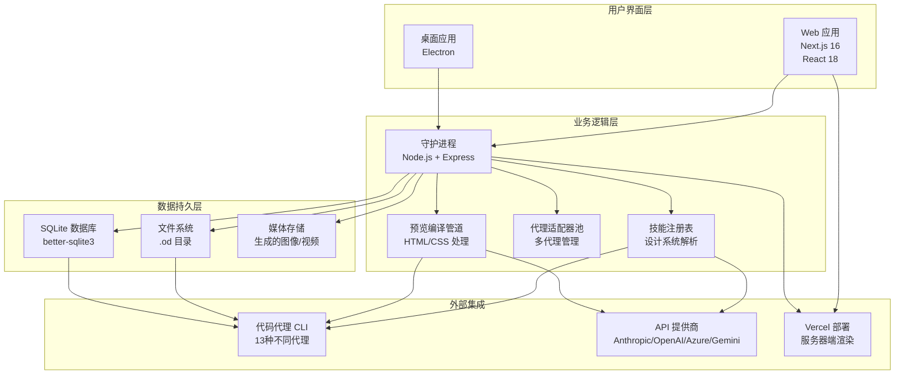
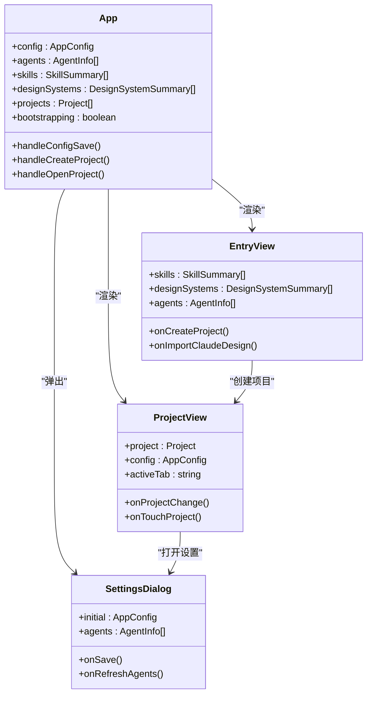
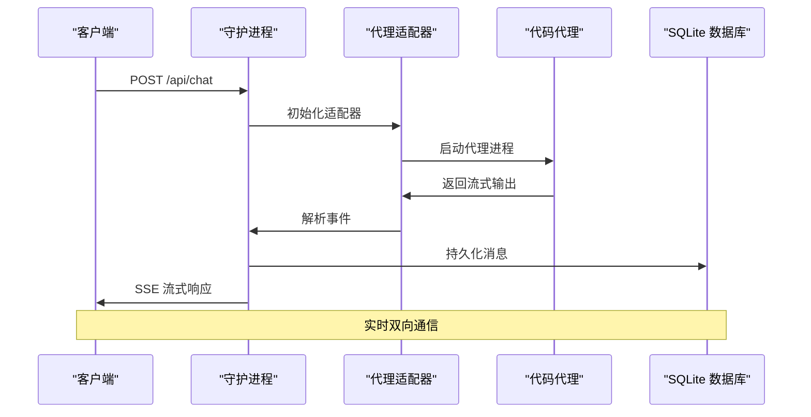
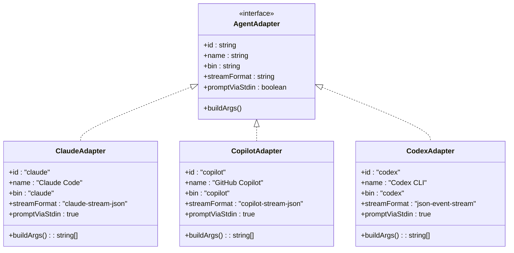
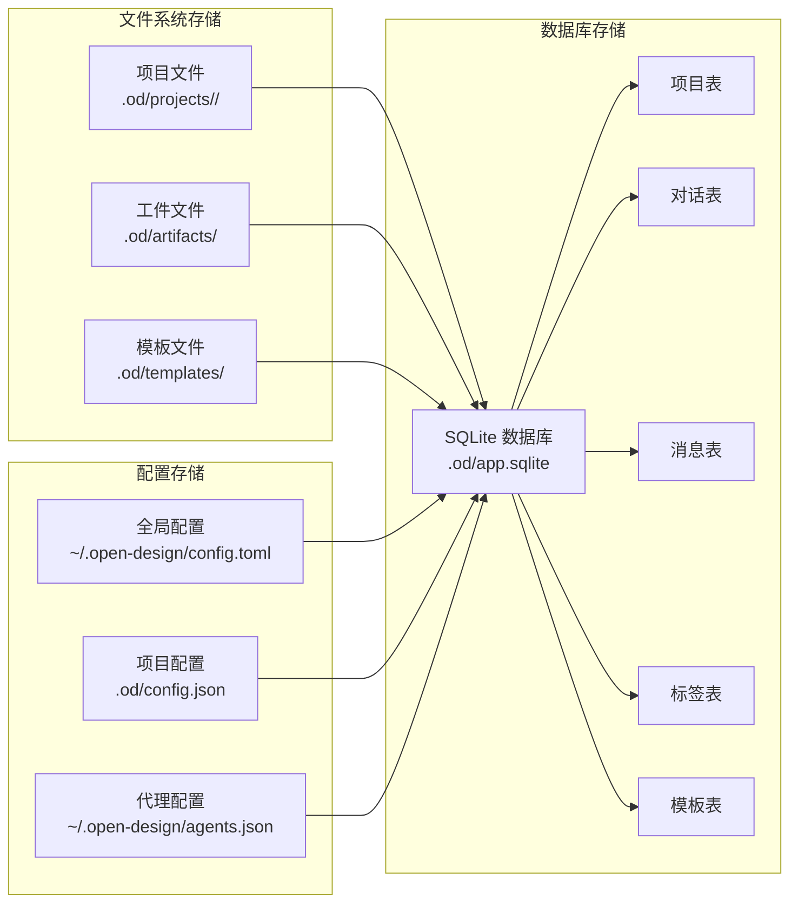
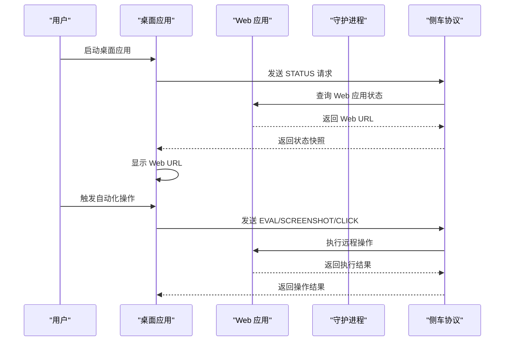
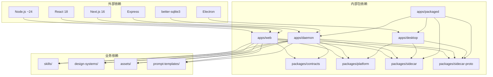

# 架构概览

<cite>
**本文档引用的文件**
- [README.md](file://README.md)
- [架构文档](file://docs/architecture.md)
- [package.json](file://package.json)
- [pnpm 工作区配置](file://pnpm-workspace.yaml)
- [Web 应用包配置](file://apps/web/package.json)
- [守护进程包配置](file://apps/daemon/package.json)
- [桌面应用包配置](file://apps/desktop/package.json)
- [打包应用包配置](file://apps/packaged/package.json)
- [守护进程服务器实现](file://apps/daemon/src/server.ts)
- [Web 应用入口](file://apps/web/src/App.tsx)
- [桌面应用主进程](file://apps/desktop/src/main/index.ts)
- [打包应用入口](file://apps/packaged/src/index.ts)
- [守护进程数据库实现](file://apps/daemon/src/db.ts)
- [Web 应用 Next.js 配置](file://apps/web/next.config.ts)
- [代理适配器定义](file://apps/daemon/src/agents.ts)
- [Web 注册表提供者](file://apps/web/src/providers/registry.ts)
- [侧车协议定义](file://packages/sidecar-proto/src/index.ts)
</cite>

## 目录
1. [简介](#简介)
2. [项目结构](#项目结构)
3. [核心组件](#核心组件)
4. [架构总览](#架构总览)
5. [详细组件分析](#详细组件分析)
6. [依赖关系分析](#依赖关系分析)
7. [性能考量](#性能考量)
8. [故障排除指南](#故障排除指南)
9. [结论](#结论)

## 简介

Open Design 是一个开源的设计产品，旨在为设计师和开发者提供本地优先的设计工作流。该系统通过将用户现有的代码代理 CLI（如 Claude Code、GitHub Copilot 等）与技能（Skills）和设计系统（Design Systems）相结合，创建了一个强大的设计生成和预览环境。

系统的核心特点包括：
- **本地优先**：所有设计工作都在本地运行，保护用户隐私和数据安全
- **多代理支持**：支持 13 种不同的代码代理 CLI，用户可以自由选择
- **技能驱动**：内置 31 个专业设计技能，涵盖从原型设计到演示文稿的各种场景
- **设计系统**：提供 72 个品牌级设计系统，确保设计的一致性和专业性
- **实时协作**：通过沙箱化预览和评论功能实现实时设计协作

## 项目结构

Open Design 采用模块化的多包架构，通过 pnpm 工作区管理各个子项目：

**图表来源**
- [项目结构图:344-441](file://README.md#L344-L441)
- [工作区配置:1-6](file://pnpm-workspace.yaml#L1-L6)

**章节来源**
- [README.md:344-441](file://README.md#L344-L441)
- [pnpm 工作区配置:1-6](file://pnpm-workspace.yaml#L1-L6)

## 核心组件

### 前端层（Next.js 16 + React 18）

Web 应用基于 Next.js 16 和 React 18 构建，提供了现代化的用户界面和交互体验：

- **应用架构**：使用 App Router 进行路由管理，支持静态导出和服务器渲染
- **状态管理**：结合 React Hooks 和浏览器存储，实现响应式状态管理
- **组件系统**：模块化的组件设计，支持主题切换和自适应布局
- **实时通信**：通过 WebSocket 实现与守护进程的实时数据交换

### 守护进程层（Node.js + Express + SQLite）

守护进程是系统的核心协调者，负责管理所有设计流程：

- **HTTP 服务**：提供 RESTful API 接口，支持项目管理、聊天对话、文件操作等功能
- **代理适配器**：统一管理各种代码代理 CLI 的连接和通信
- **数据库管理**：使用 SQLite 存储项目元数据、对话历史、模板等信息
- **文件系统**：管理 .od 目录下的所有项目文件和工件

### 桌面应用层（Electron）

可选的桌面应用提供了增强的用户体验：

- **原生窗口**：利用 Electron 提供原生桌面应用体验
- **侧车协议**：通过 JSON-RPC 通道与 Web 和守护进程通信
- **自动化功能**：支持截图、点击、控制台等桌面自动化操作

### 代理适配器系统

系统支持多种代码代理 CLI，每种都有专门的适配器：

- **Claude Code**：官方 Anthropic 代码代理
- **GitHub Copilot**：微软的 AI 代码助手
- **Codex CLI**：OpenAI 的代码生成工具
- **其他代理**：包括 Cursor Agent、Gemini CLI、Qwen Code 等

**章节来源**
- [架构文档:105-124](file://docs/architecture.md#L105-L124)
- [Web 包配置:30-51](file://apps/web/package.json#L30-L51)
- [守护进程包配置:34-56](file://apps/daemon/package.json#L34-L56)
- [桌面应用包配置:20-33](file://apps/desktop/package.json#L20-L33)

## 架构总览

Open Design 采用三层架构设计，实现了清晰的职责分离和良好的可扩展性：

**图表来源**
- [架构文档:64-101](file://docs/architecture.md#L64-L101)
- [守护进程服务器实现:1-80](file://apps/daemon/src/server.ts#L1-L80)

**章节来源**
- [架构文档:14-101](file://docs/architecture.md#L14-L101)

## 详细组件分析

### Web 应用架构

Web 应用采用现代前端架构，提供了丰富的用户交互功能：

**图表来源**
- [Web 应用入口:50-581](file://apps/web/src/App.tsx#L50-L581)

Web 应用的关键特性包括：

- **响应式设计**：支持桌面和移动设备的自适应布局
- **主题系统**：支持浅色、深色和系统主题自动切换
- **实时预览**：通过沙箱化 iframe 实现设计作品的实时预览
- **文件工作区**：提供可视化的文件管理系统

**章节来源**
- [Web 应用入口:1-582](file://apps/web/src/App.tsx#L1-L582)

### 守护进程核心架构

守护进程是整个系统的大脑，负责协调所有组件：

**图表来源**
- [守护进程服务器实现:781-800](file://apps/daemon/src/server.ts#L781-L800)

守护进程的核心功能包括：

- **会话管理**：维护每个浏览器标签页的独立会话状态
- **代理调度**：智能选择和管理多个代码代理实例
- **文件监控**：实时监控项目文件变化并触发相应处理
- **导出功能**：支持 HTML、PDF、PPTX、ZIP、Markdown 等多种格式导出

**章节来源**
- [守护进程服务器实现:1-800](file://apps/daemon/src/server.ts#L1-L800)

### 代理适配器系统

代理适配器系统是 Open Design 的核心技术之一，它抽象了不同代码代理 CLI 的差异：

**图表来源**
- [代理适配器定义:119-200](file://apps/daemon/src/agents.ts#L119-L200)

适配器系统的关键特性：

- **统一接口**：所有适配器都实现相同的接口，隐藏底层差异
- **流式处理**：支持实时的流式输出，提供更好的用户体验
- **错误处理**：完善的错误处理和重试机制
- **权限控制**：通过代理的权限模型确保安全性

**章节来源**
- [代理适配器定义:1-200](file://apps/daemon/src/agents.ts#L1-L200)

### 数据存储架构

系统采用混合存储策略，结合了文件系统和数据库的优势：

**图表来源**
- [守护进程数据库实现:39-147](file://apps/daemon/src/db.ts#L39-L147)

存储架构的优势：

- **文件系统优势**：便于版本控制、Git 集成和手动编辑
- **数据库优势**：提供结构化查询、索引和事务支持
- **配置分离**：全局配置、项目配置和代理配置相互独立

**章节来源**
- [守护进程数据库实现:1-183](file://apps/daemon/src/db.ts#L1-L183)

### 桌面应用架构

桌面应用提供了原生的用户体验和额外的功能：

**图表来源**
- [桌面应用主进程:81-143](file://apps/desktop/src/main/index.ts#L81-L143)

桌面应用的核心功能：

- **侧车协议**：通过标准化的 JSON-RPC 协议与 Web 和守护进程通信
- **窗口管理**：提供原生窗口控制和状态管理
- **自动化测试**：支持 E2E 自动化测试和桌面功能验证
- **系统集成**：与操作系统深度集成，提供更好的用户体验

**章节来源**
- [桌面应用主进程:1-159](file://apps/desktop/src/main/index.ts#L1-L159)

## 依赖关系分析

Open Design 的依赖关系体现了清晰的分层架构：

**图表来源**
- [包配置总览:1-43](file://package.json#L1-L43)
- [Web 包配置:30-51](file://apps/web/package.json#L30-L51)
- [守护进程包配置:34-56](file://apps/daemon/package.json#L34-L56)

**章节来源**
- [包配置总览:1-43](file://package.json#L1-L43)

## 性能考量

Open Design 在设计时充分考虑了性能优化：

### 启动性能
- **守护进程启动**：< 500ms（惰性适配器初始化）
- **代理检测**：< 200ms（并行 PATH 探测）
- **首次生成延迟**：主要由代理模型时间决定，系统开销 < 50ms

### 内存管理
- **流式处理**：所有代理输出都采用流式处理，避免大对象内存占用
- **文件系统优先**：大量使用文件系统存储，减少内存压力
- **垃圾回收**：合理使用 JavaScript 垃圾回收机制

### 网络优化
- **SSE 支持**：使用 Server-Sent Events 实现实时通信
- **静态资源**：Web 应用支持静态导出，减少服务器负载
- **缓存策略**：合理的缓存策略提升重复访问速度

### 可扩展性设计
- **水平扩展**：守护进程支持多实例部署
- **负载均衡**：Web 层支持多实例部署
- **数据库优化**：SQLite 使用 WAL 模式提升并发性能

## 故障排除指南

### 常见问题诊断

#### 代理连接问题
1. **检查代理安装**：确认所需的代码代理 CLI 已正确安装在 PATH 中
2. **验证权限设置**：检查代理的权限配置是否正确
3. **查看日志输出**：通过守护进程日志查看详细的错误信息

#### 文件访问问题
1. **检查目录权限**：确认 .od 目录具有正确的读写权限
2. **验证磁盘空间**：确保有足够的磁盘空间存储项目文件
3. **检查路径长度**：避免过长的文件路径导致的问题

#### 网络连接问题
1. **验证端口占用**：确认 7456 端口未被其他程序占用
2. **检查防火墙设置**：确保防火墙允许本地连接
3. **测试代理连接**：使用简单的命令测试代理连接

### 调试工具

系统提供了多种调试工具帮助开发者诊断问题：

- **健康检查端点**：`/api/health` 用于检查服务状态
- **版本信息**：`/api/version` 提供详细的版本信息
- **配置检查**：`/api/config` 显示当前配置状态
- **日志输出**：详细的日志输出帮助定位问题

**章节来源**
- [架构文档:324-340](file://docs/architecture.md#L324-L340)

## 结论

Open Design 通过其精心设计的架构，成功地将本地优先的设计理念与强大的代码代理能力相结合。系统的主要优势包括：

### 技术优势
- **模块化设计**：清晰的分层架构使得系统易于维护和扩展
- **多代理支持**：灵活的代理适配器系统支持多种代码代理
- **本地优先**：保护用户隐私，确保数据安全
- **实时协作**：通过沙箱化预览和评论功能实现实时设计协作

### 架构特色
- **Sidecar 协议**：标准化的进程间通信协议
- **混合存储**：结合文件系统和数据库的优势
- **可扩展性**：支持多种部署拓扑和扩展模式
- **安全性**：通过代理的权限模型确保系统安全

### 未来发展
系统目前处于早期实现阶段，但仍具备完整的闭环功能。未来的发展方向包括：
- 完善评论模式的手术级编辑功能
- 开发 AI 自动生成的调整面板
- 支持 Vercel 和隧道部署
- 提供一键初始化项目的能力

Open Design 代表了设计工具发展的新方向，通过将用户现有的工具和技能整合到一个统一的工作流中，为设计师和开发者提供了强大而灵活的设计解决方案。