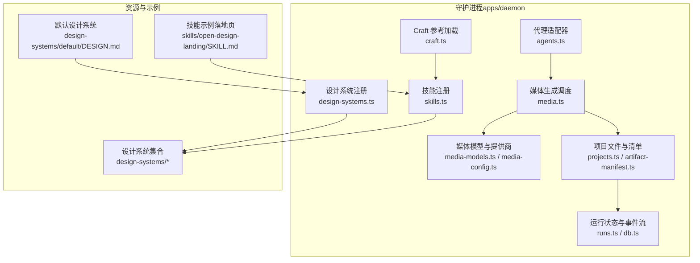
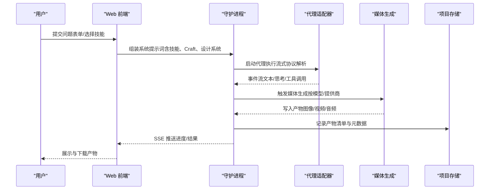
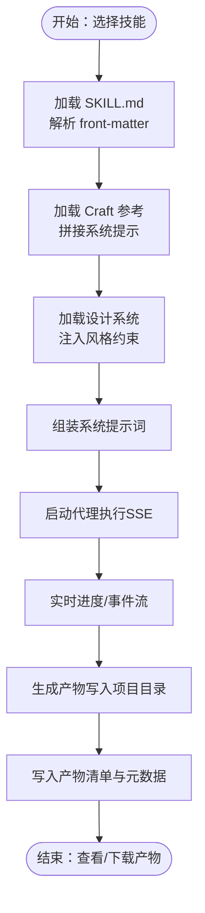
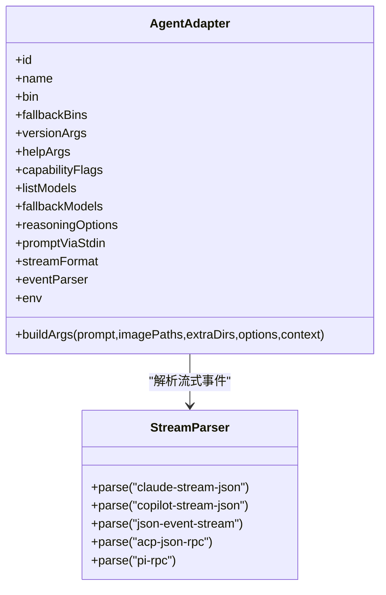
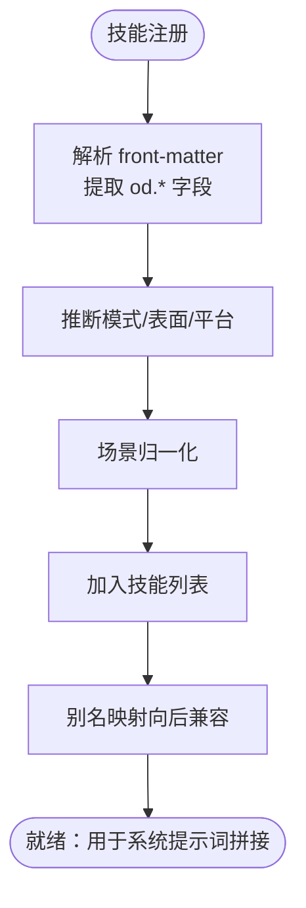
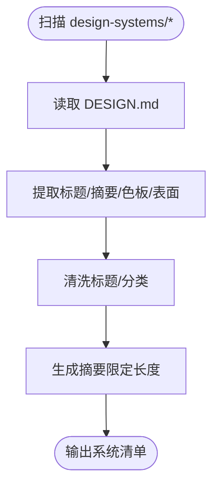
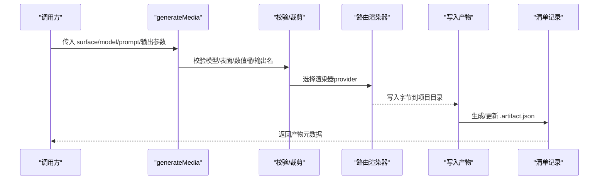
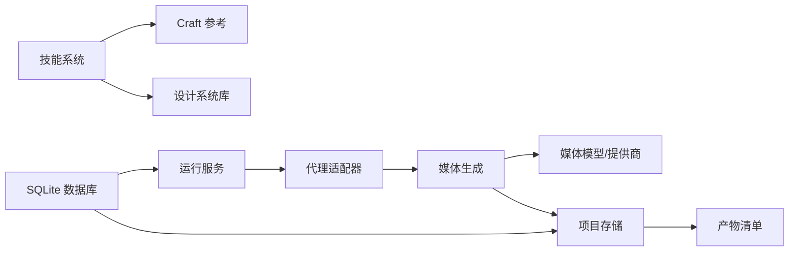

# 核心功能特性

<cite>
**本文引用的文件**
- [apps/daemon/src/skills.ts](file://apps/daemon/src/skills.ts)
- [apps/daemon/src/design-systems.ts](file://apps/daemon/src/design-systems.ts)
- [apps/daemon/src/media.ts](file://apps/daemon/src/media.ts)
- [apps/daemon/src/media-models.ts](file://apps/daemon/src/media-models.ts)
- [apps/daemon/src/media-config.ts](file://apps/daemon/src/media-config.ts)
- [apps/daemon/src/agents.ts](file://apps/daemon/src/agents.ts)
- [apps/daemon/src/craft.ts](file://apps/daemon/src/craft.ts)
- [apps/daemon/src/projects.ts](file://apps/daemon/src/projects.ts)
- [apps/daemon/src/artifact-manifest.ts](file://apps/daemon/src/artifact-manifest.ts)
- [apps/daemon/src/db.ts](file://apps/daemon/src/db.ts)
- [apps/daemon/src/runs.ts](file://apps/daemon/src/runs.ts)
- [apps/daemon/src/frontmatter.ts](file://apps/daemon/src/frontmatter.ts)
- [design-systems/README.md](file://design-systems/README.md)
- [skills/open-design-landing/SKILL.md](file://skills/open-design-landing/SKILL.md)
- [design-systems/default/DESIGN.md](file://design-systems/default/DESIGN.md)
</cite>

## 目录
1. [简介](#简介)
2. [项目结构](#项目结构)
3. [核心组件](#核心组件)
4. [架构总览](#架构总览)
5. [详细组件分析](#详细组件分析)
6. [依赖关系分析](#依赖关系分析)
7. [性能考量](#性能考量)
8. [故障排查指南](#故障排查指南)
9. [结论](#结论)
10. [附录](#附录)

## 简介
本文件系统性阐述 Open Design 的五大核心功能特性，并结合代码实现与运行机制，给出使用场景、技术实现与最佳实践，帮助用户高效利用平台完成从“问题表单”到“媒体产物”的全链路设计工作流。

## 项目结构
Open Design 采用多应用分层组织：后端守护进程（apps/daemon）负责技能注册、设计系统、媒体生成、项目持久化与运行调度；前端 Web 应用（apps/web）提供交互界面；桌面端（apps/desktop）与打包版（apps/packaged）提供本地体验；设计系统与技能资源位于顶层目录（design-systems、skills），媒体模型与适配器配置在守护进程内维护。

图示来源
- [apps/daemon/src/skills.ts](file://apps/daemon/src/skills.ts)
- [apps/daemon/src/design-systems.ts](file://apps/daemon/src/design-systems.ts)
- [apps/daemon/src/media.ts](file://apps/daemon/src/media.ts)
- [apps/daemon/src/media-models.ts](file://apps/daemon/src/media-models.ts)
- [apps/daemon/src/media-config.ts](file://apps/daemon/src/media-config.ts)
- [apps/daemon/src/agents.ts](file://apps/daemon/src/agents.ts)
- [apps/daemon/src/craft.ts](file://apps/daemon/src/craft.ts)
- [apps/daemon/src/projects.ts](file://apps/daemon/src/projects.ts)
- [apps/daemon/src/artifact-manifest.ts](file://apps/daemon/src/artifact-manifest.ts)
- [apps/daemon/src/db.ts](file://apps/daemon/src/db.ts)
- [apps/daemon/src/runs.ts](file://apps/daemon/src/runs.ts)
- [design-systems/README.md](file://design-systems/README.md)
- [skills/open-design-landing/SKILL.md](file://skills/open-design-landing/SKILL.md)
- [design-systems/default/DESIGN.md](file://design-systems/default/DESIGN.md)

章节来源
- [apps/daemon/src/skills.ts](file://apps/daemon/src/skills.ts)
- [apps/daemon/src/design-systems.ts](file://apps/daemon/src/design-systems.ts)
- [apps/daemon/src/media.ts](file://apps/daemon/src/media.ts)
- [apps/daemon/src/media-models.ts](file://apps/daemon/src/media-models.ts)
- [apps/daemon/src/media-config.ts](file://apps/daemon/src/media-config.ts)
- [apps/daemon/src/agents.ts](file://apps/daemon/src/agents.ts)
- [apps/daemon/src/craft.ts](file://apps/daemon/src/craft.ts)
- [apps/daemon/src/projects.ts](file://apps/daemon/src/projects.ts)
- [apps/daemon/src/artifact-manifest.ts](file://apps/daemon/src/artifact-manifest.ts)
- [apps/daemon/src/db.ts](file://apps/daemon/src/db.ts)
- [apps/daemon/src/runs.ts](file://apps/daemon/src/runs.ts)
- [design-systems/README.md](file://design-systems/README.md)
- [skills/open-design-landing/SKILL.md](file://skills/open-design-landing/SKILL.md)
- [design-systems/default/DESIGN.md](file://design-systems/default/DESIGN.md)

## 核心组件
- 设计工作流引擎：以技能为中心，结合 Craft 参考、设计系统与项目清单，驱动从“问题表单”到“产物”的结构化流程。
- 代理适配器系统：统一适配 13+ 编程代理，解析流式协议，保障跨平台一致性。
- 技能系统：31+ 可扩展设计技能，按场景分类与模板化工作流，支持参数化与前置检查。
- 设计系统库：72+ 品牌级设计系统，统一 DESIGN.md 规范，提供可复用的视觉与交互约束。
- 媒体生成管道：统一图像/视频/音频生成入口，按提供商与模型路由，支持占位与真实输出。

章节来源
- [apps/daemon/src/skills.ts](file://apps/daemon/src/skills.ts)
- [apps/daemon/src/design-systems.ts](file://apps/daemon/src/design-systems.ts)
- [apps/daemon/src/media.ts](file://apps/daemon/src/media.ts)
- [apps/daemon/src/media-models.ts](file://apps/daemon/src/media-models.ts)
- [apps/daemon/src/media-config.ts](file://apps/daemon/src/media-config.ts)
- [apps/daemon/src/agents.ts](file://apps/daemon/src/agents.ts)
- [apps/daemon/src/craft.ts](file://apps/daemon/src/craft.ts)
- [apps/daemon/src/projects.ts](file://apps/daemon/src/projects.ts)
- [apps/daemon/src/artifact-manifest.ts](file://apps/daemon/src/artifact-manifest.ts)
- [apps/daemon/src/db.ts](file://apps/daemon/src/db.ts)
- [apps/daemon/src/runs.ts](file://apps/daemon/src/runs.ts)
- [design-systems/README.md](file://design-systems/README.md)
- [skills/open-design-landing/SKILL.md](file://skills/open-design-landing/SKILL.md)
- [design-systems/default/DESIGN.md](file://design-systems/default/DESIGN.md)

## 架构总览
下图展示了从“技能与设计系统”到“媒体生成与产物管理”的端到端路径，以及代理适配器如何桥接不同工具链。

图示来源
- [apps/daemon/src/skills.ts](file://apps/daemon/src/skills.ts)
- [apps/daemon/src/craft.ts](file://apps/daemon/src/craft.ts)
- [apps/daemon/src/design-systems.ts](file://apps/daemon/src/design-systems.ts)
- [apps/daemon/src/agents.ts](file://apps/daemon/src/agents.ts)
- [apps/daemon/src/media.ts](file://apps/daemon/src/media.ts)
- [apps/daemon/src/projects.ts](file://apps/daemon/src/projects.ts)
- [apps/daemon/src/artifact-manifest.ts](file://apps/daemon/src/artifact-manifest.ts)
- [apps/daemon/src/runs.ts](file://apps/daemon/src/runs.ts)

## 详细组件分析

### 1. 设计工作流引擎（问题表单、五维自我批评、实时 todo 进度跟踪）
- 技能注册与发现：扫描 skills/* 下的 SKILL.md，解析 front-matter，派生模式、表面（web/image/video/audio）、场景、平台等元数据，支持别名与向后兼容。
- Craft 参考：技能通过 od.craft.requires 引用 craft/* 中的参考段落，按 slug 拼接为系统提示词的一部分。
- 设计系统注入：读取 design-systems/* 下的 DESIGN.md，抽取标题、摘要、色板与表面类型，作为全局风格约束。
- 项目与产物清单：项目树 under .od/projects/<id>/，文件与清单（.artifact.json）由守护进程统一管理，支持归档导出与类型推断。
- 实时进度：基于 runs.ts 的 SSE 事件流，记录 queued/running/succeeded/failed/canceled 等状态，支持取消与重连。

图示来源
- [apps/daemon/src/skills.ts](file://apps/daemon/src/skills.ts)
- [apps/daemon/src/craft.ts](file://apps/daemon/src/craft.ts)
- [apps/daemon/src/design-systems.ts](file://apps/daemon/src/design-systems.ts)
- [apps/daemon/src/projects.ts](file://apps/daemon/src/projects.ts)
- [apps/daemon/src/artifact-manifest.ts](file://apps/daemon/src/artifact-manifest.ts)
- [apps/daemon/src/runs.ts](file://apps/daemon/src/runs.ts)

章节来源
- [apps/daemon/src/skills.ts](file://apps/daemon/src/skills.ts)
- [apps/daemon/src/craft.ts](file://apps/daemon/src/craft.ts)
- [apps/daemon/src/design-systems.ts](file://apps/daemon/src/design-systems.ts)
- [apps/daemon/src/projects.ts](file://apps/daemon/src/projects.ts)
- [apps/daemon/src/artifact-manifest.ts](file://apps/daemon/src/artifact-manifest.ts)
- [apps/daemon/src/runs.ts](file://apps/daemon/src/runs.ts)
- [apps/daemon/src/frontmatter.ts](file://apps/daemon/src/frontmatter.ts)

最佳实践
- 使用 od.craft.requires 明确引用 craft 段落，避免遗漏关键上下文。
- 在 SKILL.md 中声明 capabilities_required，确保代理具备必要能力（如文件写入、HTTP 请求）。
- 利用 artifact-manifest 记录产物元数据，便于后续导出与版本追踪。

### 2. 代理适配器系统（13 种编程代理支持、流式协议解析、跨平台兼容性）
- 适配器定义：统一描述每个代理的二进制、探测参数、模型列表、构建参数、流格式与权限策略，支持自动探测与能力缓存。
- 流式协议：针对 Claude/Copilot/Pi 等不同流格式，守护进程解析为一致的 UI 事件，保证跨代理的一致体验。
- 跨平台：通过 capabilityFlags 与 extraAllowedDirs，适配不同平台的沙箱限制（如 Claude 的 --add-dir）。

图示来源
- [apps/daemon/src/agents.ts](file://apps/daemon/src/agents.ts)

章节来源
- [apps/daemon/src/agents.ts](file://apps/daemon/src/agents.ts)

最佳实践
- 优先使用 stdin 传递长提示，避免平台命令行长度限制。
- 针对受限环境启用 --add-dir 或等价能力，确保代理可访问技能与设计系统资源。
- 为推理型模型设置合理的 reasoning 功耗档位，平衡质量与成本。

### 3. 技能系统（31 个可扩展设计技能、场景分类、模板化工作流）
- 技能元数据：通过 SKILL.md front-matter 定义名称、触发词、模式、表面、场景、平台、特性排序、默认适用范围等。
- 场景分类：内置场景词汇集（general/engineering/product/design/marketing/sales/finance/hr/operations/support/legal/education/personal），未知值透传以便扩展。
- 工作流模板：技能示例（如 open-design-landing）提供参数化输入、图像策略（占位/生成/自带）与四步工作流契约，确保可重复交付。

图示来源
- [apps/daemon/src/skills.ts](file://apps/daemon/src/skills.ts)
- [apps/daemon/src/frontmatter.ts](file://apps/daemon/src/frontmatter.ts)

章节来源
- [apps/daemon/src/skills.ts](file://apps/daemon/src/skills.ts)
- [apps/daemon/src/frontmatter.ts](file://apps/daemon/src/frontmatter.ts)
- [skills/open-design-landing/SKILL.md](file://skills/open-design-landing/SKILL.md)

最佳实践
- 在 SKILL.md 中明确 capabilities_required，避免运行期权限不足。
- 使用 fidelity/speaker_notes/animations 等提示，指导原型质量与演示需求。
- 通过 example_prompt 提供可直接使用的起始提示，降低沟通成本。

### 4. 设计系统库（72 个品牌级设计系统、标准化 DESIGN.md 格式）
- 设计系统注册：扫描 design-systems/*，读取 DESIGN.md，抽取标题、摘要、色板与表面类型，清洗标题与分类。
- 色板提取：基于关键词启发式抽取代表色，形成 swatch 行，保证预览与一致性。
- 分类与分组：通过 Category 元数据进行分组，支持自定义分组或新增类别。

图示来源
- [apps/daemon/src/design-systems.ts](file://apps/daemon/src/design-systems.ts)
- [design-systems/README.md](file://design-systems/README.md)
- [design-systems/default/DESIGN.md](file://design-systems/default/DESIGN.md)

章节来源
- [apps/daemon/src/design-systems.ts](file://apps/daemon/src/design-systems.ts)
- [design-systems/README.md](file://design-systems/README.md)
- [design-systems/default/DESIGN.md](file://design-systems/default/DESIGN.md)

最佳实践
- 使用统一的 DESIGN.md 结构，确保标题与分类元数据清晰。
- 色板命名遵循约定，提升 swatch 提取准确性。
- 为新系统添加 Category，便于在 UI 中分组筛选。

### 5. 媒体生成管道（图像、视频、音频统一生成）
- 统一入口：generateMedia 接收 surface/model/prompt 等参数，校验模型与表面匹配、数值桶（长度/时长）裁剪、输出安全命名。
- 提供商路由：根据模型的 provider 字段路由至对应渲染器（OpenAI/Volcengine/Grok/Minimax/FishAudio/HyperFrames 等）。
- 占位与回退：未启用真实提供商时，可选择允许占位输出，或抛出明确错误，避免静默失败。
- 凭证管理：支持环境变量覆盖、本地存储与 OAuth 自动识别，优先级明确，便于多环境部署。

图示来源
- [apps/daemon/src/media.ts](file://apps/daemon/src/media.ts)
- [apps/daemon/src/media-models.ts](file://apps/daemon/src/media-models.ts)
- [apps/daemon/src/media-config.ts](file://apps/daemon/src/media-config.ts)
- [apps/daemon/src/projects.ts](file://apps/daemon/src/projects.ts)
- [apps/daemon/src/artifact-manifest.ts](file://apps/daemon/src/artifact-manifest.ts)

章节来源
- [apps/daemon/src/media.ts](file://apps/daemon/src/media.ts)
- [apps/daemon/src/media-models.ts](file://apps/daemon/src/media-models.ts)
- [apps/daemon/src/media-config.ts](file://apps/daemon/src/media-config.ts)
- [apps/daemon/src/projects.ts](file://apps/daemon/src/projects.ts)
- [apps/daemon/src/artifact-manifest.ts](file://apps/daemon/src/artifact-manifest.ts)

最佳实践
- 在 Settings 中配置提供商密钥，或通过环境变量覆盖，确保生成稳定。
- 对于视频/音频，合理设置长度/时长，避免超出提供商限制。
- 使用占位输出验证工作流，再切换真实提供商以降低成本。

## 依赖关系分析
- 技能系统依赖设计系统与 Craft 参考，共同构成系统提示词。
- 代理适配器为执行层，负责将提示词转化为实际动作与产物。
- 媒体生成依赖媒体模型与提供商配置，产物写入项目目录并生成清单。
- 项目持久化与运行状态由数据库与运行服务协同维护。

图示来源
- [apps/daemon/src/skills.ts](file://apps/daemon/src/skills.ts)
- [apps/daemon/src/craft.ts](file://apps/daemon/src/craft.ts)
- [apps/daemon/src/design-systems.ts](file://apps/daemon/src/design-systems.ts)
- [apps/daemon/src/agents.ts](file://apps/daemon/src/agents.ts)
- [apps/daemon/src/media.ts](file://apps/daemon/src/media.ts)
- [apps/daemon/src/media-models.ts](file://apps/daemon/src/media-models.ts)
- [apps/daemon/src/projects.ts](file://apps/daemon/src/projects.ts)
- [apps/daemon/src/artifact-manifest.ts](file://apps/daemon/src/artifact-manifest.ts)
- [apps/daemon/src/runs.ts](file://apps/daemon/src/runs.ts)
- [apps/daemon/src/db.ts](file://apps/daemon/src/db.ts)

章节来源
- [apps/daemon/src/skills.ts](file://apps/daemon/src/skills.ts)
- [apps/daemon/src/craft.ts](file://apps/daemon/src/craft.ts)
- [apps/daemon/src/design-systems.ts](file://apps/daemon/src/design-systems.ts)
- [apps/daemon/src/agents.ts](file://apps/daemon/src/agents.ts)
- [apps/daemon/src/media.ts](file://apps/daemon/src/media.ts)
- [apps/daemon/src/media-models.ts](file://apps/daemon/src/media-models.ts)
- [apps/daemon/src/projects.ts](file://apps/daemon/src/projects.ts)
- [apps/daemon/src/artifact-manifest.ts](file://apps/daemon/src/artifact-manifest.ts)
- [apps/daemon/src/runs.ts](file://apps/daemon/src/runs.ts)
- [apps/daemon/src/db.ts](file://apps/daemon/src/db.ts)

## 性能考量
- 技能与设计系统扫描：当前实现为每次请求重新扫描，适合中小规模（数十项）；若技能数量增长，建议引入缓存与变更监听。
- 媒体生成：对数值参数进行桶裁剪，避免超限调用；占位输出可快速验证路径，减少真实调用开销。
- 代理流式解析：按代理类型选择最优解析器，减少额外转换；stdin 传递长提示避免平台限制。
- 项目归档：ZIP 生成采用默认压缩级别，兼顾速度与体积；大文件建议分批导出。

## 故障排查指南
- 代理不可用：检查 PATH 与二进制存在性，确认 capabilityFlags 与 extraAllowedDirs 设置是否正确。
- 媒体生成失败：确认提供商密钥已配置，或允许占位输出以定位问题；查看 providerError 标记区分真实失败与回退。
- 项目路径异常：确保相对路径经 validateProjectPath 处理，避免路径逃逸与非法字符。
- 运行中断：通过 runs.cancel 主动取消，或等待 TTL 清理；关注 SSE 事件中的 error/end 通知。

章节来源
- [apps/daemon/src/agents.ts](file://apps/daemon/src/agents.ts)
- [apps/daemon/src/media.ts](file://apps/daemon/src/media.ts)
- [apps/daemon/src/projects.ts](file://apps/daemon/src/projects.ts)
- [apps/daemon/src/runs.ts](file://apps/daemon/src/runs.ts)

## 结论
Open Design 通过“技能 + 设计系统 + Craft 参考”的提示词工程化、“代理适配器”的跨平台一致性、“媒体生成”的统一路由与凭证管理，以及“项目与产物清单”的持久化，构建了从问题表单到可交付产物的完整闭环。建议在实践中结合参数化技能、标准化 DESIGN.md 与流式事件监控，持续优化交付效率与质量。

## 附录
- 设计系统数量与分类参考：参见 design-systems/README.md，包含 72+ 品牌系统与分类汇总。
- 技能示例：open-design-landing 提供参数化输入、图像策略与四步工作流契约，可作为模板化技能的参考实现。

章节来源
- [design-systems/README.md](file://design-systems/README.md)
- [skills/open-design-landing/SKILL.md](file://skills/open-design-landing/SKILL.md)
- [design-systems/default/DESIGN.md](file://design-systems/default/DESIGN.md)