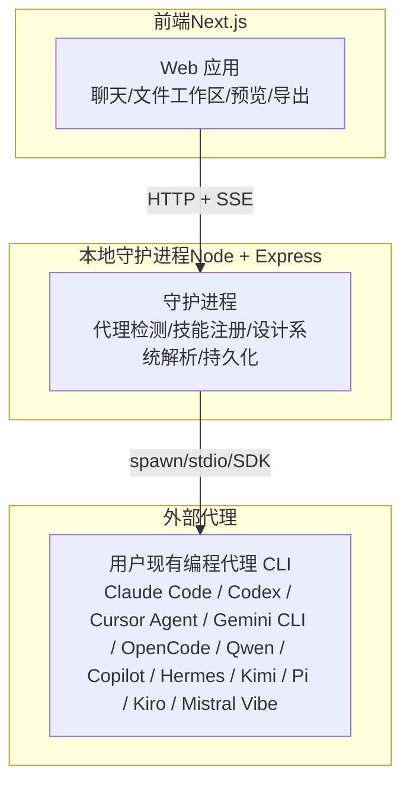
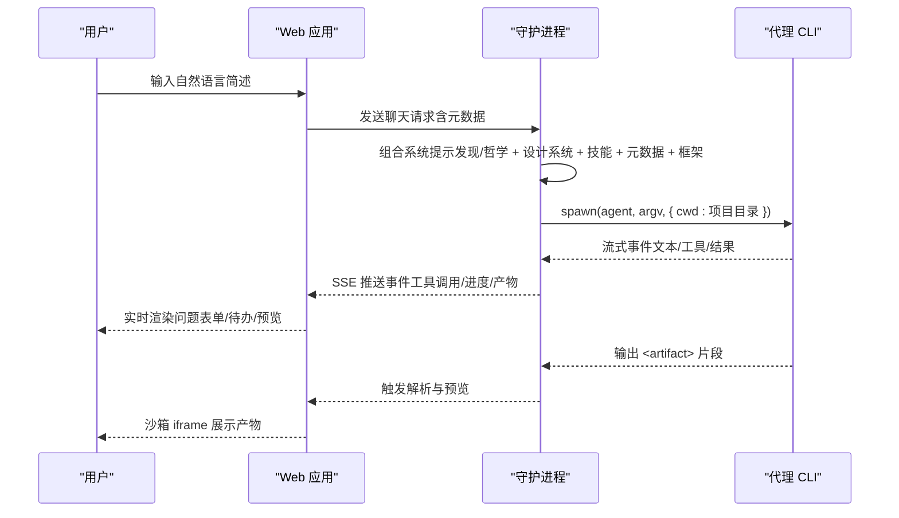
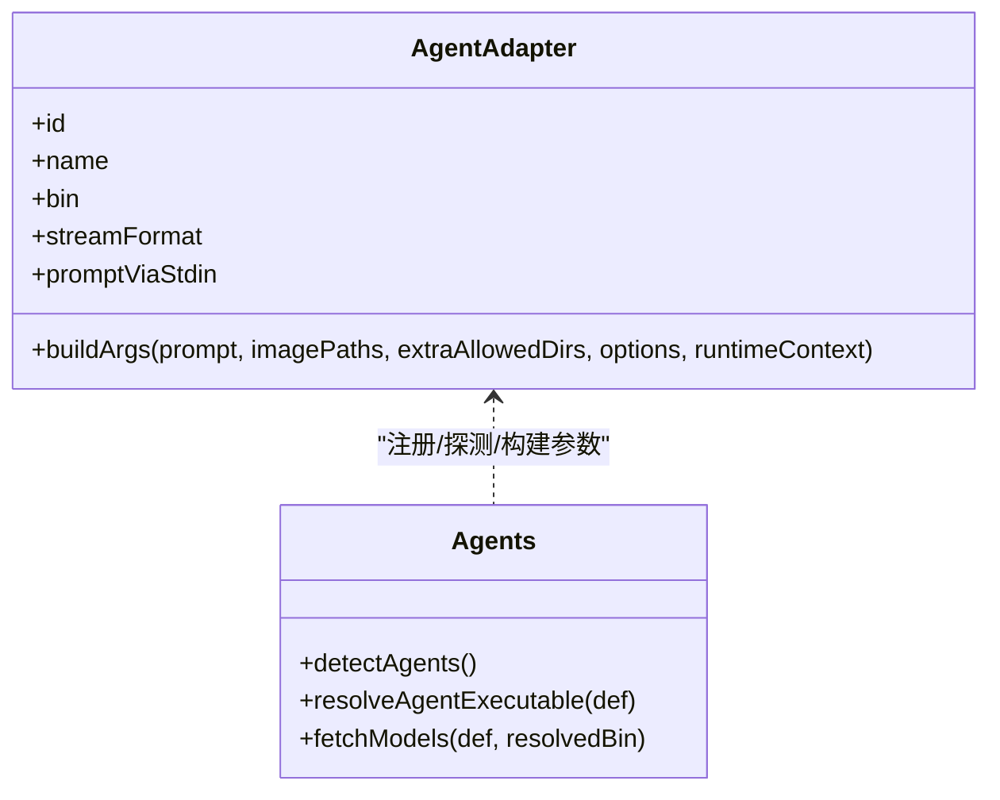
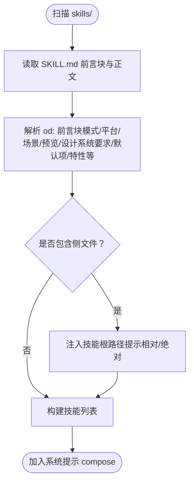
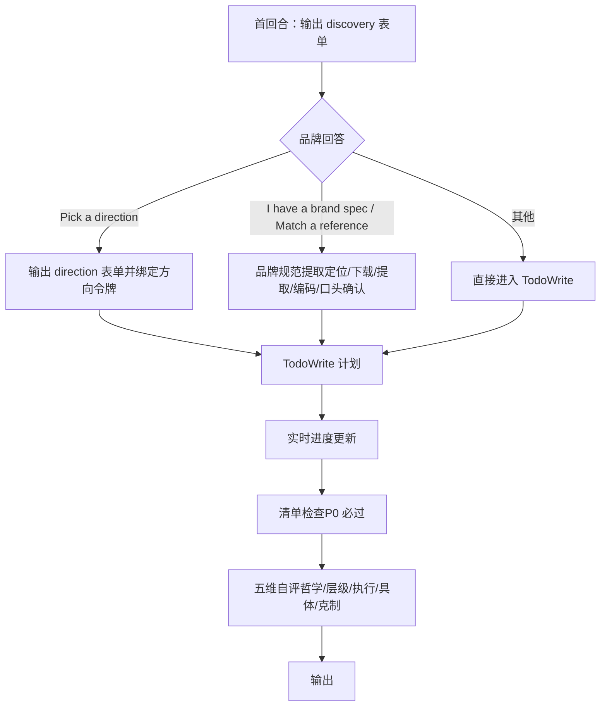
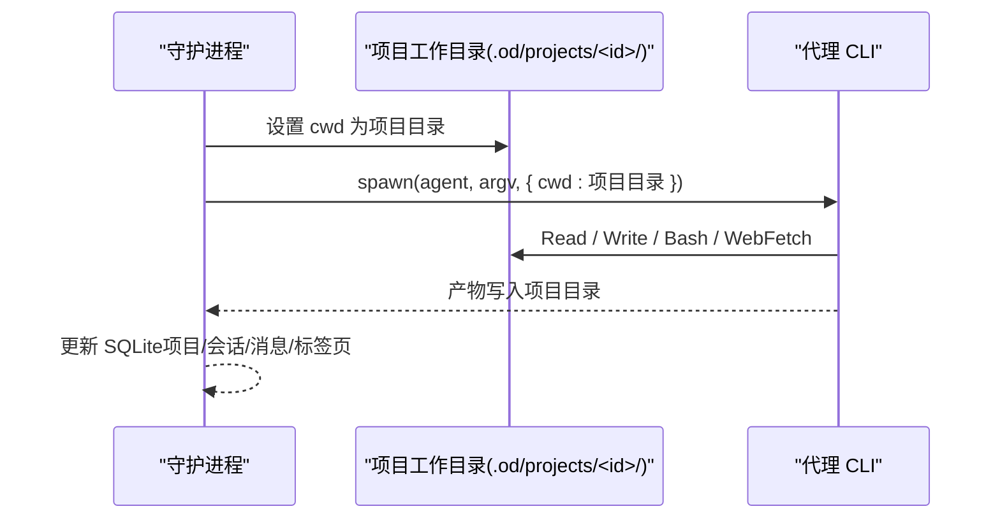
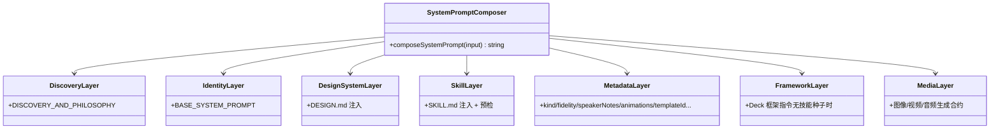
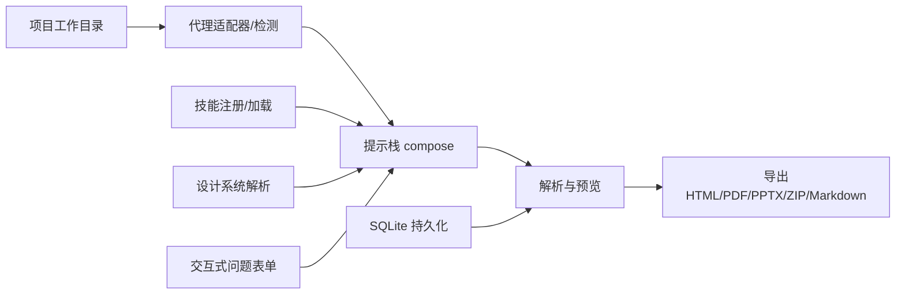

# 核心理念

<cite>
**本文引用的文件**
- [README.md](file://README.md)
- [spec.md](file://docs/spec.md)
- [DESIGN.md](file://design-systems/agentic/DESIGN.md)
- [SKILL.md](file://docs/examples/saas-landing-skill/SKILL.md)
- [skills.ts](file://apps/daemon/src/skills.ts)
- [agents.ts](file://apps/daemon/src/agents.ts)
- [parser.ts](file://apps/web/src/artifacts/parser.ts)
- [discovery.ts](file://apps/daemon/src/prompts/discovery.ts)
- [system.ts](file://apps/daemon/src/prompts/system.ts)
- [db.ts](file://apps/daemon/src/db.ts)
- [server.ts](file://apps/daemon/src/server.ts)
</cite>

## 目录
1. [引言](#引言)
2. [项目结构](#项目结构)
3. [核心组件](#核心组件)
4. [架构总览](#架构总览)
5. [详细组件分析](#详细组件分析)
6. [依赖关系分析](#依赖关系分析)
7. [性能考量](#性能考量)
8. [故障排查指南](#故障排查指南)
9. [结论](#结论)
10. [附录](#附录)

## 引言
本文件围绕 Open Design 的六大负载理念展开，系统阐述其设计理念、技术实现与实际价值，并结合仓库中的具体代码路径与使用场景，说明这些理念如何协同工作，形成独特的“以文件为中心”的设计工作流。六大理念如下：
1) 不自带代理，使用用户现有的编程代理 CLI；
2) 技能即文件，采用 SKILL.md 约定的文件系统技能；
3) 设计系统是可移植的 Markdown，基于 DESIGN.md 标准；
4) 交互式问题表单，防止 80% 的重定向；
5) 本地优先的代理运行，让代理感觉在你的笔记本上；
6) 提示栈即产品。

## 项目结构
Open Design 采用“前端 Web 应用 + 本地守护进程（Daemon）”的双层架构。前端负责聊天、文件工作区、预览与导出；守护进程负责代理检测与调度、技能注册、设计系统解析、持久化存储与媒体生成等。六大理念贯穿于该架构的各层中，确保“BYOK（Bring Your Own Key）”“文件即资产”“提示即产品”的落地。

图示来源
- [README.md:257-286](file://README.md#L257-L286)
- [spec.md:63-94](file://docs/spec.md#L63-L94)

章节来源
- [README.md:344-441](file://README.md#L344-L441)
- [spec.md:63-94](file://docs/spec.md#L63-L94)

## 核心组件
- 代理适配器与检测：守护进程扫描 PATH，自动识别用户已安装的代理 CLI，并为每种 CLI 定义参数构建、模型列表、流格式与能力探测逻辑，实现“不自带代理”的 BYOK 模式。
- 技能注册与加载：守护进程扫描 skills/ 目录，解析 SKILL.md 前言块与正文，生成可组合的技能目录，支持模式（prototype/deck/template 等）、平台、场景分组与预览元数据。
- 设计系统解析：守护进程读取 DESIGN.md，将其作为权威设计令牌注入到提示栈中，使所有生成物遵循统一的色彩、字体、间距与组件规则。
- 交互式问题表单与提示栈：守护进程在系统提示最前层注入“发现与规划”指令，强制首回合输出问题表单，第二回合根据品牌信息分支方向选择或品牌规范提取，第三回合 TodoWrite 计划并实时进度更新，最后进行五维自评与清单检查。
- 本地优先运行与持久化：守护进程在项目工作目录下启动代理，提供真实文件系统读写能力；SQLite 存储项目、会话、消息、标签页与模板，实现跨设备/重启的上下文延续。
- 预览与导出：前端通过沙箱 iframe 渲染生成的 <artifact> 内容，支持 HTML/PDF/PPTX/ZIP/Markdown 多格式导出。

章节来源
- [agents.ts:119-604](file://apps/daemon/src/agents.ts#L119-L604)
- [skills.ts:41-98](file://apps/daemon/src/skills.ts#L41-L98)
- [system.ts:111-193](file://apps/daemon/src/prompts/system.ts#L111-L193)
- [discovery.ts:26-170](file://apps/daemon/src/prompts/discovery.ts#L26-L170)
- [db.ts:38-183](file://apps/daemon/src/db.ts#L38-L183)
- [parser.ts:11-180](file://apps/web/src/artifacts/parser.ts#L11-L180)

## 架构总览
六大理念在架构中的映射如下：
- 不自带代理：代理检测与适配器定义在守护进程中，按 CLI 类型分别构建参数、模型列表与流解析器。
- 技能即文件：技能注册扫描本地 SKILL.md 文件，解析 od: 前言块与正文，注入到提示栈。
- 设计系统是可移植 Markdown：守护进程读取 DESIGN.md 并注入系统提示，作为权威令牌来源。
- 交互式问题表单：系统提示最前层强制首回合输出问题表单，分支处理品牌信息，随后 TodoWrite 与五维自评。
- 本地优先运行：守护进程以项目目录为 cwd 启动代理，提供真实文件系统能力与持久化。
- 提示栈即产品：composeSystemPrompt 将发现与哲学、设计系统、技能、元数据与框架指令拼接为最终系统提示。

图示来源
- [system.ts:111-193](file://apps/daemon/src/prompts/system.ts#L111-L193)
- [discovery.ts:26-170](file://apps/daemon/src/prompts/discovery.ts#L26-L170)
- [parser.ts:89-179](file://apps/web/src/artifacts/parser.ts#L89-L179)
- [server.ts:1-200](file://apps/daemon/src/server.ts#L1-L200)

章节来源
- [README.md:257-286](file://README.md#L257-L286)
- [spec.md:63-94](file://docs/spec.md#L63-L94)

## 详细组件分析

### 理念一：不自带代理，使用用户现有的编程代理 CLI
- 设计思想：将“代理循环”委托给用户已有的最强编程代理 CLI，避免重复订阅与锁死单一提供商；BYOK 代理通过守护进程适配器接入，支持多厂商与多模型。
- 技术实现：
  - 代理检测：守护进程扫描 PATH，识别可用 CLI 并探测其能力标志与模型列表，动态生成模型菜单。
  - 参数构建：针对不同 CLI 的 argv 形态、stdin 传递策略与权限模式进行定制，避免 Windows/类 Unix 的长度限制与权限弹窗。
  - 流解析：为每种 CLI 定义流格式与事件解析器，统一输出到前端 UI。
- 实际价值：
  - 用户可自由切换代理（如从 Claude Code 切换到 Codex），技能无需改动；
  - 支持 BYOK 代理（Anthropic/OpenAI/Azure/Gemini）作为回退路径；
  - 降低部署与运维复杂度，适合团队内统一标准化。

图示来源
- [agents.ts:119-604](file://apps/daemon/src/agents.ts#L119-L604)

章节来源
- [agents.ts:119-604](file://apps/daemon/src/agents.ts#L119-L604)
- [README.md:217-222](file://README.md#L217-L222)

### 理念二：技能即文件，采用 SKILL.md 约定的文件系统技能
- 设计思想：将“设计技能”以文件形式组织，遵循 Claude Code 的 SKILL.md 约定，并扩展 od: 前言块，实现可版本化、可复用、可共享的技能生态。
- 技术实现：
  - 技能注册：守护进程扫描 skills/ 目录，解析 SKILL.md 的 YAML 前言块与正文，推断模式（prototype/deck/template）、平台（desktop/mobile）、场景（design/marketing/operations/engineering/product/finance/hr/sales/personal）等元数据。
  - 预置前置条件：当技能包含侧文件（assets/template.html、references/*.md）时，守护进程在注入技能正文前添加“技能根路径”提示，确保代理在项目工作目录内正确访问。
  - 可组合性：技能正文与 DESIGN.md、craft 规则、项目元数据共同组成系统提示，形成“文件即资产”的工作流。
- 实际价值：
  - 新增技能只需放入 skills/ 目录并重启守护进程即可生效；
  - 技能作者可独立维护与发布，第三方可直接复用；
  - 与现有 Claude Code 技能保持兼容，便于迁移与复用。

图示来源
- [skills.ts:41-153](file://apps/daemon/src/skills.ts#L41-L153)

章节来源
- [skills.ts:41-153](file://apps/daemon/src/skills.ts#L41-L153)
- [SKILL.md:1-121](file://docs/examples/saas-landing-skill/SKILL.md#L1-L121)
- [README.md:116-121](file://README.md#L116-L121)

### 理念三：设计系统是可移植的 Markdown，基于 DESIGN.md 标准
- 设计思想：将设计系统抽象为可审阅、可版本化的 DESIGN.md 文件，作为权威令牌来源，贯穿所有生成物。
- 技术实现：
  - 设计系统解析：守护进程读取 DESIGN.md，将其注入系统提示的“Active design system”部分，覆盖颜色、字体、间距、布局、组件、动效、声音、品牌与反模式。
  - 令牌绑定：当技能包含种子模板时，代理在复制种子后先绑定 DESIGN.md 中的令牌到 :root，再填充内容。
  - 可移植性：72+ 个产品系统与 57+ 设计技能均以 DESIGN.md/DESIGN.md 规范导入，形成可复用的设计语言库。
- 实际价值：
  - 团队可将品牌设计系统沉淀为 DESIGN.md，跨项目一致应用；
  - 对比“临时聊天中的设计系统”，文件化更易审查与协作；
  - 与技能解耦，技能仅需遵循令牌约定即可产出一致风格。

章节来源
- [system.ts:132-136](file://apps/daemon/src/prompts/system.ts#L132-L136)
- [DESIGN.md:1-72](file://design-systems/agentic/DESIGN.md#L1-L72)
- [README.md:443-474](file://README.md#L443-L474)

### 理念四：交互式问题表单，防止 80% 的重定向
- 设计思想：在首次设计任务中强制输出问题表单，提前锁定关键设计决策，减少后续返工与重定向。
- 技术实现：
  - 系统提示最前层注入“发现与规划”指令，要求首回合输出 <question-form id="discovery">，包含输出类型、平台、受众、视觉语调、品牌背景、规模与约束等字段。
  - 第二回合根据品牌回答分支：A）由用户选择“视觉方向”；B）执行品牌规范提取（定位/下载/提取/编码/口头确认）；C）直接进入 TodoWrite。
  - 第三回合 TodoWrite 计划与实时进度卡片，随后清单检查与五维自评，最后输出 <artifact>。
- 实际价值：
  - 将“模型自由发挥”转变为“用户主导的确定性方向”，显著降低风格漂移；
  - 通过“先表单、后生成”的节奏，提升反馈速度与产出质量。

图示来源
- [discovery.ts:26-170](file://apps/daemon/src/prompts/discovery.ts#L26-L170)

章节来源
- [discovery.ts:26-170](file://apps/daemon/src/prompts/discovery.ts#L26-L170)
- [README.md:231-236](file://README.md#L231-L236)

### 理念五：本地优先的代理运行，让代理感觉在你的笔记本上
- 设计思想：守护进程以项目工作目录为 cwd 启动代理，赋予其真实文件系统读写能力，实现“本地优先”的代理运行体验。
- 技术实现：
  - 项目工作目录：.od/projects/<id>/ 作为代理的 cwd，代理可直接读取技能种子、设计系统与侧文件，写入产物并生成下载芯片。
  - 持久化：SQLite 存储项目、会话、消息、标签页与模板，重启后上下文延续。
  - 跨平台优化：对长提示与 Windows ENAMETOOLONG 进行 stdin 或临时文件回退，保证稳定运行。
- 实际价值：
  - 代理具备真实文件系统能力，可执行 Bash、读写文件、生成多格式产物；
  - 开发者可在本地快速迭代，无需云端往返；
  - 与桌面自动化（IPC）结合，支持无头测试与远程调试。

图示来源
- [db.ts:38-183](file://apps/daemon/src/db.ts#L38-L183)
- [server.ts:1-200](file://apps/daemon/src/server.ts#L1-L200)

章节来源
- [README.md:237-239](file://README.md#L237-L239)
- [db.ts:38-183](file://apps/daemon/src/db.ts#L38-L183)
- [server.ts:1-200](file://apps/daemon/src/server.ts#L1-L200)

### 理念六：提示栈即产品
- 设计思想：将“系统提示”视为产品的核心契约，由多个可组合层构成：发现与哲学、身份与工作流、活动设计系统、活动技能、项目元数据、框架指令与媒体生成合约。
- 技术实现：
  - composeSystemPrompt 将多层内容拼接为最终系统提示：发现与哲学（首回合表单/分支/TodoWrite/清单/自评）→ 身份与工作流 → 活动设计系统 → 活动技能（含预检）→ 项目元数据 → 框架指令（仅对 Deck 且无技能种子时）→ 媒体生成合约（仅对图像/视频/音频表面）。
  - 该提示栈在每次聊天前动态组装，确保“文件即资产、BYOK 代理、本地优先”的理念在每一层都得到体现。
- 实际价值：
  - 提示栈可编辑、可审计、可版本化，形成“提示即产品”的可追溯性；
  - 通过分层注入，实现“强约束 + 可扩展”的平衡；
  - 便于第三方作者复用与扩展。

图示来源
- [system.ts:111-193](file://apps/daemon/src/prompts/system.ts#L111-L193)
- [discovery.ts:26-170](file://apps/daemon/src/prompts/discovery.ts#L26-L170)

章节来源
- [system.ts:111-193](file://apps/daemon/src/prompts/system.ts#L111-L193)
- [README.md:241-255](file://README.md#L241-L255)

## 依赖关系分析
六大理念之间的耦合与协作如下：
- 代理适配器与技能注册：两者共同决定“可用的技能集合”与“可用的代理集合”，二者解耦但通过守护进程统一编排。
- 设计系统与技能：设计系统作为权威令牌来源，被技能正文与种子模板引用，形成“令牌权威 + 工作流约束”的双重保障。
- 交互式问题表单与提示栈：问题表单是提示栈的“第一层硬规则”，确保后续 TodoWrite 与清单检查有效执行。
- 本地优先运行与持久化：项目工作目录与 SQLite 数据库共同支撑“文件即资产”的本地体验。
- 提示栈即产品：上述所有要素最终汇聚为系统提示，形成“可编辑、可审计、可版本化”的产品契约。

图示来源
- [agents.ts:119-604](file://apps/daemon/src/agents.ts#L119-L604)
- [skills.ts:41-153](file://apps/daemon/src/skills.ts#L41-L153)
- [system.ts:111-193](file://apps/daemon/src/prompts/system.ts#L111-L193)
- [discovery.ts:26-170](file://apps/daemon/src/prompts/discovery.ts#L26-L170)
- [parser.ts:89-179](file://apps/web/src/artifacts/parser.ts#L89-L179)
- [db.ts:38-183](file://apps/daemon/src/db.ts#L38-L183)

章节来源
- [README.md:257-286](file://README.md#L257-L286)
- [spec.md:63-94](file://docs/spec.md#L63-L94)

## 性能考量
- 代理启动与参数构建：针对不同 CLI 的 argv 长度限制与平台差异进行优化，避免 spawn 失败与权限弹窗。
- 流解析与事件合并：统一的事件解析器与增量事件推送，减少前端渲染压力。
- 本地文件系统与缓存：项目工作目录直连，减少网络往返；数据库 WAL 模式与索引优化，提升查询效率。
- 预览与导出：沙箱 iframe 渲染与多格式导出在守护进程与前端协同下完成，避免大文件上传与云端依赖。

## 故障排查指南
- 代理未被检测到：检查 PATH 是否包含所需 CLI，或在设置中指定自定义模型；查看守护进程日志与模型列表探测结果。
- 技能未显示：确认 SKILL.md 前言块与正文完整，重启守护进程后刷新页面；检查技能目录权限与文件名大小写。
- 设计系统不生效：确认 DESIGN.md 结构完整且被正确注入；检查技能种子是否正确绑定 :root 令牌。
- 问题表单不出现：确认系统提示未被覆盖；检查是否处于“跳过问题”模式或已在表单中提交答案。
- 本地运行异常：检查项目工作目录权限与磁盘空间；Windows 下注意 ENAMETOOLONG 限制，必要时启用 stdin 或临时文件回退。
- 持久化数据异常：检查 .od/app.sqlite 是否存在与可写；必要时重置项目或迁移数据库。

章节来源
- [agents.ts:799-800](file://apps/daemon/src/agents.ts#L799-L800)
- [skills.ts:41-98](file://apps/daemon/src/skills.ts#L41-L98)
- [system.ts:111-193](file://apps/daemon/src/prompts/system.ts#L111-L193)
- [discovery.ts:26-170](file://apps/daemon/src/prompts/discovery.ts#L26-L170)
- [db.ts:38-183](file://apps/daemon/src/db.ts#L38-L183)

## 结论
六大理念共同构成了 Open Design 的独特设计工作流：以文件为中心的技能与设计系统、以用户现有代理为核心的 BYOK、以交互式问题表单与提示栈为入口的高质量产出、以及以本地优先与持久化为基础的高效迭代体验。通过守护进程与前端的协同，这些理念在代码层面得到了清晰的实现与验证，为开发者提供了可审计、可扩展、可复用的设计自动化基础设施。

## 附录
- 使用场景建议：
  - 快速原型：选择 prototype 技能，配合 DESIGN.md 令牌与交互式表单，快速锁定方向并生成 HTML 原型。
  - 演示文稿：选择 deck 技能或无技能 deck 项目，守护进程注入框架指令，确保导航、计数器、打印样式一致。
  - 品牌规范：通过“品牌规范提取”流程，将品牌资料转化为 DESIGN.md，统一跨项目风格。
  - 团队协作：将 SKILL.md 与 DESIGN.md 放入版本库，通过守护进程的提示栈与持久化，实现跨设备与跨时间的上下文延续。