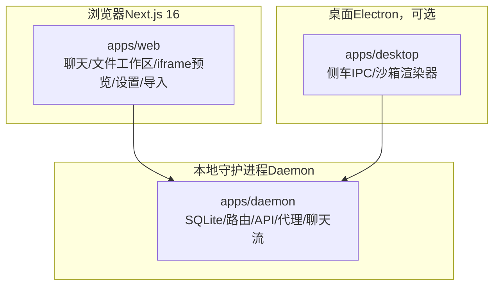
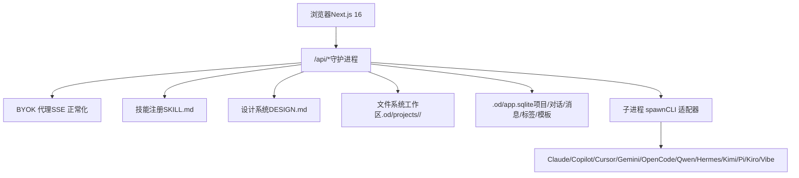
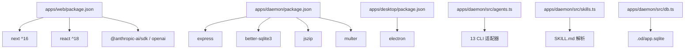

# 竞品对比分析

<cite>
**本文档引用的文件**
- [README.md](file://README.md)
- [package.json](file://package.json)
- [apps/web/package.json](file://apps/web/package.json)
- [apps/desktop/package.json](file://apps/desktop/package.json)
- [apps/daemon/package.json](file://apps/daemon/package.json)
- [apps/daemon/src/agents.ts](file://apps/daemon/src/agents.ts)
- [apps/daemon/src/skills.ts](file://apps/daemon/src/skills.ts)
- [apps/daemon/src/db.ts](file://apps/daemon/src/db.ts)
- [apps/daemon/src/prompts/discovery.ts](file://apps/daemon/src/prompts/discovery.ts)
- [design-systems/claude/DESIGN.md](file://design-systems/claude/DESIGN.md)
- [design-systems/application/DESIGN.md](file://design-systems/application/DESIGN.md)
- [docs/spec.md](file://docs/spec.md)
- [AGENTS.md](file://AGENTS.md)
</cite>

## 目录
1. [简介](#简介)
2. [项目结构](#项目结构)
3. [核心组件](#核心组件)
4. [架构总览](#架构总览)
5. [详细组件分析](#详细组件分析)
6. [依赖关系分析](#依赖关系分析)
7. [性能考量](#性能考量)
8. [故障排除指南](#故障排除指南)
9. [结论](#结论)
10. [附录](#附录)

## 简介
本文件面向希望在本地优先、可部署 Web、可 BYOK 的设计自动化平台中进行决策的用户，提供 Open Design 与 Claude Design、Open CoDesign 的客观对比分析。对比维度包括许可证、形态、部署能力、代理运行时、技能系统、设计系统、供应商灵活性、核心功能等，并通过数据表格呈现关键差异，辅以优劣势分析与选型建议。

## 项目结构
Open Design 采用多应用分层架构：
- Web 应用（Next.js 16 + React 18）负责聊天、文件工作区、iframe 预览、设置与导入
- Daemon（Node + Express + better-sqlite3）负责本地代理、技能注册、设计系统、聊天 SSE、文件上传与导出
- Desktop（Electron）可选，用于桌面自动化与 E2E
- 工作区通过 tools-dev 生命周期管理（启动/停止/运行/状态/日志/检查）

**图表来源**
- [README.md: 257-286:257-286](file://README.md#L257-L286)
- [apps/web/package.json: 1-52:1-52](file://apps/web/package.json#L1-L52)
- [apps/daemon/package.json: 1-57:1-57](file://apps/daemon/package.json#L1-L57)
- [apps/desktop/package.json: 1-34:1-34](file://apps/desktop/package.json#L1-L34)

**章节来源**
- [README.md: 344-441:344-441](file://README.md#L344-L441)
- [package.json: 1-43:1-43](file://package.json#L1-L43)

## 核心组件
- 许可证：Apache-2.0（开放、宽松商用友好）
- 形态：Web 应用 + 本地守护进程（可选桌面）
- 部署能力：支持本地运行、Vercel Web 层部署
- 代理运行时：用户现有 CLI（13 个适配器）或 BYOK 代理（Anthropic/OpenAI/Azure/Google）
- 技能系统：31 个基于 SKILL.md 的文件系统技能，可直接放入 skills/ 目录即生效
- 设计系统：129 个基于 DESIGN.md 的品牌系统（含 72 个产品系统）
- 供应商灵活性：12 个 CLI 适配器 + 多提供商 BYOK 代理
- 核心功能：问题表单、方向选择器、实时待办进度、沙箱 iframe 预览、Claude Design ZIP 导入、文件系统工作区、5 维自我评审、Artifact lint、侧车 IPC + 桌面自动化、导出格式（HTML/PDF/PPTX/ZIP/Markdown）

**章节来源**
- [README.md: 49-66:49-66](file://README.md#L49-L66)
- [README.md: 587-612:587-612](file://README.md#L587-L612)

## 架构总览
Open Design 的核心是“本地守护进程 + Web 客户端”的双层架构，守护进程负责：
- 代理运行时：扫描 PATH，按 CLI 适配器拼装参数并以子进程方式运行
- 技能与设计系统：解析 SKILL.md 与 DESIGN.md，注入提示词
- 数据持久化：SQLite 存储项目/对话/消息/标签/模板
- 代理接口：/api/proxy/{anthropic,openai,azure,google}/stream（SSE 正常化，SSRF 阻断）

**图表来源**
- [README.md: 257-286:257-286](file://README.md#L257-L286)
- [apps/daemon/src/agents.ts: 119-604:119-604](file://apps/daemon/src/agents.ts#L119-L604)
- [apps/daemon/src/skills.ts: 41-98:41-98](file://apps/daemon/src/skills.ts#L41-L98)
- [apps/daemon/src/db.ts: 38-183:38-183](file://apps/daemon/src/db.ts#L38-L183)

## 详细组件分析

### 许可证对比
- Open Design：Apache-2.0（开源、可商用、专利授权明确）
- Claude Design：闭源（Anthropic）
- Open CoDesign：MIT（开源、宽松）

对比结论：若需严格开源合规与商业使用自由度，Open Design 明显更优；若仅需开源，Open CoDesign 亦可。

**章节来源**
- [README.md: 589-591:589-591](file://README.md#L589-L591)

### 形态对比
- Open Design：Web 应用 + 本地守护进程（可选桌面）
- Claude Design：Web（claude.ai）
- Open CoDesign：桌面（Electron）

对比结论：Open Design 在形态上兼顾 Web 可部署性与本地控制力；Claude Design 仅云服务形态；Open CoDesign 仅桌面形态。

**章节来源**
- [README.md: 589-592:589-592](file://README.md#L589-L592)

### 部署能力对比
- Open Design：本地运行、Vercel Web 层部署
- Claude Design：不可部署（云专属）
- Open CoDesign：未见公开部署说明（桌面）

对比结论：Open Design 在可部署性上具备明显优势，适合需要自托管或云部署的团队。

**章节来源**
- [README.md: 589-593:589-593](file://README.md#L589-L593)

### 代理运行时对比
- Open Design：13 个 CLI 适配器 + BYOK 代理（Anthropic/OpenAI/Azure/Google，SSRF 阻断）
- Claude Design：内置代理（Opus 4.7）
- Open CoDesign：内置代理（pi-ai）

对比结论：Open Design 的“用户现有 CLI”模式带来更强的工具链兼容性与成本弹性；Claude Design 与 Open CoDesign 则提供“即插即用”的代理体验。

**章节来源**
- [README.md: 589-594:589-594](file://README.md#L589-L594)
- [apps/daemon/src/agents.ts: 119-604:119-604](file://apps/daemon/src/agents.ts#L119-L604)

### 技能系统对比
- Open Design：31 个 SKILL.md 文件系统技能，可直接放入 skills/ 目录生效
- Claude Design：专有技能（私有）
- Open CoDesign：12 个 TypeScript 模块 + SKILL.md（编译进应用）

对比结论：Open Design 的技能系统最易扩展与复用；Claude Design 闭源；Open CoDesign 通过 TS 模块实现但不开放外部贡献。

**章节来源**
- [README.md: 589-595:589-595](file://README.md#L589-L595)
- [apps/daemon/src/skills.ts: 41-98:41-98](file://apps/daemon/src/skills.ts#L41-L98)

### 设计系统对比
- Open Design：129 个 DESIGN.md 系统（含 72 个产品系统）
- Claude Design：专有设计系统（私有）
- Open CoDesign：DESIGN.md（路线图 v0.2）

对比结论：Open Design 的设计系统数量与覆盖度显著领先，且以 Markdown 可移植形式存在，便于跨项目共享与版本化。

**章节来源**
- [README.md: 589-596:589-596](file://README.md#L589-L596)
- [design-systems/claude/DESIGN.md: 1-316:1-316](file://design-systems/claude/DESIGN.md#L1-L316)
- [design-systems/application/DESIGN.md: 1-72:1-72](file://design-systems/application/DESIGN.md#L1-L72)

### 供应商灵活性对比
- Open Design：12 个 CLI 适配器 + BYOK 代理（Anthropic/OpenAI/Azure/Google）
- Claude Design：Anthropic 专用
- Open CoDesign：pi-ai 多供应商（7+）

对比结论：Open Design 在 CLI 适配器数量与 BYOK 代理多样性上具备优势，适合多供应商混合策略。

**章节来源**
- [README.md: 589-597:589-597](file://README.md#L589-L597)
- [apps/daemon/src/agents.ts: 119-604:119-604](file://apps/daemon/src/agents.ts#L119-L604)

### 核心功能对比（摘要）
- 问题表单（Turn 1）：Open Design 强制规则；Claude Design/ Open CoDesign 无此硬规则
- 方向选择器：Open Design 提供 5 套确定性方向；其他产品无此机制
- 实时待办进度与工具流：Open Design 与 Open CoDesign 具备；Claude Design 未见
- 沙箱 iframe 预览：Open Design 与 Open CoDesign 具备；Claude Design 未见
- 导入 Claude Design ZIP：Open Design 支持；其他产品不支持
- 文件系统工作区：Open Design 具备；Claude Design/ Open CoDesign 未见
- 5 维自我评审：Open Design 具备；其他产品未见
- Artifact lint：Open Design 具备；其他产品未见
- 侧车 IPC + 桌面自动化：Open Design 具备；其他产品未见
- 导出格式：Open Design 与 Open CoDesign 更丰富；Claude Design 有限

**章节来源**
- [README.md: 587-612:587-612](file://README.md#L587-L612)
- [apps/daemon/src/prompts/discovery.ts: 26-263:26-263](file://apps/daemon/src/prompts/discovery.ts#L26-L263)

### 详细功能对比表格
以下为基于仓库文档的客观对比数据表：

| 对比维度 | Claude Design（Anthropic） | Open CoDesign | **Open Design** |
|---|---|---|---|
| 许可证 | 闭源 | MIT | **Apache-2.0** |
| 形态 | Web（claude.ai） | 桌面（Electron） | **Web 应用 + 本地守护进程** |
| 可部署到 Vercel | ❌ | ❌ | **✅** |
| 代理运行时 | 内置（Opus 4.7） | 内置（pi-ai） | **用户现有 CLI + BYOK 代理** |
| 技能系统 | 专有 | 12 TS 模块 + SKILL.md | **31 个 SKILL.md 文件系统技能** |
| 设计系统 | 专有 | DESIGN.md（v0.2 路线图） | **129 个 DESIGN.md 系统** |
| 供应商灵活性 | Anthropic 专用 | 7+ via pi-ai | **12 CLI 适配器 + 多提供商 BYOK** |
| 问题表单（Turn 1） | ❌ | ❌ | **✅ 强制规则** |
| 方向选择器 | ❌ | ❌ | **✅ 5 套确定性方向** |
| 实时待办进度 + 工具流 | ❌ | ✅ | **✅** |
| 沙箱 iframe 预览 | ❌ | ✅ | **✅** |
| 导入 Claude Design ZIP | n/a | ❌ | **✅ 支持** |
| 文件系统工作区 | ❌ | 部分（Electron 沙箱） | **✅ 真实 cwd + SQLite 持久化** |
| 5 维自我评审 | ❌ | ❌ | **✅ 预发射门禁** |
| Artifact lint | ❌ | ❌ | **✅ /api/artifacts/lint** |
| 侧车 IPC + 桌面自动化 | ❌ | ❌ | **✅ typed 五字段进程 + tools-dev 检查** |
| 导出格式 | 有限 | HTML/PDF/PPTX/ZIP/Markdown | **HTML/PDF/PPTX（代理驱动）/ZIP/Markdown** |

**章节来源**
- [README.md: 587-612:587-612](file://README.md#L587-L612)

## 依赖关系分析
- Web 应用依赖 Next.js 16、React 18、@open-design/* 包族
- 守护进程依赖 Express、better-sqlite3、multer、JSZip 等
- 桌面应用依赖 Electron 与 sidecar 协议
- 代理运行时通过 agents.ts 中的 AGENT_DEFS 注册 13 个 CLI 适配器
- 技能系统通过 skills.ts 扫描 skills/ 目录并解析 SKILL.md
- 设计系统通过 DESIGN.md 文件提供可移植的品牌规范

**图表来源**
- [apps/web/package.json: 1-52:1-52](file://apps/web/package.json#L1-L52)
- [apps/daemon/package.json: 1-57:1-57](file://apps/daemon/package.json#L1-L57)
- [apps/desktop/package.json: 1-34:1-34](file://apps/desktop/package.json#L1-L34)
- [apps/daemon/src/agents.ts: 119-604:119-604](file://apps/daemon/src/agents.ts#L119-L604)
- [apps/daemon/src/skills.ts: 41-98:41-98](file://apps/daemon/src/skills.ts#L41-L98)
- [apps/daemon/src/db.ts: 38-183:38-183](file://apps/daemon/src/db.ts#L38-L183)

**章节来源**
- [apps/web/package.json: 1-52:1-52](file://apps/web/package.json#L1-L52)
- [apps/daemon/package.json: 1-57:1-57](file://apps/daemon/package.json#L1-L57)
- [apps/desktop/package.json: 1-34:1-34](file://apps/desktop/package.json#L1-L34)

## 性能考量
- 本地守护进程 + 子进程 spawn：在大型提示或长参数场景下，Open Design 通过 stdin 或临时文件兜底避免 ENAMETOOLONG/ E2BIG（Windows/Linux 限制），提升稳定性
- SQLite 持久化：WAL 模式与外键约束优化读写一致性与并发
- SSE 正常化：BYOK 代理将不同提供商的 SSE 输出统一为一致事件流，减少前端适配复杂度
- 预览沙箱：iframe srcdoc 渲染降低 DOM 污染风险，提高安全性

**章节来源**
- [apps/daemon/src/agents.ts: 150-184:150-184](file://apps/daemon/src/agents.ts#L150-L184)
- [apps/daemon/src/db.ts: 23-24:23-24](file://apps/daemon/src/db.ts#L23-L24)
- [README.md: 589-612:589-612](file://README.md#L589-L612)

## 故障排除指南
- 无法检测到 CLI：确认 PATH 中对应二进制存在，或在设置中指定自定义模型
- Windows ENAMETOOLONG：Open Design 已内置 stdin/临时文件兜底，无需手动拆分参数
- BYOK 代理 SSRF 阻断：守护进程拒绝 loopback/链路本地/RFC1918 目标，确保安全
- SQLite 文件损坏：可通过删除 .od/app.sqlite 并重启守护进程重建
- 导入 Claude Design ZIP 失败：检查 ZIP 结构是否符合预期，或尝试重新导出

**章节来源**
- [apps/daemon/src/agents.ts: 688-701:688-701](file://apps/daemon/src/agents.ts#L688-L701)
- [apps/daemon/src/db.ts: 16-29:16-29](file://apps/daemon/src/db.ts#L16-L29)
- [README.md: 589-612:589-612](file://README.md#L589-L612)

## 结论
- 若追求开源、可部署、可 BYOK、可扩展技能与设计系统，Open Design 是最优解
- 若偏好“即插即用”的代理体验且不关心开源与部署，Claude Design 与 Open CoDesign 各有侧重
- 在供应商灵活性、文件系统工作区、5 维自我评审、Artifact lint、侧车 IPC 等关键能力上，Open Design 具备明显优势

## 附录

### 选型建议速查
- 开源合规与商业使用：优先 Open Design（Apache-2.0）
- 云原生/即插即用：Claude Design（受限于闭源与云形态）
- 桌面优先：Open CoDesign（形态与部分功能接近）
- 自托管/可部署：Open Design（Vercel 部署、本地守护进程）
- 技能生态扩展：Open Design（SKILL.md 文件系统，31 个现成技能）
- 设计系统规模：Open Design（129 个 DESIGN.md 系统）

**章节来源**
- [README.md: 587-612:587-612](file://README.md#L587-L612)