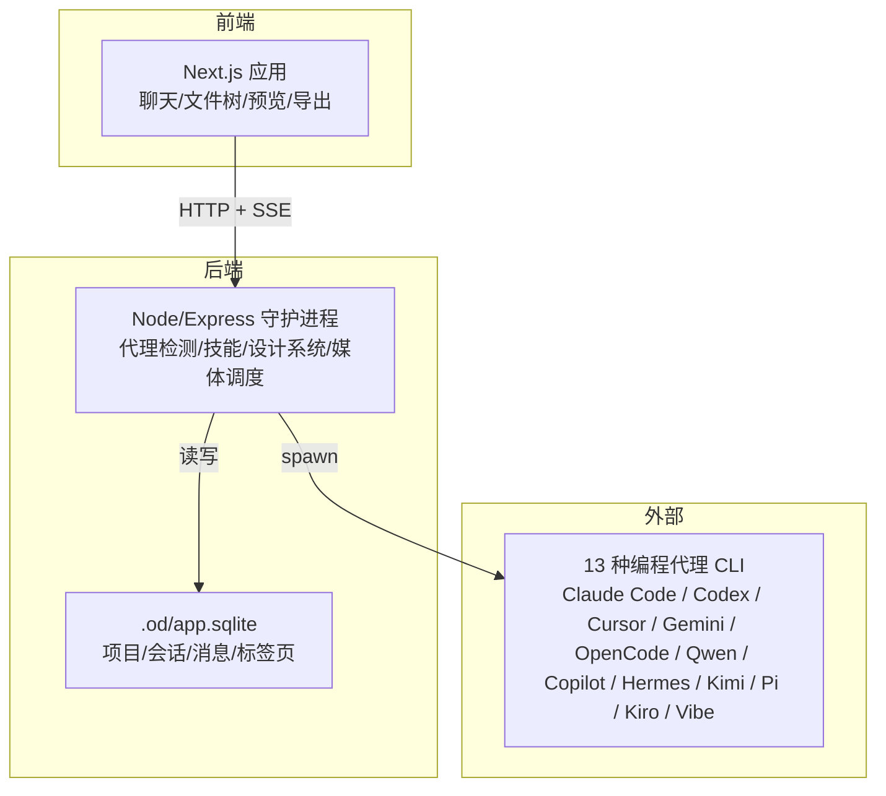
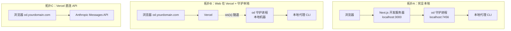
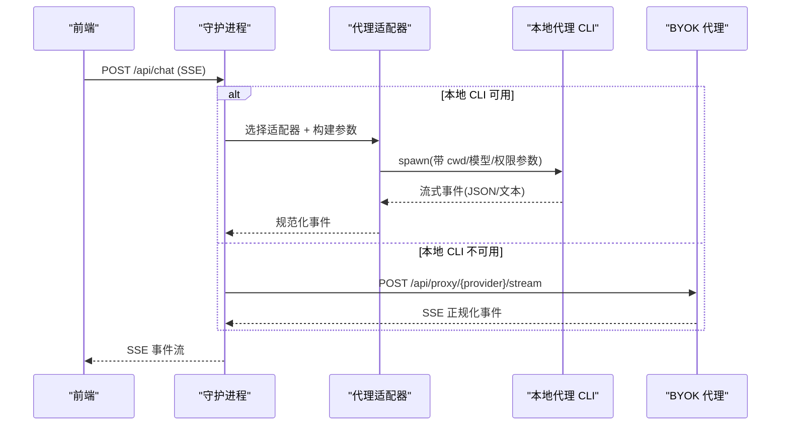
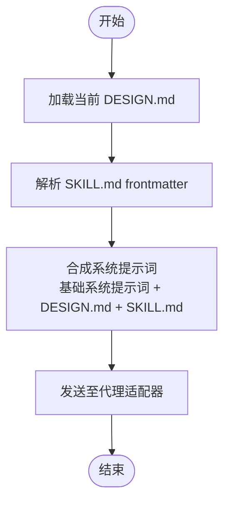
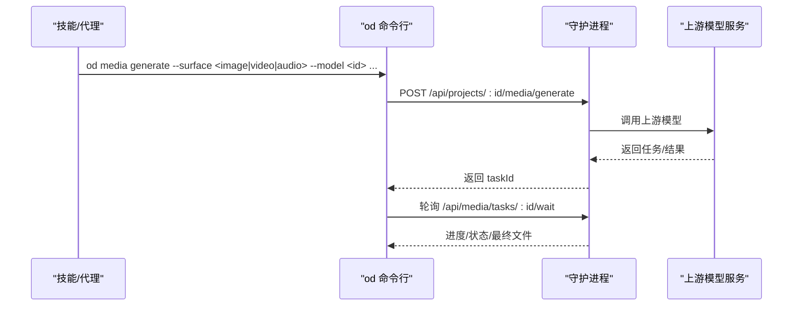
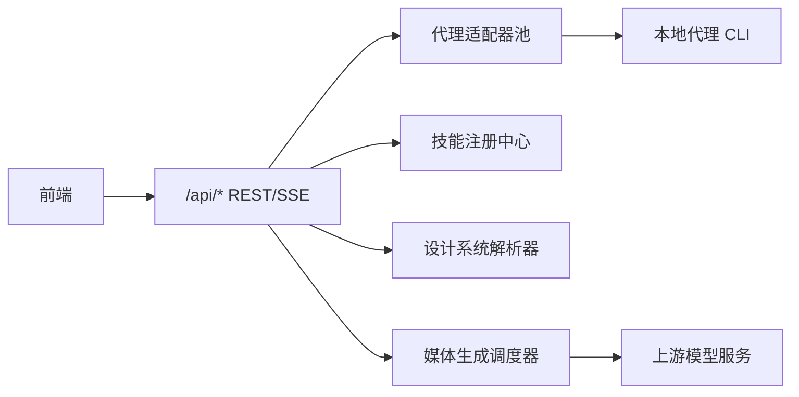

# 项目介绍

<cite>
**本文引用的文件**
- [README.md](file://README.md)
- [QUICKSTART.md](file://QUICKSTART.md)
- [docs/spec.md](file://docs/spec.md)
- [docs/architecture.md](file://docs/architecture.md)
- [apps/daemon/src/cli.ts](file://apps/daemon/src/cli.ts)
- [apps/daemon/src/agents.ts](file://apps/daemon/src/agents.ts)
- [apps/daemon/src/skills.ts](file://apps/daemon/src/skills.ts)
- [apps/daemon/src/server.ts](file://apps/daemon/src/server.ts)
- [apps/web/app/layout.tsx](file://apps/web/app/layout.tsx)
- [design-systems/README.md](file://design-systems/README.md)
</cite>

## 目录
1. [引言](#引言)
2. [项目结构](#项目结构)
3. [核心组件](#核心组件)
4. [架构总览](#架构总览)
5. [详细组件分析](#详细组件分析)
6. [依赖分析](#依赖分析)
7. [性能考虑](#性能考虑)
8. [故障排查指南](#故障排查指南)
9. [结论](#结论)
10. [附录](#附录)

## 引言
Open Design 是 Claude Design 的开源替代方案，核心价值在于“本地优先、可部署”的 Web 设计协作平台。它不强制绑定任何特定代理或模型，而是将“最强的编码代理”（如 Claude Code、Codex、Cursor Agent、Gemini CLI、OpenCode、Qwen、GitHub Copilot CLI、Hermes、Kimi、Pi、Kiro、Mistral Vibe）直接引入到你的本地环境，通过 13 种编程代理 CLI 自动检测、31 个可组合技能与 72 个品牌级设计系统，构建完全开放的创作工作流。

项目强调四大核心理念：
- 不自带代理：代理来自你已安装的 CLI，或通过 BYOK 代理桥接到任意 OpenAI 兼容服务。
- 技能即文件：遵循 Claude Code 的 SKILL.md 规范，以文件形式组织，便于版本化、复用与分享。
- 设计系统是可移植的 Markdown：统一的 DESIGN.md 9 段落规范，让品牌风格在所有输出中一致传递。
- 交互式问题表单：在模型开始生成前，先锁定需求边界，减少往返与偏差。

Open Design 的目标用户包括：
- 已有编码代理订阅的独立开发者与设计师；
- 希望将设计系统标准化并自动应用到所有产出的设计系统维护者；
- 希望发布可复用设计技能的技能作者；
- 需要将密钥与数据保留在自管环境中的团队。

## 项目结构
仓库采用多包工作区（pnpm workspace）组织，核心由以下模块构成：
- apps/daemon：Node/Express 后端，负责代理检测、技能注册、设计系统解析、媒体生成调度、SSE 转发与静态资源服务。
- apps/web：Next.js 16 App Router 前端，提供聊天、文件树、预览、评论与导出等能力。
- skills/：31 个 SKILL.md 技能包，覆盖原型、演示文稿、文档与运营场景。
- design-systems/：72 个 DESIGN.md 设计系统，涵盖 AI/LLM、开发者工具、生产力、金融、电商、媒体、汽车等多个类别。
- packages/：跨应用共享的协议与运行时基础库。
- docs/：产品规格、架构、适配器、模式等文档。
- scripts/：上游同步与构建脚本（如设计系统导入）。

图表来源
- [docs/architecture.md](file://docs/architecture.md)
- [apps/daemon/src/server.ts](file://apps/daemon/src/server.ts)

章节来源
- [README.md](file://README.md)
- [QUICKSTART.md](file://QUICKSTART.md)
- [docs/architecture.md](file://docs/architecture.md)

## 核心组件
- 代理适配层（apps/daemon/src/agents.ts）
  - 自动扫描 PATH，识别 13 种 CLI 并建立适配器；支持按 CLI 的能力动态注入参数、模型列表与流格式。
  - 对于无本地 CLI 的场景，提供 BYOK 代理（Anthropic/OpenAI/Azure OpenAI/Google Gemini）的 SSE 正规化通道，并内置 SSRF 阻断。
- 技能注册中心（apps/daemon/src/skills.ts）
  - 扫描 skills/ 目录，解析 SKILL.md frontmatter，暴露模式（prototype/deck/template/design-system）、场景、平台、默认项等元数据。
- 设计系统解析器（apps/daemon/src/design-systems.ts）
  - 加载 DESIGN.md，注入到系统提示词中，确保所有技能产出风格一致。
- 媒体生成调度器（apps/daemon/src/media.js）
  - 统一图像/视频/音频生成入口，通过 od 命令行子命令触发，支持 gpt-image-2、Seedance 2.0、HyperFrames 等模型族。
- 前端渲染与交互（apps/web/app/layout.tsx 及其子模块）
  - 沙箱 iframe 预览、评论标注、滑杆参数化微调、导出（HTML/PDF/PPTX/ZIP/Markdown）。

章节来源
- [apps/daemon/src/agents.ts](file://apps/daemon/src/agents.ts)
- [apps/daemon/src/skills.ts](file://apps/daemon/src/skills.ts)
- [apps/daemon/src/server.ts](file://apps/daemon/src/server.ts)
- [apps/web/app/layout.tsx](file://apps/web/app/layout.tsx)

## 架构总览
Open Design 采用“Web 应用 + 本地守护进程”的拓扑，支持三种部署形态：
- 本地全量：浏览器直连本地 Next.js 与 7456 端口守护进程。
- Vercel + 本地守护：通过隧道连接，守护进程在本地机器运行。
- Vercel 直连 API：无本地守护，直接使用 BYOK 代理，体验降级但可快速试用。

图表来源
- [docs/architecture.md](file://docs/architecture.md)

章节来源
- [docs/architecture.md](file://docs/architecture.md)
- [QUICKSTART.md](file://QUICKSTART.md)

## 详细组件分析

### 组件A：代理适配器与 BYOK 代理
- 自动检测：启动时并行探测 PATH 中的 13 种 CLI，记录可用性、版本与能力标志位，动态生成模型列表。
- 参数构建：针对不同 CLI 的 argv 形态与 stdin 限制，统一构建 spawn 参数，避免 Windows/类 Unix 的长度上限问题。
- 流解析：为每种 CLI 提供事件解析器（如 claude-stream-json、copilot-stream-json、json-event-stream、acp-json-rpc、pi-rpc、plain），将原始输出转为 UI 事件。
- BYOK 代理：当未检测到本地 CLI 时，走 /api/proxy/{anthropic,openai,azure,google}/stream，将上游 SSE 正规化为 delta/end/error，同时阻断 loopback/link-local/RFC1918 目标以防 SSRF。

图表来源
- [apps/daemon/src/agents.ts](file://apps/daemon/src/agents.ts)
- [apps/daemon/src/server.ts](file://apps/daemon/src/server.ts)

章节来源
- [apps/daemon/src/agents.ts](file://apps/daemon/src/agents.ts)
- [apps/daemon/src/server.ts](file://apps/daemon/src/server.ts)
- [QUICKSTART.md](file://QUICKSTART.md)

### 组件B：技能注册与系统提示词合成
- 技能发现：扫描 skills/ 目录，解析 SKILL.md frontmatter，推导模式/场景/平台/默认项等元数据，支持“技能根路径”前置说明以便代理读取相对路径资产。
- 系统提示词：每次发送时，将基础系统提示词、当前 DESIGN.md 与 SKILL.md 合成最终提示，保证风格与规则一致。
- 示例与种子：支持从示例项目加载种子模板与参考文件，加速首次生成。

图表来源
- [apps/daemon/src/skills.ts](file://apps/daemon/src/skills.ts)
- [apps/daemon/src/server.ts](file://apps/daemon/src/server.ts)

章节来源
- [apps/daemon/src/skills.ts](file://apps/daemon/src/skills.ts)
- [apps/daemon/src/server.ts](file://apps/daemon/src/server.ts)

### 组件C：设计系统与可视化方向
- 设计系统：72 个 DESIGN.md 系统，覆盖 AI/LLM、开发者工具、生产力、金融、电商、媒体、汽车等领域；支持手写 starter 与从上游仓库同步。
- 视觉方向：当用户未提供品牌资料时，系统提供 5 种确定性视觉方向（编辑部/现代极简/科技实用/粗野主义/暖软），每个方向绑定 OKLch 色彩与字体栈，避免 AI 自由发挥。

章节来源
- [design-systems/README.md](file://design-systems/README.md)
- [README.md](file://README.md)

### 组件D：媒体生成与任务编排
- 统一入口：前端或技能通过 od 命令行子命令触发媒体生成，传入 surface（image/video/audio）、model、prompt、输出文件名、长宽比、时长/音色等参数。
- 任务轮询：守护进程返回 taskId，客户端可轮询等待完成；支持进度回放与错误透传。
- 支持模型：gpt-image-2（Azure/OpenAI）、Seedance 2.0（ByteDance）、HyperFrames（HTML→MP4 动态图形）等。

图表来源
- [apps/daemon/src/cli.ts](file://apps/daemon/src/cli.ts)
- [apps/daemon/src/server.ts](file://apps/daemon/src/server.ts)

章节来源
- [apps/daemon/src/cli.ts](file://apps/daemon/src/cli.ts)
- [apps/daemon/src/server.ts](file://apps/daemon/src/server.ts)

## 依赖分析
- 组件耦合
  - 前端与后端通过 /api/* REST 与 SSE 解耦；SSE 仅用于流式输出，其他操作通过 REST。
  - 代理适配器对 CLI 的依赖通过 PATH 探测与能力标志位解耦，新增 CLI 仅需扩展适配器定义。
  - 技能与设计系统通过文件系统加载，无需集中注册，降低耦合度。
- 外部依赖
  - 代理：13 种 CLI 或 BYOK 代理；BYOK 代理支持 Anthropic、OpenAI、Azure OpenAI、Google Gemini。
  - 媒体：gpt-image-2、Seedance 2.0、HyperFrames 等模型族；上游服务可能受网络与配额限制。
- 数据存储
  - .od/ 下的 SQLite（项目/会话/消息/标签页）与纯文件（工件/历史/会话）并存，便于审查与迁移。

图表来源
- [apps/daemon/src/server.ts](file://apps/daemon/src/server.ts)
- [apps/daemon/src/agents.ts](file://apps/daemon/src/agents.ts)
- [apps/daemon/src/skills.ts](file://apps/daemon/src/skills.ts)

章节来源
- [apps/daemon/src/server.ts](file://apps/daemon/src/server.ts)
- [apps/daemon/src/agents.ts](file://apps/daemon/src/agents.ts)
- [apps/daemon/src/skills.ts](file://apps/daemon/src/skills.ts)

## 性能考虑
- 启动与检测：守护进程冷启动 < 500ms；代理检测并行探测 PATH，< 200ms；首次生成延迟主要由模型决定，OD 开销 < 50ms。
- 预览刷新：工件文件写入触发去抖动重建与 iframe 替换，刷新频率可控。
- 技能索引：冷扫描约 100ms（约 50 个技能），开发模式下使用 chokidar 监听变更。
- 反向代理：若在守护进程前放置反向代理，需保持 /api/* 的 SSE 不缓冲且禁用 gzip，否则可能出现分块传输中断。

章节来源
- [docs/architecture.md](file://docs/architecture.md)

## 故障排查指南
- “PATH 未检测到代理”
  - 安装任一：claude、codex、devin、gemini、opencode、cursor-agent、qwen、copilot，或在设置中切换到 BYOK API 模式并粘贴密钥。
- “/api/chat 返回 500”
  - 查看守护进程终端日志，通常为 CLI 参数不匹配；检查 apps/daemon/src/agents.ts 中对应适配器的 buildArgs。
- “媒体生成提示 OD_BIN 缺失或 daemon URL 为 :0”
  - 重新构建守护进程 CLI 并重启管理进程；确认 OD_DAEMON_URL 为真实端口（非 :0）。
- “Codex 插件上下文过大”
  - 使用 OD_CODEX_DISABLE_PLUGINS=1 启动，使守护进程派生的 Codex 进程禁用插件。
- “产物未渲染”
  - 确认系统提示词已正确下发，必要时切换更严格的技能或更强模型。

章节来源
- [QUICKSTART.md](file://QUICKSTART.md)
- [apps/daemon/src/agents.ts](file://apps/daemon/src/agents.ts)

## 结论
Open Design 以“文件即技能、Markdown 即设计系统、代理即服务”的理念，将现有最强编码代理无缝接入到设计工作流中。通过交互式问题表单、五维自我评审、沙箱预览与导出管线，它在不牺牲灵活性的前提下，提供了可审计、可复用、可部署的本地优先设计协作体验。对于希望保留代理选择权、设计系统可移植性与数据主权的个人与团队，Open Design 提供了清晰而强大的替代方案。

## 附录
- 快速开始
  - 环境要求：Node ~24、pnpm 10.33.x；macOS/Linux/WSL2 为主，Windows WSL2 更稳妥。
  - 一键运行：corepack enable → pnpm install → pnpm tools-dev run web。
  - 首次加载会自动检测代理、加载技能与设计系统，随后即可输入提示词并查看实时预览。
- 与 Claude Design 的差异化
  - 许可证：Apache-2.0；形态：Web 应用 + 本地守护；代理：用户自有 CLI 或 BYOK；技能：文件化 SKILL.md；设计系统：文件化 DESIGN.md；部署：可部署到 Vercel；评论/微调：部分实现中。
- 与 Open CoDesign 的差异化
  - 形态：Web 应用 + 本地守护 vs Electron；代理：用户自有 CLI；技能：文件化 SKILL.md；设计系统：文件化 DESIGN.md；评论/微调：OD 在推进中。

章节来源
- [README.md](file://README.md)
- [QUICKSTART.md](file://QUICKSTART.md)
- [docs/spec.md](file://docs/spec.md)