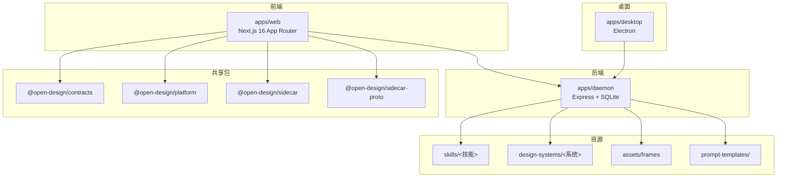
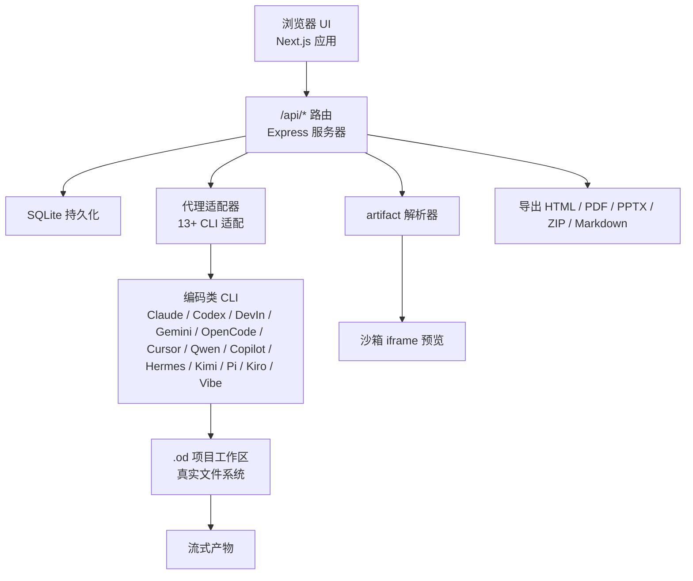
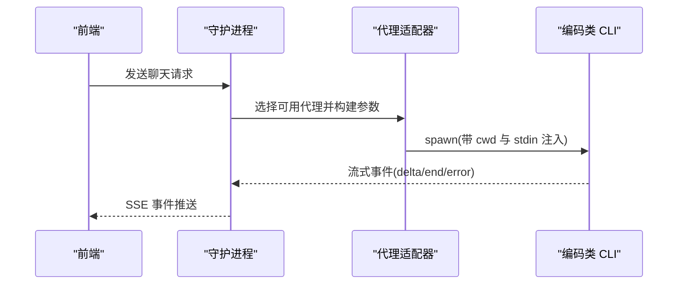
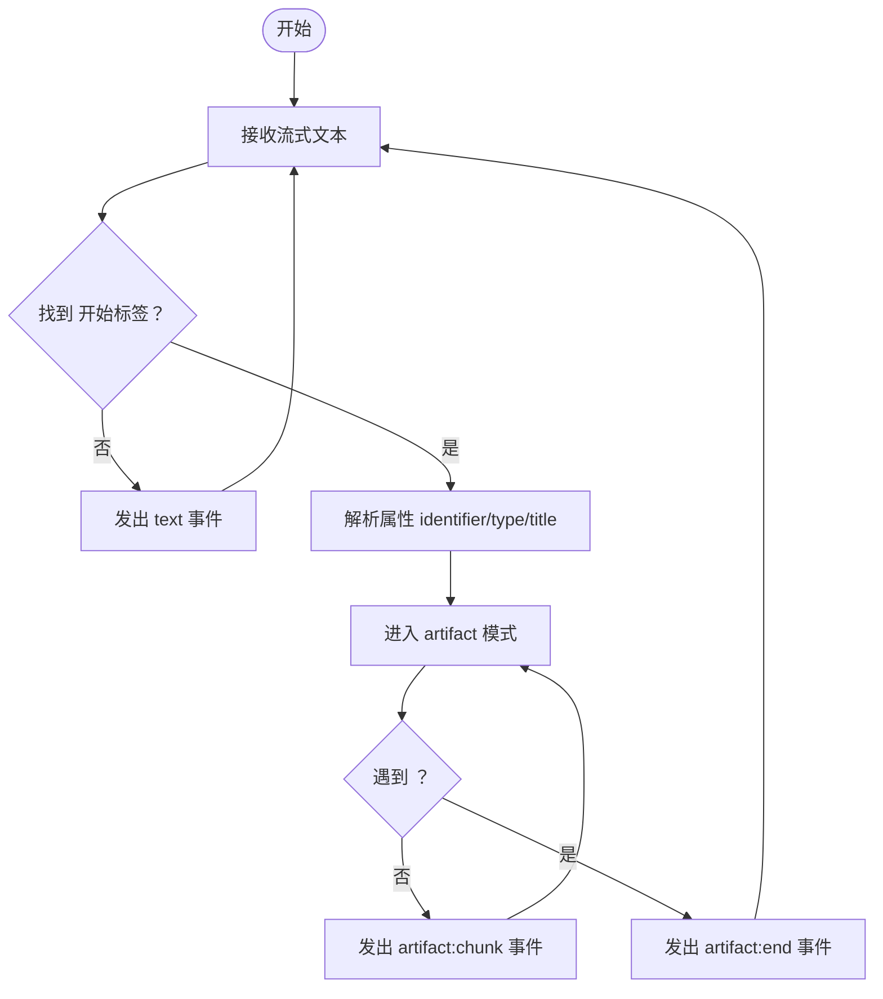
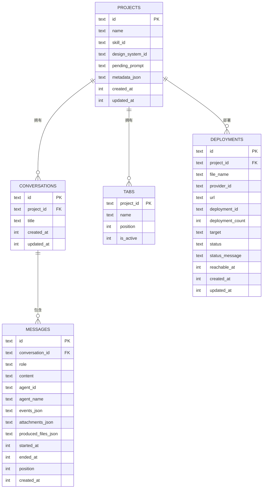
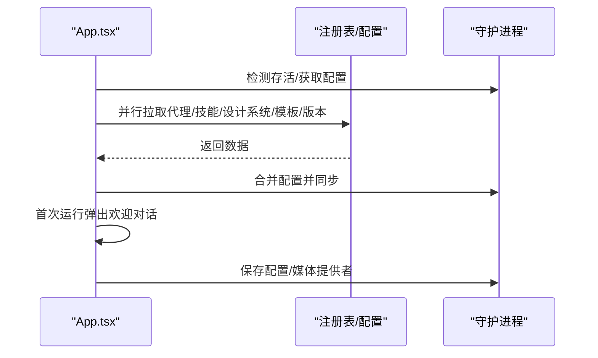
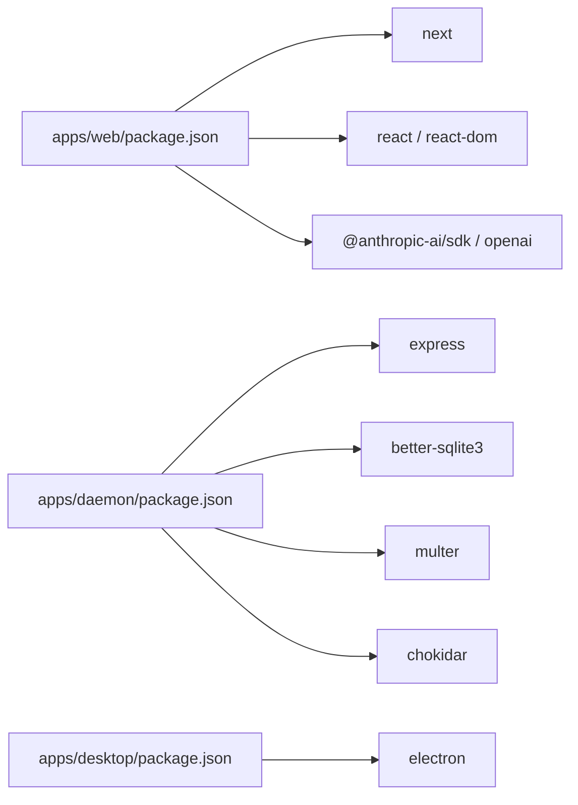

# 项目概述

<cite>
**本文引用的文件**
- [README.md](file://README.md)
- [apps/web/package.json](file://apps/web/package.json)
- [apps/daemon/package.json](file://apps/daemon/package.json)
- [apps/desktop/package.json](file://apps/desktop/package.json)
- [package.json](file://package.json)
- [apps/web/src/App.tsx](file://apps/web/src/App.tsx)
- [apps/daemon/src/server.ts](file://apps/daemon/src/server.ts)
- [apps/daemon/src/agents.ts](file://apps/daemon/src/agents.ts)
- [apps/daemon/src/db.ts](file://apps/daemon/src/db.ts)
- [apps/web/src/artifacts/parser.ts](file://apps/web/src/artifacts/parser.ts)
</cite>

## 目录
1. [引言](#引言)
2. [项目结构](#项目结构)
3. [核心组件](#核心组件)
4. [架构总览](#架构总览)
5. [详细组件分析](#详细组件分析)
6. [依赖分析](#依赖分析)
7. [性能考虑](#性能考虑)
8. [故障排查指南](#故障排查指南)
9. [结论](#结论)
10. [附录](#附录)

## 引言
Open Design 是 Claude Design 的开源替代方案，定位为“本地优先、可部署”的 Web 设计协作平台。其核心价值主张包括：
- 不自带代理：通过本地已安装的任意编码类 CLI 作为“代理”，实现 BYOK（Bring Your Own Key）与 BYOK（Bring Your Own Agent）的完全开放生态。
- 技能即文件：以 SKILL.md 为最小单元，将“技能”以文件夹形式组织，便于添加、替换与复用。
- 设计系统是可移植的 Markdown：采用统一的 DESIGN.md 规范，跨产品系统可移植，便于在不同项目间共享与切换。
- 交互式问题表单：在正式生成前，先锁定关键设计要素，降低返工率，提升产出质量。
- 本地优先：所有运行时数据默认保存在本地隐藏目录，支持 SQLite 持久化与真实文件工作区，确保可审计与可控。

与 Claude Design 的差异化优势：
- 开源许可与可自托管：Apache-2.0 许可，支持 Vercel 部署与本地运行。
- 多代理适配：支持 13+ 编码类 CLI，且具备 BYOK 代理能力，覆盖多模型提供商。
- 文件级技能与设计系统：便于社区贡献与二次开发。
- 本地文件系统与预览：真实 cwd、真实工具链、沙箱 iframe 预览，便于调试与导出。

## 项目结构
仓库采用 pnpm 工作区组织，核心应用与包如下：
- apps/web：Next.js 16 App Router 前端应用，负责聊天、文件工作区、预览与设置等。
- apps/daemon：Node + Express 后端服务，负责路由、SQLite 数据持久化、代理与媒体管线、项目管理等。
- apps/desktop：Electron 客户端壳层（可选），用于桌面自动化与 E2E。
- packages/*：共享契约、平台与侧车协议等。
- skills/：31 个技能（SKILL.md + assets + references）。
- design-systems/：72 个 DESIGN.md 设计系统。
- assets/：设备框架等公共资源。
- prompt-templates/：图像/视频模板库。
- scripts/：同步与构建脚本。

图表来源
- [apps/web/package.json:1-52](file://apps/web/package.json#L1-L52)
- [apps/daemon/package.json:1-57](file://apps/daemon/package.json#L1-L57)
- [apps/desktop/package.json:1-34](file://apps/desktop/package.json#L1-L34)
- [package.json:1-43](file://package.json#L1-L43)

章节来源
- [README.md: 344-441:344-441](file://README.md#L344-L441)
- [apps/web/package.json: 1-52:1-52](file://apps/web/package.json#L1-L52)
- [apps/daemon/package.json: 1-57:1-57](file://apps/daemon/package.json#L1-L57)
- [apps/desktop/package.json: 1-34:1-34](file://apps/desktop/package.json#L1-L34)
- [package.json: 1-43:1-43](file://package.json#L1-L43)

## 核心组件
- 本地守护进程（Daemon）
  - 负责路由、SQLite 持久化、代理与媒体管线、项目管理、导入导出、部署等。
  - 提供 /api/* 接口，支持 BYOK 代理与本地代理两类模式。
- 前端应用（Web）
  - Next.js App Router + React 18，负责入口视图、项目视图、设置、预览与聊天。
  - 通过 providers 与后端交互，状态由本地存储与后端共同维护。
- 桌面壳层（Desktop）
  - 可选 Electron 客户端，通过 sidecar 协议与后端通信，支持无头测试与自动化。
- 技能与设计系统
  - 技能：SKILL.md + assets + references，31 个内置技能。
  - 设计系统：DESIGN.md，72 个内置系统，支持切换与预览。
- 资源与模板
  - 设备框架 assets/frames、prompt-templates/ 图像/视频模板库。

章节来源
- [README.md: 257-300:257-300](file://README.md#L257-L300)
- [apps/web/src/App.tsx: 50-582:50-582](file://apps/web/src/App.tsx#L50-L582)
- [apps/daemon/src/server.ts: 781-884:781-884](file://apps/daemon/src/server.ts#L781-L884)

## 架构总览
Open Design 采用“Web 前端 + 本地守护进程 + 多代理适配器”的分层架构。前端通过 SSE 与守护进程通信；守护进程根据所选代理类型，将提示与上下文流式转发到对应 CLI；CLI 写入项目工作区并产出 artifact；守护进程解析 artifact 并通过沙箱 iframe 渲染；SQLite 存储项目、会话、消息与标签页等元数据。

图表来源
- [README.md: 257-286:257-286](file://README.md#L257-L286)
- [apps/daemon/src/server.ts: 781-884:781-884](file://apps/daemon/src/server.ts#L781-L884)
- [apps/web/src/artifacts/parser.ts: 1-180:1-180](file://apps/web/src/artifacts/parser.ts#L1-L180)

章节来源
- [README.md: 257-286:257-286](file://README.md#L257-L286)
- [apps/daemon/src/server.ts: 781-884:781-884](file://apps/daemon/src/server.ts#L781-L884)
- [apps/web/src/artifacts/parser.ts: 1-180:1-180](file://apps/web/src/artifacts/parser.ts#L1-L180)

## 详细组件分析

### 组件一：代理检测与适配（agents.ts）
- 自动扫描 PATH，识别 13+ 编码类 CLI，并为每个 CLI 定义参数构建、流格式与模型列表。
- 支持 stdin 注入长提示，规避 Windows/Linux 的命令行长度限制。
- 对 ACP（Agent Client Protocol）与 JSON-RPC 的 CLI 进行统一抽象，保证流式事件一致性。

图表来源
- [apps/daemon/src/agents.ts: 119-604:119-604](file://apps/daemon/src/agents.ts#L119-L604)
- [apps/daemon/src/server.ts: 781-884:781-884](file://apps/daemon/src/server.ts#L781-L884)

章节来源
- [apps/daemon/src/agents.ts: 119-604:119-604](file://apps/daemon/src/agents.ts#L119-L604)
- [README.md: 620-642:620-642](file://README.md#L620-L642)

### 组件二：聊天与 artifact 流解析（parser.ts）
- 流式解析 <artifact> 标签，输出标准化事件：artifact:start、artifact:chunk、artifact:end。
- 与前端预览与导出流程对接，确保增量渲染与最终落盘。

图表来源
- [apps/web/src/artifacts/parser.ts: 89-179:89-179](file://apps/web/src/artifacts/parser.ts#L89-L179)

章节来源
- [apps/web/src/artifacts/parser.ts: 1-180:1-180](file://apps/web/src/artifacts/parser.ts#L1-L180)

### 组件三：数据持久化（db.ts）
- 使用 better-sqlite3 存储项目、会话、消息、标签页与部署记录。
- 表结构涵盖外键约束与索引，支持按项目/会话维度查询与更新。

图表来源
- [apps/daemon/src/db.ts: 38-183:38-183](file://apps/daemon/src/db.ts#L38-L183)

章节来源
- [apps/daemon/src/db.ts: 1-800:1-800](file://apps/daemon/src/db.ts#L1-L800)

### 组件四：前端应用生命周期（App.tsx）
- 初始化：检测守护进程存活、拉取代理/技能/设计系统/模板/版本信息，合并后端配置。
- 设置与引导：首次运行弹出欢迎对话，保存配置并同步至守护进程。
- 项目管理：创建/打开/删除项目，处理待定提示与项目更新时间戳。
- 宠物 Overlay：可选的 UI 动画元素，支持唤醒/收起与宠物切换。

图表来源
- [apps/web/src/App.tsx: 88-190:88-190](file://apps/web/src/App.tsx#L88-L190)
- [apps/web/src/App.tsx: 230-242:230-242](file://apps/web/src/App.tsx#L230-L242)

章节来源
- [apps/web/src/App.tsx: 50-582:50-582](file://apps/web/src/App.tsx#L50-L582)

### 组件五：BYOK 代理与安全策略（server.ts）
- BYOK 代理：支持 Anthropic、OpenAI 兼容、Azure OpenAI、Google Gemini 的 SSE 正常化。
- SSRF 防护：拒绝 loopback/link-local/RFC1918 主机，仅允许受控回源。
- 上传与归档：支持项目文件上传、ZIP 归档下载与清理。

章节来源
- [apps/daemon/src/server.ts: 781-884:781-884](file://apps/daemon/src/server.ts#L781-L884)
- [README.md: 568-569:568-569](file://README.md#L568-L569)

## 依赖分析
- 前端依赖
  - Next.js 16 App Router + React 18 + TypeScript，支持 Vercel 部署。
  - @anthropic-ai/sdk、openai 等 SDK 用于与上游模型交互。
- 后端依赖
  - Express、better-sqlite3、multer、chokidar 等，提供路由、数据库、文件上传与文件监听。
- 桌面依赖
  - Electron，配合 sidecar 协议进行 IPC 通信。
- 工作区脚本
  - pnpm 工作区 + onlyBuiltDependencies，确保原生模块正确编译。

图表来源
- [apps/web/package.json: 30-40:30-40](file://apps/web/package.json#L30-L40)
- [apps/daemon/package.json: 34-44:34-44](file://apps/daemon/package.json#L34-L44)
- [apps/desktop/package.json: 20-24:20-24](file://apps/desktop/package.json#L20-L24)

章节来源
- [apps/web/package.json: 1-52:1-52](file://apps/web/package.json#L1-L52)
- [apps/daemon/package.json: 1-57:1-57](file://apps/daemon/package.json#L1-L57)
- [apps/desktop/package.json: 1-34:1-34](file://apps/desktop/package.json#L1-L34)
- [package.json: 27-41:27-41](file://package.json#L27-L41)

## 性能考虑
- 流式传输：SSE 与多代理适配器统一事件格式，减少 UI 渲染抖动。
- 本地文件系统：真实 cwd 与文件读写，避免远程网络开销，提升迭代速度。
- SQLite 轻量存储：WAL 模式与索引优化，满足中小规模项目的数据访问需求。
- 预览沙箱：iframe srcdoc 渲染，隔离样式与脚本，避免全局污染。
- 上传与归档：限制单文件大小与并发数量，避免内存与磁盘压力。

## 故障排查指南
- 守护进程未启动或无法连接
  - 检查 tools-dev 生命周期命令与端口绑定，确认 OD_BIND_HOST 与 OD_WEB_PORT。
  - 查看日志与健康检查接口，确认 /api/health 或版本接口可达。
- 代理不可用或模型列表为空
  - 确认 PATH 中存在对应 CLI，或在设置中手动指定自定义模型。
  - 对于需要权限的 CLI，确保非交互模式已启用（如 --allow-all-tools、--yolo、--permission-mode bypassPermissions）。
- 上传失败或文件名乱码
  - 检查 multipart 文件名解码与清洗逻辑，确认文件大小与字段数量限制。
- 导出异常
  - 确认 artifact 结构完整，解析器能正确识别 <artifact> 标签与闭合标签。
  - 检查导出格式（HTML/PDF/PPTX/ZIP/Markdown）是否被技能支持。

章节来源
- [apps/daemon/src/server.ts: 574-678:574-678](file://apps/daemon/src/server.ts#L574-L678)
- [apps/web/src/artifacts/parser.ts: 178-180:178-180](file://apps/web/src/artifacts/parser.ts#L178-L180)

## 结论
Open Design 以“技能即文件、设计系统是可移植的 Markdown、交互式问题表单、本地优先”为核心理念，构建了可扩展、可部署、可审计的设计协作平台。通过多代理适配与 BYOK 代理能力，它既兼容现有生态，又保持对用户选择的尊重；通过 SQLite 与真实文件工作区，确保可操作性与可移植性。对于希望在本地或云端自托管设计工作流的团队与个人，Open Design 提供了清晰、稳定且可持续演进的路径。

## 附录
- 快速开始
  - 安装依赖、启用 corepack、安装并运行 tools-dev，随后在浏览器中打开 Web URL。
- 首次运行状态
  - 守护进程自动创建 .od 目录，包含 app.sqlite、artifacts 与 projects/<id>。
- 仓库结构
  - 顶层 README.md 提供完整目录与职责说明，便于快速定位模块。

章节来源
- [README.md: 300-342:300-342](file://README.md#L300-L342)
- [README.md: 443-441:443-441](file://README.md#L443-L441)